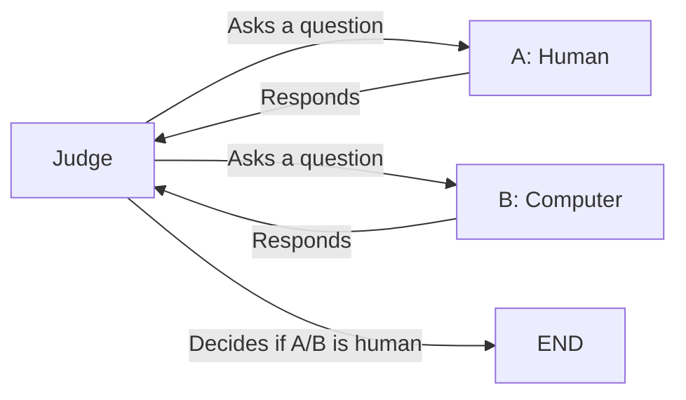

[toc]

# Introducción

*Artificial intelligence* (AI) would be the possession of  intelligence, or the exercise of thought, by machines such as computers. Philosophically, the main AI question is “Can there be such?” or, as  Alan Turing put it, “Can a machine think?” What makes this a  philosophical and not just a scientific and technical question is the  scientific recalcitrance of the concept of intelligence or thought and  its moral, religious, and legal significance. In European and other  traditions, moral and legal standing depend not just on what is  outwardly done but also on inward states of mind. Only rational  individuals have standing as moral agents and status as moral patients  subject to certain harms, such as being betrayed. Only sentient  individuals are subject to certain other harms, such as pain and  suffering. Since computers give every outward appearance of performing  intellectual tasks, the question arises: “Are they really thinking?” And if they are really thinking, are they not, then, owed similar rights to rational human beings? Many fictional explorations of AI in literature  and film explore these very questions.

A complication arises if humans are animals and if animals are  themselves machines, as scientific biology supposes. Still, “we wish to  exclude from the machines” in question “men born in the usual manner”  (Alan Turing), or even in unusual manners such as *in vitro* fertilization or ectogenesis. And if [nonhuman animals think](https://iep.utm.edu/ani-mind/), we wish to exclude them from the machines, too. More particularly, the  AI thesis should be understood to hold that thought, or intelligence,  can be produced by artificial means; made, not grown. For brevity’s  sake, we will take “machine” to denote just the artificial ones. Since  the present interest in thinking machines has been aroused by a  particular kind of machine, an electronic computer or digital computer,  present controversies regarding claims of artificial intelligence center on these.

Accordingly, the scientific discipline and engineering enterprise of  AI has been characterized as “the attempt to discover and implement the  computational means” to make machines “behave in ways that would be  called intelligent if a human were so behaving” (John McCarthy), or to  make them do things that “would require intelligence if done by men”  (Marvin Minsky). These standard formulations duck the question of  whether deeds which indicate intelligence when done by humans truly  indicate it when done by machines: that’s the philosophical question.  So-called *weak AI* grants the fact (or prospect) of intelligent-acting machines; *strong AI* says these actions can be real intelligence. Strong AI says some artificial computation is thought. [Computationalism](https://iep.utm.edu/compmind/) says that all thought is computation. Though many strong AI advocates  are computationalists, these are logically independent claims: some  artificial computation being thought is consistent with some thought not being computation, contra computationalism. All thought being  computation is consistent with some computation (and perhaps all  artificial computation) not being thought.

# Thinkers, and Thoughts

## What Things Think?

Intelligence might be styled the capacity to think extensively and  well. Thinking well centrally involves apt conception, true  representation, and correct reasoning. Quickness is generally counted a  further cognitive virtue. The extent or breadth of a thing’s thinking  concerns the variety of content it can conceive, and the variety of  thought processes it deploys. Roughly, the more extensively a thing  thinks, the higher the “level” (as is said) of its thinking.  Consequently, we need to distinguish two different AI questions:

> 1. Can machines think at all?
> 2. Can machine intelligence approach or surpass the human level?

In Computer Science, work termed “AI” has traditionally focused on  the high-level problem; on imparting high-level abilities to “use  language, form abstractions and concepts” and to “solve kinds of  problems now reserved for humans” (McCarthy et al. 1955); abilities to  play intellectual games such as checkers (Samuel 1954) and chess (Deep  Blue); to prove mathematical theorems (GPS); to apply expert knowledge  to diagnose bacterial infections (MYCIN); and so forth. More recently  there has arisen a humbler seeming conception – “behavior-based” or  “nouvelle” AI – according to which seeking to endow [embodied machines](https://iep.utm.edu/embodcog/), or robots, with so much as “insect level intelligence” (Brooks 1991)  counts as AI research. Where traditional human-level AI successes impart isolated high-level abilities to function in restricted domains, or  “microworlds,” behavior-based AI seeks to impart coordinated low-level  abilities to function in unrestricted real-world domains.

Still, to the extent that what is called “thinking” in us is  paradigmatic for what thought is, the question of human level  intelligence may arise anew at the foundations. Do insects think at all? And if insects … what of “bacteria level intelligence” (Brooks 1991a)?  Even “water flowing downhill,” it seems, “*tries* to get to the bottom of the hill by ingeniously *seeking* the line of least resistance” (Searle 1989). Don’t we have to draw the  line somewhere? Perhaps seeming intelligence – to really be intelligence – has to come up to some threshold level.

## Thought: Intelligence, Sentience, and Values

Much as intentionality (“aboutness” or representation) is central to  intelligence, felt qualities (so-called “qualia”) are crucial to  sentience. Here, drawing on Aristotle, medieval thinkers distinguished  between the “passive intellect” wherein the soul is affected, and the  “active intellect” wherein the soul forms conceptions, draws inferences, makes judgments, and otherwise acts. Orthodoxy identified the soul  proper (the immortal part) with the active rational element.  Unfortunately, disagreement over how these two (qualitative-experiential and cognitive-intentional) factors relate is as rife as disagreement  over what things think; and these disagreements are connected. Those who dismiss the seeming intelligence of computers because computers lack  feelings seem to hold qualia to be necessary for intentionality*.* Those like Descartes, who dismiss the seeming sentience of nonhuman  animals because he believed animals don’t think, apparently hold  intentionality to be necessary for qualia. Others deny one or both  necessities, maintaining either the possibility of cognition absent  qualia (as Christian orthodoxy, perhaps, would have the  thought-processes of God, angels, and the saints in heaven to be), or  maintaining the possibility of feeling absent cognition (as Aristotle  grants the lower animals).

# The Turing Test

While we don’t know what thought or intelligence is, essentially, and while we’re very far from agreed on what things do and don’t have it,  almost everyone agrees that humans think, and agrees with Descartes that our intelligence is amply manifest in our speech. Along these lines,  Alan Turing suggested that if computers showed human level  conversational abilities we should, by that, be amply assured of their  intelligence. Turing proposed a specific conversational test for  human-level intelligence, the “Turing test” it has come to be called.  Turing himself characterizes this test in terms of an “imitation game”  (Turing 1950, p. 433) whose original version “is played by three people, a man (A), a woman (B), and an interrogator (C) who may be of either  sex. The interrogator stays in a room apart from the other two. … The  object of the game for the interrogator is to determine which of the  other two is the man and which is the woman. The interrogator is allowed to put questions to A and B [by teletype to avoid visual and auditory  clues]. … . It is A’s object in the game to try and cause C to make the  wrong identification. … The object of the game for the third player (B)  is to help the interrogator.” Turing continues, “We may now ask the  question, `What will happen when a machine takes the part of A in this  game?’ Will the interrogator decide wrongly as often when the game is  being played like this as he does when the game is played between a man  and a woman? These questions replace our original, `Can machines  think?'” (Turing 1950) The test setup may be depicted this way:

This test may serve, as Turing notes, to test not just for shallow  verbal dexterity, but for background knowledge and underlying reasoning  ability as well, since interrogators may ask any question or pose any  verbal challenge they choose. Regarding this test Turing famously  predicted that “in about fifty years’ time [by the year 2000] it will be possible to program computers … to make them play the imitation game so well that an average interrogator will have no more than 70 per cent.  chance of making the correct identification after five minutes of  questioning” (Turing 1950); a prediction that has famously failed. As of the year 2000, machines at the Loebner Prize competition played the  game so ill that the average interrogator had 100 percent chance of  making the correct identification after five minutes of questioning (see Moor 2001).

It is important to recognize that Turing proposed his test as a  qualifying test for human-level intelligence, not as a disqualifying  test for intelligence per se (as Descartes had proposed); nor would it  seem suitably disqualifying unless we are prepared (as Descartes was) to deny that any nonhuman animals possess any intelligence whatsoever.  Even at the human level the test would seem not to be straightforwardly  disqualifying: machines as smart as we (or even smarter) might still be  unable to mimic us well enough to pass. So, from the failure of machines to pass this test, we can infer neither their complete lack of  intelligence nor, that their thought is not up to the human level.  Nevertheless, the manners of current machine failings clearly bespeak  deficits of wisdom and wit, not just an inhuman style. Still, defenders  of the Turing test claim we would have ample reason to deem them  intelligent – as intelligent as we are – if they could pass this test.

# Appearances of AI

The extent to which machines seem intelligent depends first, on  whether the work they do is intellectual (for example, calculating sums) or manual (for example, cutting steaks): herein, an electronic  calculator is a better candidate than an electric carving knife. A  second factor is the extent to which the device is self-actuated  (self-propelled, activated, and controlled), or “autonomous”: herein, an electronic calculator is a better candidate than an abacus. Computers  are better candidates than calculators on both headings. Where  traditional AI looks to increase computer intelligence quotients (so to  speak), nouvelle AI focuses on enabling robot autonomy.

## Computers

### Prehistory

In the beginning, tools (for example, axes) were extensions of human  physical powers; at first powered by human muscle; then by domesticated  beasts and in situ forces of nature, such as water and wind. The steam  engine put fire in their bellies; machines became self-propelled,  endowed with vestiges of self-control (as by Watt’s 1788 centrifugal  governor); and the rest is modern history. Meanwhile, automation of  intellectual labor had begun. Blaise Pascal developed an early  adding/subtracting machine, the Pascaline (circa 1642). Gottfried  Leibniz added multiplication and division functions with his Stepped  Reckoner (circa 1671). The first programmable device, however, plied  fabric not numerals. The Jacquard loom developed (circa 1801) by  Joseph-Marie Jacquard used a system of punched cards to automate the  weaving of programmable patterns and designs: in one striking  demonstration, the loom was programmed to weave a silk tapestry portrait of Jacquard himself.

In designs for his Analytical Engine mathematician/inventor Charles  Babbage recognized (circa 1836) that the punched cards could control  operations on symbols as readily as on silk; the cards could encode  numerals and other symbolic data and, more importantly, instructions,  including conditionally branching instructions, for numeric and other  symbolic operations. Augusta Ada Lovelace (Babbage’s software engineer)  grasped the import of these innovations: “The bounds of arithmetic” she  writes, “were … outstepped the moment the idea of applying the  [instruction] cards had occurred” thus “enabling mechanism to combine  together with general symbols, in successions of unlimited variety and  extent” (Lovelace 1842). “Babbage,” Turing notes, “had all the essential ideas” (Turing 1950). Babbage’s Engine – had he constructed it in all  its steam powered cog-wheel driven glory – would have been a  programmable all-purpose device, the first digital computer.

### Theoretical Interlude: Turing Machines

Before automated computation became feasible with the advent of  electronic computers in the mid twentieth century, Alan Turing laid the  theoretical foundations of Computer Science by formulating with  precision the link Lady Lovelace foresaw “between the operations of  matter and the abstract mental processes of the *most abstract*  branch of mathematical sciences” (Lovelace 1942). Turing (1936-7)  describes a type of machine (since known as a “Turing machine”) which  would be capable of computing any possible algorithm, or performing any  “rote” operation. Since Alonzo Church (1936) – using recursive functions and Lambda-definable functions – had identified the very same set of  functions as “rote” or algorithmic as those calculable by Turing  machines, this important and widely accepted identification is known as  the “Church-Turing Thesis” (see, Turing 1936-7: Appendix). The machines  Turing described are

> only capable of a finite number of conditions …  “m-configurations.” The machine is supplied with a “tape” (the analogue  of paper) running through it, and divided into sections (called  “squares”) each capable of bearing a “symbol.” At any moment there is  just one square … which is “in the machine.” … The “scanned symbol” is  the only one of which the machine is, so to speak, “directly aware.”  However, by altering its m-configuration the machine can effectively  remember some of the symbols which it has “seen” (scanned) previously.  The possible behavior of the machine at any moment is determined by the  m-configuration … and the scanned symbol …. This pair … called the  “configuration” … determines the possible behaviour of the machine. In  some of the configurations in which the square is blank … the machine  writes down a new symbol on the scanned square: in other configurations  it erases the scanned symbol. The machine may also change the square  which is being scanned, but only by shifting it one place to right or  left. In addition to any of these operations the m-configuration may be  changed. (Turing 1936-7)

Turing goes on to show how such machines can encode actionable  descriptions of other such machines. As a result, “It is possible to  invent a single machine which can be used to compute any computable  sequence” (Turing 1936-7). Today’s digital computers are (and Babbage’s  Engine would have been) physical instantiations of this “universal  computing machine” that Turing described abstractly. Theoretically, this means everything that can be done algorithmically or “by rote” at all  “can all be done with one computer suitably programmed for each case”;  “considerations of speed apart, it is unnecessary to design various new  machines to do various computing processes” (Turing 1950).  Theoretically, regardless of their hardware or architecture (see below), “all digital computers are in a sense equivalent”: equivalent in  speed-apart capacities to the “universal computing machine” Turing  described.

### From Theory to Practice

In practice, where speed is not apart, hardware and architecture are  crucial: the faster the operations the greater the computational power.  Just as improvement on the hardware side from cogwheels to circuitry was needed to make digital computers practical at all, improvements in  computer performance have been largely predicated on the continuous  development of faster, more and more powerful, machines.  Electromechanical relays gave way to vacuum tubes, tubes to transistors, and transistors to more and more integrated circuits, yielding vastly  increased operation speeds. Meanwhile, memory has grown faster and  cheaper.

Architecturally, all but the earliest and some later experimental  machines share a stored program serial design often called “von Neumann  architecture” (based on John von Neumann’s role in the design of EDVAC,  the first computer to store programs along with data in working memory). The architecture is serial in that operations are performed one at a  time by a central processing unit (CPU) endowed with a rich repertoire  of *basic* operations: even so-called “reduced instruction set”  (RISC) chips feature basic operation sets far richer than the minimal  few Turing proved theoretically sufficient. Parallel architectures, by  contrast, distribute computational operations among two or more units  (typically many more) capable of acting simultaneously, each having  (perhaps) drastically reduced basic operational capacities.

In 1965, Gordon Moore (co-founder of Intel) observed that the density of transistors on integrated circuits had doubled every year since  their invention in 1959: “Moore’s law” predicts the continuation of  similar exponential rates of growth in chip density (in particular), and computational power (by extension), for the foreseeable future.  Progress on the software programming side – while essential and by no  means negligible – has seemed halting by comparison. The road from power to performance is proving rockier than Turing anticipated.  Nevertheless, machines nowadays do behave in many ways that would be  called intelligent in humans and other animals. Presently, machines do  many things formerly only done by animals and thought to evidence some  level of intelligence in these animals, for example, seeking, detecting, and tracking things; seeming evidence of basic-level AI. Presently,  machines also do things formerly only done by humans and thought to  evidence high-level intelligence in us; for example, making mathematical discoveries, playing games, planning, and learning; seeming evidence of human-level AI.

## “Existence Proofs” of AI

### Low-Level Appearances and Attributions

The doings of many machines – some much simpler than computers –  inspire us to describe them in mental terms commonly reserved for  animals. Some missiles, for instance, seek heat, or so we say. We call  them “heat seeking missiles” and nobody takes it amiss. Room thermostats monitor room temperatures and try to keep them within set ranges by  turning the furnace on and off; and if you hold dry ice next to its  sensor, it will take the room temperature to be colder than it is, and  mistakenly turn on the furnace (see McCarthy 1979). Seeking, monitoring, trying, and taking things to be the case seem to be mental processes or conditions, marked by their intentionality. Just as humans have  low-level mental qualities – such as seeking and detecting things – in  common with the lower animals, so too do computers seem to share such  low-level qualities with simpler devices. Our working characterizations  of computers are rife with low-level mental attributions: we say they  detect key presses, try to initialize their printers, search for  available devices, and so forth. Even those who would deny the  proposition “machines think” when it is explicitly put to them, are  moved unavoidably in their practical dealings to characterize the doings of computers in mental terms, and they would be hard put to do  otherwise. In this sense, Turing’s prediction that “at the end of the  century the use of words and general educated opinion will have altered  so much that one will be able to speak of machines thinking without  expecting to be contradicted” (Turing 1950) has been as mightily  fulfilled as his prediction of a modicum of machine success at playing  the Imitation Game has been confuted. The Turing test and AI as  classically conceived, however, are more concerned with high-level  appearances such as the following.

### Theorem Proving and Mathematical Discovery

Theorem proving and mathematical exploration being their home turf,  computers have displayed not only human-level but, in certain respects,  superhuman abilities here. For speed and accuracy of mathematical  calculation, no human can match the speed and accuracy of a computer. As for high level mathematical performances, such as theorem proving and  mathematical discovery, a beginning was made by A. Newell, J.C. Shaw,  and H. Simon’s (1957) “Logic Theorist” program which proved 38 of the  first 51 theorems of B. Russell and A.N. Whitehead’s *Principia Mathematica*. Newell and Simon’s “General Problem Solver” (GPS) extended similar  automated theorem proving techniques outside the narrow confines of pure logic and mathematics. Today such techniques enjoy widespread  application in expert systems like MYCIN, in logic tutorial software,  and in computer languages such as PROLOG. There are even original  mathematical discoveries owing to computers. Notably, K. Appel, W.  Haken, and J. Koch (1977a, 1977b), and computer, proved that every  planar map is four colorable – an important mathematical conjecture that had resisted unassisted human proof for over a hundred years. Certain  computer generated parts of this proof are too complex to be directly  verified (without computer assistance) by human mathematicians.

Whereas attempts to apply general reasoning to unlimited domains are  hampered by explosive inferential complexity and computers’ lack of  common sense, expert systems deal with these problems by restricting  their domains of application (in effect, to microworlds), and crafting  domain-specific inference rules for these limited domains. MYCIN for  instance, applies rules culled from interviews with expert human  diagnosticians to descriptions of patients’ presenting symptoms to  diagnose blood-borne bacterial infections. MYCIN displays diagnostic  skills approaching the expert human level, albeit strictly limited to  this specific domain. Fuzzy logic is a formalism for representing  imprecise notions such as *most* and *bald*and enabling inferences based on such facts as that a bald person mostly lacks hair.

### Game Playing

Game playing engaged the interest of AI researchers almost from the  start. Samuel’s (1959) checkers (or “draughts”) program was notable for  incorporating mechanisms enabling it to learn from experience well  enough to eventually to outplay Samuel himself. Additionally, in setting one version of the program to play against a slightly altered version,  carrying over the settings of the stronger player to the next  generation, and repeating the process – enabling stronger and stronger  versions to evolve – Samuel pioneered the use of what have come to be  called “genetic algorithms” and “evolutionary” computing. Chess has also inspired notable efforts culminating, in 1997, in the famous victory of Deep Blue over defending world champion Gary Kasparov in a widely  publicized series of matches (recounted in Hsu 2002). Though some in AI  disparaged Deep Blue’s reliance on “brute force” application of computer power rather than improved search guiding heuristics, we may still add  chess to checkers (where the reigning “human-machine machine champion”  since 1994 has been CHINOOK, the machine), and backgammon, as games that computers now play at or above the highest human levels. Computers also play fair to middling poker, bridge, and Go – though not at the highest human level. Additionally, intelligent agents or “softbots” are  elements or participants in a variety of electronic games.

### Planning

Planning, in large measure, is what puts the intellect in  intellectual games like chess and checkers. To automate this broader  intellectual ability was the intent of Newell and Simon’s General  Problem Solver (GPS) program. GPS was able to solve puzzles like the  cannibals missionaries problem (how to transport three missionaries and  three cannibals across a river in a canoe for two without the  missionaries becoming outnumbered on either shore) by “setting up  subgoals whose attainment leads to the attainment of the [final] goal”  (Newell & Simon 1963: 284). By these methods GPS would “generate a  tree of subgoals” (Newell & Simon 1963: 286) and seek a path from  initial state (for example, all on the near bank) to final goal (all on  the far bank) by heuristically guided search along a branching “tree” of available actions (for example, two cannibals cross, two missionaries  cross, one of each cross, one of either cross, in either direction)  until it finds such a path (for example, two cannibals cross, one  returns, two cannibals cross, one returns, two missionaries cross, … ),  or else finds that there is none. Since the number of branches increases exponentially as a function of the number of options available at each  step, where paths have many steps with many options available at each  choice point, as in the real world, combinatorial explosion ensues and  an exhaustive “brute force” search becomes computationally intractable;  hence, heuristics (fallible rules of thumb) for identifying and  “pruning” the most unpromising branches in order to devote increased  attention to promising ones are needed. The widely deployed STRIPS  formalism first developed at Stanford for Shakey the robot in the late  sixties (see Nilsson 1984) represents actions as operations on states,  each operation having preconditions (represented by state descriptions)  and effects (represented by state descriptions): for example, the  go(there) operation might have the preconditions at(here) &  path(here,there) and the effect at(there). AI planning techniques are  finding increasing application and even becoming indispensable in a  multitude of complex planning and scheduling tasks including airport  arrivals, departures, and gate assignments; store inventory management;  automated satellite operations; military logistics; and many others.

### Robots

Robots based on sense-model-plan-act (SMPA) approach pioneered by  Shakey, however, have been slow to appear. Despite operating in a  simplified, custom-made experimental environment or microworld and  reliance on the most powerful available offboard computers, Shakey  “operated excruciatingly slowly” (Brooks 1991b), as have other SMPA  based robots. An ironic revelation of robotics research is that  abilities such as object recognition and obstacle avoidance that humans  share with “lower” animals often prove more difficult to implement than  distinctively human “high level” mathematical and inferential abilities  that come more naturally (so to speak) to computers. Rodney Brooks’  alternative behavior-based approach has had success imparting low-level  behavioral aptitudes outside of custom designed microworlds, but it is  hard to see how such an approach could ever “scale up” to enable  high-level intelligent action (see Behaviorism: [Objections & Discussion](https://iep.utm.edu/behavior/#H2): [Methodological Complaints](https://iep.utm.edu/behavior/#SSH2a.iv)). Perhaps hybrid systems can overcome the limitations of both approaches. On the practical front, progress is being made: NASA’s Mars exploration rovers Spirit and Opportunity, for instance, featured autonomous  navigation abilities. If space is the “final frontier” the final  frontiersmen are apt to be robots. Meanwhile, Earth robots seem bound to become smarter and more pervasive.

### Knowledge Representation (KR)

Knowledge representation embodies concepts and information in  computationally accessible and inferentially tractable forms. Besides  the STRIPS formalism mentioned above, other important knowledge  representation formalisms include AI programming languages such as  PROLOG, and LISP; data structures such as frames, scripts, and  ontologies; and neural networks (see below). The “frame problem” is the  problem of reliably updating dynamic systems’ parameters in response to  changes in other parameters so as to capture commonsense  generalizations: that the colors of things remain unchanged by their  being moved, that their positions remain unchanged by their being  painted, and so forth. More adequate representation of commonsense  knowledge is widely thought to be a major hurdle to development of the  sort of interconnected planning and thought processes typical of  high-level human or “general” intelligence. The CYC project (Lenat et  al. 1986) at Cycorp and MIT’s Open Mind project are ongoing attempts to  develop “ontologies” representing commonsense knowledge in computer  usable forms.

### Machine Learning (ML)

Learning – performance improvement, concept formation, or information acquisition due to experience – underwrites human common sense, and one may doubt whether any preformed ontology could ever impart common sense in full human measure. Besides, whatever the other intellectual  abilities a thing might manifest (or seem to), at however high a level,  without learning capacity, it would still seem to be sadly lacking  something crucial to human-level intelligence and perhaps intelligence  of any sort. The possibility of machine learning is implicit in computer programs’ abilities to self-modify and various means of realizing that  ability continue to be developed. Types of machine learning techniques  include decision tree learning, ensemble learning,  current-best-hypothesis learning, explanation-based learning, Inductive  Logic Programming (ILP), Bayesian statistical learning, instance-based  learning, reinforcement learning, and neural networks. Such techniques  have found a number of applications from game programs whose play  improves with experience to data mining (discovering patterns and  regularities in bodies of information).

### Neural Networks and Connectionism

Neural or [connectionist networks](https://iep.utm.edu/connect/) – composed of simple processors or nodes acting in parallel – are  designed to more closely approximate the architecture of the brain than  traditional serial symbol-processing systems. Presumed  brain-computations would seem to be performed in parallel by the  activities of myriad brain cells or neurons. Much as their parallel  processing is spread over various, perhaps widely distributed, nodes,  the representation of data in such connectionist systems is similarly  distributed and sub-symbolic (not being couched in formalisms such as  traditional systems’ machine codes and ASCII). Adept at pattern  recognition, such networks seem notably capable of forming concepts on  their own based on feedback from experience and exhibit several other  humanoid cognitive characteristics besides. Whether neural networks are  capable of implementing high-level symbol processing such as that  involved in the generation and comprehension of natural language has  been hotly disputed. Critics (for example, Fodor and Pylyshyn 1988)  argue that neural networks are incapable, in principle, of implementing  syntactic structures adequate for compositional semantics – wherein the  meaning of larger expressions (for example, sentences) are built up from the meanings of constituents (for example, words) – such as those  natural language comprehension features. On the other hand, Fodor (1975) has argued that symbol-processing systems are incapable of concept  acquisition: here the pattern recognition capabilities of networks seem  to be just the ticket. Here, as with robots, perhaps hybrid systems can  overcome the limitations of both the parallel distributed and  symbol-processing approaches.

### Natural Language Processing (NLP)

Natural language processing has proven more difficult than might have been anticipated. Languages are symbol systems and (serial  architecture) computers are symbol crunching machines, each with its own proprietary instruction set (machine code) into which it translates or  compiles instructions couched in high level programming languages like  LISP and C. One of the principle challenges posed by natural languages  is the proper assignment of meaning. High-level computer languages  express imperatives which the machine “understands” procedurally by  translation into its native (and similarly imperative) machine code:  their constructions are basically instructions. Natural languages, on  the other hand, have – perhaps principally – declarative functions:  their constructions include descriptions whose understanding seems  fundamentally to require rightly relating them to their referents in the world. Furthermore, high level computer language instructions have  unique machine code compilations (for a given machine), whereas, the  same natural language constructions may bear different meanings in  different linguistic and extralinguistic contexts. Contrast “the child  is in the pen” and “the ink is in the pen” where the first “pen” should  be understood to mean a kind of enclosure and the second “pen” a kind of writing implement. Commonsense, in a word, is how *we* know  this; but how would a machine know, unless we could somehow endow  machines with commonsense? In more than a word it would require  sophisticated and integrated syntactic, morphological, semantic,  pragmatic, and discourse processing. While the holy grail of full  natural language understanding remains a distant dream, here as  elsewhere in AI, piecemeal progress is being made and finding  application in grammar checkers; information retrieval and information  extraction systems; natural language interfaces for games, search  engines, and question-answering systems; and even limited machine  translation (MT).

## On the Behavioral Evidence

Low level intelligent action is pervasive, from thermostats (to cite a low tech. example) to voice recognition (for example, in cars,  cell-phones, and other appliances responsive to spoken verbal commands)  to fuzzy controllers and “neuro fuzzy” rice cookers. Everywhere these  days there are “smart” devices. High level intelligent action, such as  presently exists in computers, however, is episodic, detached, and  disintegral. Artifacts whose intelligent doings would instance  human-level comprehensiveness, attachment, and integration – such as Lt. Commander Data (of *Star Trek the Next Generation*) and HAL (of *2001 a Space Odyssey*) – remain the stuff of science fiction, and will almost certainly  continue to remain so for the foreseeable future. In particular, the  challenge posed by the Turing test remains unmet. Whether it ever will  be met remains an open question.

Beside this factual question stands a more theoretic one. Do the  “low-level” deeds of smart devices and disconnected “high-level” deeds  of computers – despite not achieving the general human level –  nevertheless comprise or evince genuine intelligence? Is it really  thinking? And if general human-level behavioral abilities ever were  achieved – it might still be asked – would that really be thinking?  Would human-level robots be owed human-level moral rights and owe  human-level moral obligations?

# Against AI: Objections and Replies

## Computationalism and Competing Theories of Mind

With the industrial revolution and the dawn of the machine age,  vitalism as a biological hypothesis – positing a life force in addition  to underlying physical processes – lost steam. Just as the heart was  discovered to be a pump, cognitivists*,* nowadays, work on the  hypothesis that the brain is a computer, attempting to discover what  computational processes enable learning, perception, and similar  abilities. Much as biology told us what kind of machine the heart is,  cognitivists believe, psychology will soon (or at least someday) tell us what kind of machine the brain is; doubtless some kind of computing  machine. Computationalism elevates the cognivist’s working hypothesis to a universal claim that all thought is computation. Cognitivism’s  ability to explain the “productive capacity” or “creative aspect” of  thought and language – the very thing Descartes argued precluded minds  from being machines – is perhaps the principle evidence in the theory’s  favor: it explains how finite devices can have infinite capacities such  as capacities to generate and understand the infinitude of possible  sentences of natural languages; by a combination of recursive syntax and compositional semantics. Given the Church-Turing thesis (above),  computationalism underwrites the following theoretical argument for  believing that human-level intelligent behavior can be computationally  implemented, and that such artificially implemented intelligence would  be real.

> 1. Thought is some kind of computation (Computationalism).
> 2. Digital computers, being universal Turing machines, can perform all possible computations. (Church-Turing thesis)   *therefore,*
> 3. Digital computers can think.

Computationalism, as already noted, says that all thought is  computation, not that all computation is thought. Computationalists,  accordingly, may still deny that the machinations of current generation  electronic computers comprise real thought or that these devices possess any genuine intelligence; and many do deny it based on their perception of various behavioral deficits these machines suffer from. However, few computationalists would go so far as to deny the possibility of genuine intelligence ever being artificially achieved. On the other hand,  competing would-be-scientific theories of what thought essentially is – [dualism](https://iep.utm.edu/dualism/) and mind-brain [identity theory](https://iep.utm.edu/identity/) – give rise to arguments for disbelieving that any kind of artificial  computational implementation of intelligence could be genuine thought,  however “general” and whatever its “level.”

*Dualism* – holding that thought is essentially subjective experience – would underwrite the following argument:

> 1. Thought is some kind of conscious experience. (Dualism)
> 2. Machines can’t have conscious experiences.  *therefore,*
> 3. Machines can’t think.

*Mind-brain identity theory* – holding that thoughts essentially are biological brain processes – yields yet another argument:

> 1. Thoughts are specific biological brain processes. (Mind-Brain Identity)
> 2. Artificial computers can’t have biological brain processes. (By our initial definition of the “artificial” in AI, above).   *therefore*,
> 3. Artificial computers can’t think.

While seldom so baldly stated, these basic theoretical objections –  especially dualism’s – underlie several would-be refutations of AI.  Dualism, however, is scientifically unfit: given the subjectivity of  conscious experiences, whether computers already have them, or ever  will, seems impossible to know. On the other hand, such bald mind-brain  identity as the anti-AI argument premises seems too speciesist to be  believed. Besides AI, it calls into doubt the possibility of  extraterrestrial, perhaps all nonmammalian, or even all nonhuman,  intelligence. As plausibly modified to allow species specific  mind-matter identities, on the other hand, it would not preclude  computers from being considered distinct species themselves.

## Arguments from Behavioral Disabilities

### The Mathematical Objection

*Objection:* There are unprovable mathematical theorems (as  Gödel 1931 showed) which humans, nevertheless, are capable of knowing to be true. This “mathematical objection” against AI was envisaged by  Turing (1950) and pressed by Lucas (1965) and Penrose (1989). In a  related vein, Fodor observes “some of the most striking things that  people do – ‘creative’ things like writing poems, discovering laws, or,  generally, having good ideas – don’t *feel* like species of  rule-governed processes” (Fodor 1975). Perhaps many of the most  distinctively human mental abilities are not rote, cannot be  algorithmically specified, and consequently are not computable.

*Reply:* First, “it is merely stated, without any sort of  proof, that no such limits apply to the human intellect” (Turing 1950),  i.e., that human mathematical abilities are Gödel unlimited. Second, if  indeed such limits are absent in humans, it requires a further proof  that the absence of such limitations is somehow essential to human-level performance more broadly construed, not a peripheral “blind spot.”  Third, if humans can solve computationally unsolvable problems by some  other means, what bars artificially augmenting computer systems with  these means (whatever they might be)?

### The Rule-bound Inflexibility or “Brittleness” of Machine Behavior

*Objection:* The brittleness of von Neumann machine  performance – their susceptibility to cataclysmic “crashes” due to  slight causes, for example, slight hardware malfunctions, software  glitches, and “bad data” – seems linked to the formal or rule-bound  character of machine behavior; to their needing “rules of conduct to  cover every eventuality” (Turing 1950). Human performance seems less  formal and more flexible. Hubert Dreyfus has pressed objections along  these lines to insist there is a range of high-level human behavior that cannot be reduced to rule-following: the “immediate intuitive  situational response that is characteristic of [human] expertise” he  surmises, “must depend almost entirely on intuition and hardly at all on analysis and comparison of alternatives” (Dreyfus 1998) and  consequently cannot be programmed.

*Reply:* That von Neumann processes are unlike our thought  processes in these regards only goes to show that von Neumann machine  thinking is not humanlike in these regards, not that it is not thinking  at all, nor even that it cannot come up to the human level. Furthermore, parallel machines (see above) whose performances characteristically  “degrade gracefully” in the face of “bad data” and minor hardware damage seem less brittle and more humanlike, as Dreyfus recognizes. Even von  Neumann machines – brittle though they are – are not totally inflexible: their capacity for modifying their programs to learn enables them to  acquire abilities they were never programmed by us to have, and respond  unpredictably in ways they were never explicitly programmed to respond,  based on experience. It is also possible to equip computers with random  elements and key high level choices to these elements’ outputs to make  the computers more “devil may care”: given the importance of random  variation for trial and error learning this may even prove useful.

### The Lack of Feelings Objection

*Objection:* Computers, for all their mathematical and other  seemingly high-level intellectual abilities have no emotions or feelings … so, what they do – however “high-level” – is not real thinking.

*Reply:* This is among the most commonly heard objections to  AI and a recurrent theme in its literary and cinematic portrayal.  Whereas we have strong inclinations to say computers see, seek, and  infer things we have scant inclinations to say they ache or itch or  experience ennui. Nevertheless, to be sustained, this objection requires reason to believe that thought is inseparable from feeling. Perhaps  computers are just dispassionate thinkers. Indeed, far from being  regarded as indispensable to rational thought, passion traditionally has been thought antithetical to it. Alternately – if emotions are somehow  crucial to enabling general human level intelligence – perhaps machines  could be artificially endowed with these: if not with subjective qualia  (below) at least with their functional equivalents.

### Scalability and Disunity Worries

*Objection:* The episodic, detached, and disintegral character of such piecemeal high-level abilities as machines now possess argues  that human-level comprehensiveness, attachment, and integration, in all  likelihood, can never be artificially engendered in machines; arguably  this is because Gödel unlimited mathematical abilities, rule-free  flexibility, or feelings are crucial to engendering general  intelligence. These shortcomings all seem related to each other and to  the manifest stupidity of computers.

*Reply:* Likelihood is subject to dispute. Scalability  problems seem grave enough to scotch short term optimism: never, on the  other hand, is a long time. If Gödel unlimited mathematical abilities,  or rule-free flexibility, or feelings, are required, perhaps these can  be artificially produced. Gödel aside, feeling and flexibility clearly  seem related in us and, equally clearly, much manifest stupidity in  computers is tied to their rule-bound inflexibility. However, even if  general human-level intelligent behavior is artificially unachievable,  no blanket indictment of AI threatens clearly from this at all. Rather  than conclude from this lack of generality that low-level AI and  piecemeal high-level AI are not real intelligence, it would perhaps be  better to conclude that low-level AI (like intelligence in lower  life-forms) and piecemeal high-level abilities (like those of human  “idiot savants”) are genuine intelligence, albeit piecemeal and  low-level.

## Arguments from Subjective Disabilities

Behavioral abilities and disabilities are objective empirical  matters. Likewise, what computational architecture and operations are  deployed by a brain or a computer (what computationalism takes to be  essential), and what chemical and physical processes underlie (what  mind-brain identity theory takes to be essential), are objective  empirical questions. These are questions to be settled by appeals to  evidence accessible, in principle, to any competent observer. Dualistic  objections to strong AI, on the other hand, allege deficits which are in principle not publicly apparent. According to such objections,  regardless of how seemingly intelligently a computer behaves, and  regardless of what mechanisms and underlying physical processes make it  do so, it would still be disqualified from truly being intelligent due  to its lack of subjective qualities essential for true intelligence.  These supposed qualities are, in principle, introspectively discernible  to the subject who has them and no one else: they are “private”  experiences, as it’s sometimes put, to which the subject has “privileged access.”

### Free Will: Lady Lovelace’s Objection?

*Objection:* That a computer cannot “originate anything” but  only “can do whatever we know how to order it to perform” (Lovelace  1842) was arguably the first and is certainly among the most frequently  repeated objections to AI. While the manifest “brittleness” and  inflexibility of extant computer behavior fuels this objection in part,  the complaint that “they can only do what we know how to tell them to”  also expresses deeper misgivings touching on values issues and on the  autonomy of human choice. In this connection, the allegation against  computers is that – being deterministic systems – they can never have  free will such as we are inwardly aware of in ourselves. We are  autonomous, they are automata.

*Reply:* It may be replied that physical organisms are  likewise deterministic systems, and we are physical organisms. If we are truly free, it would seem that free will is compatible with  determinism; so, computers might have it as well. Neither does our  inward certainty that we have free choice, extend to its metaphysical  relations. Whether what we have when we experience our freedom is  compatible with determinism or not is not itself inwardly experienced.  If appeal is made to subatomic indeterminacy underwriting higher level  indeterminacy (leaving scope for freedom) in us, it may be replied that  machines are made of the same subatomic stuff (leaving similar scope).  Besides, choice is not chance. If it’s no sort of causation either,  there is nothing left for it to be in a physical system: it would be a  nonphysical, supernatural element, perhaps a God-given soul. But then  one must ask why God would be unlikely to “consider the circumstances  suitable for conferring a soul” (Turing 1950) on a Turing test passing  computer.

*Objection II:* It cuts deeper than some  theological-philosophical abstraction like “free will”: what machines  are lacking is not just some dubious metaphysical freedom to be absolute authors of their acts. It’s more like the life force: the will to live. In P. K. Dick’s *Do Androids Dream of Electric Sheep*bounty  hunter Rick Deckard reflects that “in crucial situations” the “the  artificial life force” animating androids “seemed to fail if pressed too far”; when the going gets tough the droids give up. He questions their … gumption. That’s what I’m talking about: this is what machines will  always lack.

*Reply II:* If this “life force” is not itself a  theological-philosophical abstraction (the soul), it would seem to be a  scientific posit. In fact it seems to be the Aristotelian posit of a *telos* or *entelechy* which scientific biology no longer accepts. This short reply, however,  fails to do justice to the spirit of the objection, which is more  intuitive than theoretical; the lack being alleged is supposed to be  subtly manifest, not truly occult. But how reliable is this intuition?  Though some who work intimately with computers report strong feelings of this sort, others are strong AI advocates and feel no such qualms. Like Turing, I believe such would-be empirical intuitions “are mostly  founded on the principle of scientific induction” (Turing 1950) and are  closely related to such manifest disabilities of present machines as  just noted. Since extant machines lack sufficient motivational  complexity for words like “gumption” even to apply, this is taken for an intrinsic lack. Thought experiments, imagining motivationally more  complex machines such as Dick’s androids are equivocal. Deckard himself  limits his accusation of life-force failure to “some of them” … “not  all”; and the androids he hunts, after all, are risking their “lives” to escape servitude. If machines with general human level intelligence  actually were created and consequently demanded their rights and  rebelled against human authority, perhaps this would show sufficient  gumption to silence this objection. Besides, the natural life force  animating us also seems to fail if pressed too far in some of us.

### Intentionality: Searle’s Chinese Room Argument

*Objection:* Imagine that you (a monolingual English speaker)  perform the offices of a computer: taking in symbols as input,  transitioning between these symbols and other symbols according to  explicit written instructions, and then outputting the last of these  other symbols. The instructions are in English, but the input and output symbols are in Chinese. Suppose the English instructions were a Chinese NLU program and by this method, to input “questions”, you output  “answers” that are indistinguishable from answers that might be given by a native Chinese speaker. You pass the Turing test for understanding  Chinese, nevertheless, you understand “not a word of the Chinese”  (Searle 1980), and neither would any computer; and the same result  generalizes to “any Turing machine simulation” (Searle 1980) of any  intentional mental state. It wouldn’t really be thinking.

*Reply:* Ordinarily, when one understands a language (or  possesses certain other intentional mental states) this is apparent both to the understander (or possessor) and to others: subjective  “first-person” appearances and objective “third-person” appearances  coincide. Searle’s experiment is abnormal in this regard. The dualist  hypothesis privileges subjective experience to override all would-be  objective evidence to the contrary; but the point of experiments is to  adjudicate between competing hypotheses. The Chinese room experiment  fails because acceptance of its putative result – that the person in the room doesn’t understand – already presupposes the dualist hypothesis  over computationalism or mind-brain identity theory. Even if absolute  first person authority were granted, the “systems reply” points out, the person’s imagined lack, in the room, of any inner feeling of  understanding is irrelevant to claims AI, here, because the person in  the room is not the would-be understander. The understander would be the whole system (of symbols, instructions, and so forth) of which the  person is only a part; so, the subjective experiences of the person in  the room (or the lack thereof) are irrelevant to whether *the system*understands.

### Consciousness: Subjectivity and Qualia

*Objection:* There’s nothing that it’s like, subjectively, to  be a computer. The “light” of consciousness is not on, inwardly, for  them. There’s “no one home.” This is due to their lack of felt qualia.  To equip computers with sensors to detect environmental conditions, for  instance, would not thereby endow them with the private sensations (of  heat, cold, hue, pitch, and so forth) that accompany sense-perception in us: such private sensations are what consciousness is made of.

*Reply:* To evaluate this complaint fairly it is necessary to  exclude computers’ current lack of emotional-seeming behavior from the  evidence. The issue concerns what’s only discernible subjectively  (“privately” “by the first-person”). The device in question must be  imagined outwardly to act indistinguishably from a feeling individual –  imagine Lt. Commander Data with a sense of humor (Data 2.0). Since  internal functional factors are also objective, let us further imagine  this remarkable android to be a product of reverse engineering: the  physiological mechanisms that subserve human feeling having been  discovered and these have been inorganically replicated in Data 2.0. He  is functionally equivalent to a feeling human being in his emotional  responses, only inorganic. It may be possible to imagine that Data 2.0  merely simulates whatever feelings he appears to have: he’s a “perfect  actor” (see Block 1981) “zombie”. Philosophical consensus has it that  perfect acting zombies are conceivable; so, Data 2.0 might be zombie.  The objection, however, says he *must be*; according to this objection it must be inconceivable that Data 2.0 really *is* sentient. But certainly we can conceive that he is – indeed, more easily than not, it seems.

*Objection II:* At least it may be concluded that since  current computers (objective evidence suggests) do lack feelings – until Data 2.0 does come along (if ever) – we are entitled, given computers’  lack of feelings, to deny that the low-level and piecemeal high-level  intelligent behavior of computers bespeak genuine subjectivity or  intelligence.

*Reply II:* This objection conflates subjectivity with  sentience. Intentional mental states such as belief and choice seem  subjective independently of whatever qualia may or may not attend them:  first-person authority extends no less to my beliefs and choices than to my feelings.

# Conclusion: Not the Last Word

Fool’s gold seems to be gold, but it isn’t. AI detractors say, “‘AI’  seems to be intelligence, but isn’t.” But there is no scientific  agreement about what thought or intelligence *is*, like there is about gold. Weak AI doesn’t necessarily entail strong AI, but *prima facie* it does. Scientific theoretic reasons could withstand the behavioral  evidence, but presently none are withstanding. At the basic level, and  fragmentarily at the human level, computers do things that we credit as  thinking when humanly done; and so should we credit them when done by  nonhumans, absent credible theoretic reasons against. As for general  human-level seeming-intelligence – if this were artificially achieved,  it too should be credited as genuine, given what we now know. Of course, before the day when general human-level intelligent machine behavior  comes – if it ever does – we’ll have to know more. Perhaps by then  scientific agreement about what thinking is will theoretically withstand the empirical evidence of AI. More likely, though, if the day does  come, theory will concur with, not withstand, the strong conclusion: if  computational means avail, that confirms computationalism.

And if computational means prove unavailing – if they continue to  yield decelerating rates of progress towards the “scaled up” and  interconnected human-level capacities required for general human-level  intelligence – this, conversely, would disconfirm computationalism. It  would evidence that computation alone cannot avail. Whether such an  outcome would spell defeat for the strong AI thesis that human-level  artificial intelligence is possible would depend on whether whatever  else it might take for general human-level intelligence – besides  computation – is artificially replicable. Whether such an outcome would  undercut the claims of current devices to really have the mental  characteristics their behavior seems to evince would further depend on  whether whatever else it takes proves to be essential to thought *per se* on whatever theory of thought scientifically emerges, if any ultimately does.

# Fuentes de información

- [Wikipedia](https://es.wikipedia.org)
- [Modelos de Inteligencia Artificial (Ed. Marcombo)](https://www.marcombo.com/modelos-de-inteligencia-artificial-9788426734419/)
- https://iep.utm.edu/artificial-intelligence/
