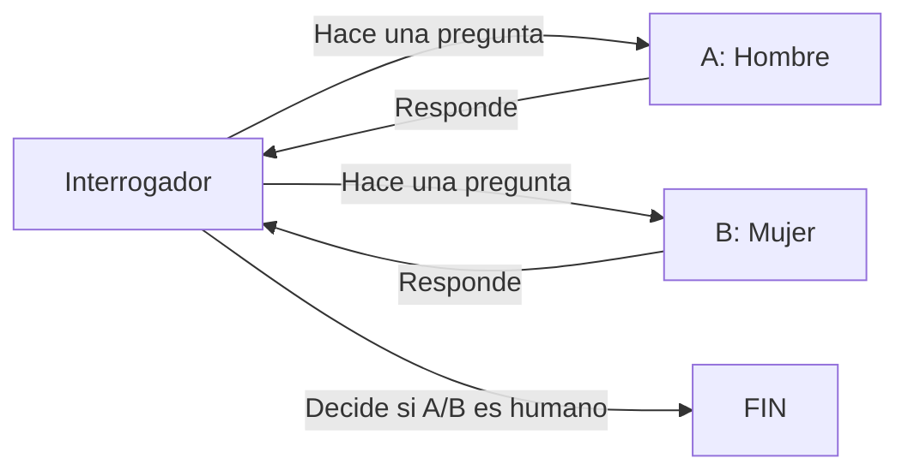
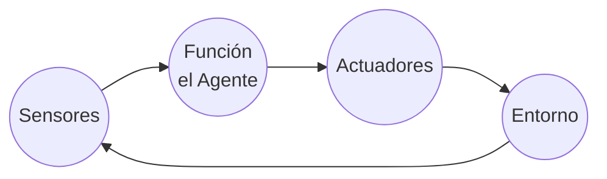
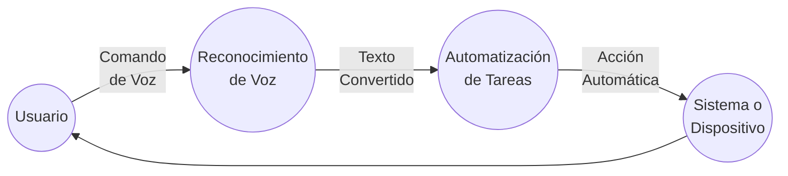
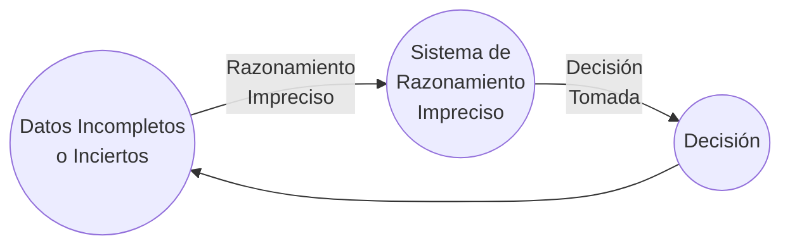
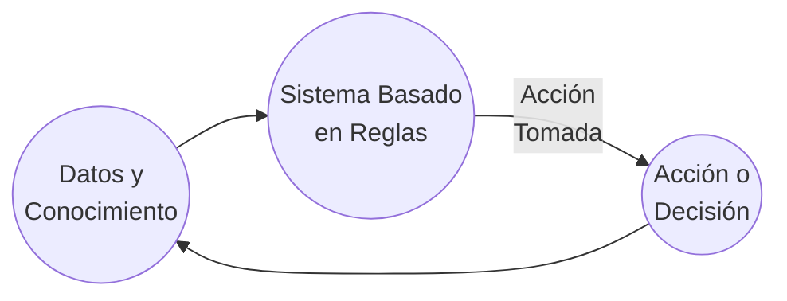
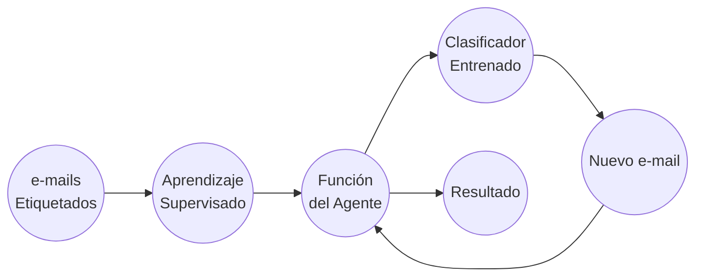
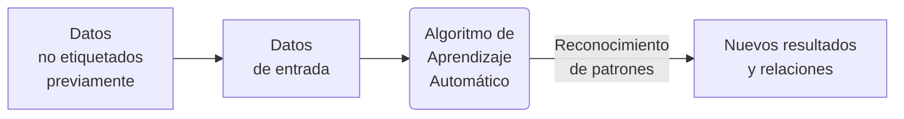

[toc]

# Fundamentos de los Sistemas Inteligentes

## Definición de Inteligencia Artificial (IA)

La Inteligencia Artificial es un campo de la informática y la ciencia de la computación que se enfoca en la creación de sistemas y programas capaces de realizar tareas que normalmente requieren inteligencia humana.

Una primera definición bastante común que podemos encontrar para la Inteligencia Artificial es:

> “Habilidad para aprender y resolver problemas, llevada a cabo por una máquina o software”

En general, la mayoría de los expertos coinciden en que es la simulación de procesos de inteligencia humana por parte de máquinas, especialmente sistemas informáticos. Estos procesos incluyen:

1. El **aprendizaje** a través de la adquisición de información y reglas para el uso de la información.
2. El **razonamiento** usando las reglas para llegar a conclusiones aproximadas o definitivas.
3. La **autocorrección**.

Una definición más concreta y consensuada podría ser:

> “La inteligencia artificial es la inteligencia llevada a cabo por máquinas. En ciencias de la computación, una máquina «inteligente» ideal es un agente flexible que percibe su entorno y lleva a cabo acciones que maximicen sus posibilidades de éxito en algún objetivo o tarea”.

En realidad, cada generación de hardware y software ha asignado este término a las arquitecturas y técnicas de vanguardia en ese momento. Es por esto que la propia definición puede ir cambiando y evolucionando a medida que se van alcanzando metas más ambiciosas. Podríamos decir que cada nueva oleada de avance tecnológico en este ámbito pasa a conformar una nueva definición de inteligencia artificial, o, al menos, añade un matiz propio a ésta.

La realidad actual es que la IA despierta tanta fascinación como desconfianza. En la gran mayoría de los casos, no se conoce bien la técnica con la que se desarrolla. Ese desconocimiento es el que favorece que se mezcle la realidad con las influencias y fantasías de lo leído y visto en novelas, series y películas.

¿Qué es realmente posible con la tecnología actual y qué sigue perteneciendo al campo de la ciencia ficción? Una habilidad que debe tener cualquier profesional del campo de la IA es, precisamente, ser capaz de explicar de forma sencilla las verdaderas amenazas que esta tecnología puede representar, y saber transmitir una imagen de responsabilidad al respecto.

>Los ordenadores (y con ellos la inteligencia artificial) no son ni buenos ni malos. Hacen lo que los humanos programamos que hagan. La inteligencia y, sobre todo, la intencionalidad que pueda tener un programa o aplicación la proporciona el humano (o equipo de humanos) que lo definen y desarrollan.

## Historia de la IA

 A lo largo de la historia, la IA ha pasado por diferentes etapas de desarrollo, con avances y desafíos significativos.

**Prehistoria de la IA o proto-IA (Antes del 1950):** En realidad, antes de 1956 ya hubo una serie de hitos científicos que podríamos considerar parte del nacimiento de la Inteligencia Artificial:

En 1943 McCulloch y Pitts presentaron un primer modelo de los podría ser una neurona artificial, publicándose en el Boletín de Biofísica Matemática con el título: “A logical calculus of the ideas immanent in
nervous activity”. Partieron de tres fuentes: conocimientos sobre la fisiología básica y funcionamiento de las neuronas en el cerebro, el análisis formal de la lógica preposicional de Russell y Whitehead y la teoría de la computación de Turing. Es por esto que se consideran los eventos más importantes en el origen de la IA (Russell, S., y Norvig, P. 2008)

En 1950, en el trabajo “Computing Machinery and Intelligence”, Alan Turing define la conducta inteligente de la máquina como la capacidad de lograr eficiencia a nivel humano en todas las actividades de tipo cognoscitivo, suficiente para engañar a un evaluador humano, y da forma al famoso “Test de Turing”. En este histórico artículo Turing propuso que la pregunta «¿puede pensar una máquina?» era demasiado filosófica para tener valor y, para hacerlo más concreto, propuso un «juego de imitación». En la prueba de Turing intervienen dos personas y una computadora. Una persona, el interrogador, se sienta en una sala y teclea preguntas en la terminal de una computadora. Cuando aparecen las respuestas en la terminal, el interrogador intenta determinar si fueron hechas por otra persona o por una computadora. Si la computadora actúa de manera inteligente, según Turing, es inteligente.  Turing continúa, "*Ahora podemos preguntar: '¿Qué sucederá cuando una máquina tome el papel de A en este juego?' ¿Decidirá el interrogador erróneamente tan a menudo cuando se juegue de esta manera como lo hace cuando el juego se juega entre un hombre y una mujer? Estas preguntas reemplazan nuestra pregunta original: '¿Pueden las máquinas pensar?'* "(Turing, 1950) La configuración de la prueba puede representarse de esta manera:

Este test puede servir, como señala Turing, no solo para probar una destreza verbal superficial, sino también el conocimiento de fondo y la capacidad de razonamiento subyacente, ya que los interrogadores pueden hacer cualquier pregunta o plantear cualquier desafío verbal que elijan. Con respecto a este test, Turing predijo famosamente que "dentro de unos cincuenta años [para el año 2000] será posible programar computadoras... para hacer que jueguen el juego de imitación tan bien que un interrogador promedio tendrá no más del 70 por ciento de probabilidad de hacer la identificación correcta después de cinco minutos de interrogación" (Turing 1950); una predicción que ha fallado notoriamente. En el año 2000, las máquinas en la competición del Premio Loebner jugaron tan mal el juego que el interrogador promedio tuvo un 100 por ciento de probabilidad de hacer la identificación correcta después de cinco minutos de interrogación (ver Moor 2001).

**Primeros Conceptos de IA (Décadas de 1950 y 1960):** El término "Inteligencia Artificial" fue acuñado por John McCarthy en 1956, durante una conferencia (Dartmouth Summer Research Conference on Artificial Intelligence) que se considera el punto de inicio oficial del campo. En dicho encuentro, John McCarthy, Marvin Minsky, Nathaniel Rochester, Claude Shannon, Ray Solomonoff, Oliver Selfridge, Trenchard More, Arthur Samuel, Herbert Simon y Allen Newell, crearon la conjetura inicial  “Every aspect of
learning or any other feature of intelligence can be so precisely described that a machine can be made to simulate it”. En esa época, los investigadores estaban entusiasmados por la idea de que las computadoras pudieran ser programadas para simular la capacidad de razonar y resolver problemas como lo hace el ser humano. Se realizaron esfuerzos iniciales para desarrollar programas que pudieran jugar al ajedrez, realizar cálculos matemáticos y comprender lenguaje natural. En esta conferencia se hicieron previsiones triunfalistas a diez años que jamás se cumplieron (como diríamos ahora "**se vinieron muy arriba**").

A partir de esta conferencia, los siguientes años, se dieron sucesivos éxitos y avances (teniendo en cuenta que entonces se contaba con computadores y herramientas de computación bastante rudimentarios) fruto de investigaciones y multitud de proyectos con grandes expectativas. Los más importantes fueron:

- Creación del LISP en 1958 por John McCarthy (será el lenguaje de programación predominante en posteriores desarrollos de Inteligencia Artificial).
- Desarrollo de Micromundos (mundo de bloques) en 1959 por Minsky y Papert en el MIT. 
- Construcción del demostrador de Teoremas de Geometría en 1959 por Herbert Gelernter.
- Investigación de los "sistemas expertos" en 1965 por Santford. 
- Lanzamiento de ELIZA en 1966 (será el primer chatbot que implementa lenguaje natural).

**La Década del Estancamiento (1970):** A finales de la década de 1960 y principios de la década de 1970, la IA experimentó una etapa de estancamiento conocida como el "invierno de la IA". Los avances prometidos no se materializaron, y las expectativas sobre lo que la IA podría lograr superaron las capacidades tecnológicas y computacionales de la época. Esto llevó a una disminución en la financiación y el interés en el campo.

**El Renacimiento de la IA (Décadas de 1980 y 1990):** En la década de 1980, la IA experimentó un resurgimiento significativo debido a avances en la teoría y la computación. Se desarrollaron nuevas técnicas de razonamiento, representación del conocimiento y búsqueda heurística. Los sistemas expertos, que utilizan reglas y conocimiento específico de dominio para resolver problemas, se convirtieron en una aplicación exitosa de la IA en campos como la medicina y la ingeniería. Se produjo una rivalidad entre Estados Unidos y Japón para ver quién investigaba y desarrollaba más aplicaciones de IA. El principal gran hito en esta etapa fue la creación de R1, el primer sistema experto comercial, en 1982 gracias a McDermott (en 4 años de implantación supuso un ahorro de 40 millones de dólares al año).

**Aprendizaje Automático y el Auge de la IA Moderna (finales de los 90 y década de 2000 en adelante):** El siglo XXI ha sido testigo de una revolución en la IA, impulsada en gran parte por el auge del Aprendizaje Automático. Con la disponibilidad masiva de datos y avances en algoritmos, las máquinas ahora pueden aprender patrones complejos a partir de datos y mejorar su rendimiento a través de la experiencia. Esto ha llevado a avances significativos en campos como la visión por computadora, el procesamiento del lenguaje natural y el reconocimiento de voz.

La consagración definitiva de la Inteligencia Artificial llegó a finales de los 90. Con los siguientes grandes hitos, que veremos con algo más de detalle:

- El programa Deep Blue desarrollado por IBM logró vencer en 1997 al campeón del mundo en ajedrez, Gari Kaspárov.

   

  Deep Blue fue una "supercomputadora" que desarrolló la empresa IBM en los años 90 del S.XX para jugar al ajedrez.

  En febrero de 1996 se enfrentaron el entonces campeón del mundo, Gary Kaspárov contra la máquina. La primera partida la ganó Deep Blue, otras tres las ganó Kaspárov y dos más quedaron en tablas. Fue la primera máquina que derrotó a un experto jugador. 

  En realidad, siendo fieles al concepto de Inteligencia Artificial, esta máquina no se puede considerar exactamente como tal, pues "solo" era capaz de calcular a gran velocidad millones de posiciones posibles por segundo, pero le faltaba "intuición". Es decir, contaba con una tremenda base de datos (posibles jugadas, movimientos, etc), pero sus programadores no fueron jugadores de ajedrez expertos, por lo que la máquina no siempre elegía la jugada óptima.

  > ¿Sabes cuántas jugadas posibles hay en el ajedrez? Son cerca de 10^120^ (diez elevado a ciento veinte... 100000000000000000000... así hasta 120 ceros). 
  >
  > Para hacerte una idea más real de la tremenda capacidad de cálculo de Deep Blue, se estima que la cantidad de átomos que existen en el Universo es de entre 10^80^ y 10^82^. 
  >
  > El ajedrez es un juego complejo... ¿no crees?
  
- El sistema Watson, también de IBM, logró ganar en 2011 el popular concurso televisivo Jeopardy! frente a los dos máximos campeones de este programa.

   

  IBM continuó investigando en el campo de la Inteligencia Artificial (a la vez que sus ordenadores aumentaban su capacidad de cómputo) y, con lo aprendido con Deep Blue y otros desarrollos, creó Watson, una computadora que logró en 2011 ganar en Jeopardy!, uno de los concursos de conocimiento más famosos en Estados Unidos.

  Watson era un sistema capaz de comprender y responder preguntas, en lenguaje natural (es decir, expresadas como habla cualquier humano, con variaciones y diferentes formas de expresar la misma idea). Contaba con una base de datos almacenada localmente (sin conexión a Internet) compuesta de enciclopedias, diccionarios, tesauros, artículos de noticias, obras literarias y otras bases de datos complementarias).

- La empresa Deep Mind publicó "el vídeo de los 500 millones de dólares". En dicho vídeo mostraba cómo la red neuronal que había desarrollado aprende a jugar al Arkanoid de manera autónoma. Google acabó comprando esta empresa en 2014 por 500 millones de dólares (de ahí el nombre del vídeo).

   

   https://www.youtube.com/watch?v=V1eYniJ0Rnk

   DeepMind, una compañía inglesa creada en 2010, publicó a los pocos años de su creación el que se denominó "El vídeo de los 500 millones de dólares". En dicho vídeo (que puedes ver más arriba) mostraba cómo su Inteligencia Artificial había aprendido a jugar gracias a la técnica de entrenamiento autónomo (Machine Learning) por refuerzo al "Arkanoid" (un juego arcade del S.XX).

   La red neuronal que desarrolló "aprendía" a jugar como un humano (con memoria a corto plazo, aplicando lo aprendido en cada partida a las siguientes). Así, en el vídeo podemos ver cómo en las primeras partidas descubre cómo debe mover para evitar perder. Mas adelante aprende a ganar puntos destruyendo ladrillos, y a "ganar" la partida alcanzando la máxima puntuación. Y finalmente "descubre" que si logra colar la pelota por un lateral hasta la parte superior de la pantalla gana en mucho menos tiempo.

   Al poco tiempo de publicarse este vídeo recibió oferta de compra de Facebook, que no se materializó, y acto seguido de Google, que la compró por 500 millones de dólares (de ahí el nombre del vídeo).

   Ya dentro de la matriz de Google continuaron profundizando en las técnicas de Aprendizaje Automático, logrando otro hito, como veremos más adelante.

- Google liberó Tensor Flow, su librería para Machine Learning, en 2015, permitiendo que cualquier persona pudiera acceder a sus servidores y crear su propio equipo con capacidad de autoprogramación y de aprender de forma autónoma.

   

   https://www.youtube.com/watch?v=oZikw5k_2FM

   En noviembre de 2015 Google liberó TensorFlow, el programa de Inteligencia Artificial que había desarrollado mejorando un sistema de aprendizaje automático anterior conocido como DistBelief.
   Fue la primera vez que se ponía a disposición de cualquier usuario, investigador o empresa interesados en realizar sus propios experimentos de Inteligencia Artificial. Supuso un gran impulso tanto en el campo de la investigación (la propia comunidad de desarrolladores ayudó y sigue ayudando a mejorar y perfeccionar la herramienta) como en el de la democratización de la Inteligencia Artificial, haciéndola accesible para todos.

   En la actualidad sigue utilizándose tanto para primeras aproximaciones al universo de la IA, como para desarrollar prototipos o ejercicios más complejos. 

- La IA de AlphaGo de Google sorprendió a todos proponiendo en una partida de Go una jugada que nunca hubiera hecho un experto jugador humano... que en pocos movimientos más le dió la victoria.

   

   Trailer: https://www.youtube.com/watch?v=8tq1C8spV_g

   Documental completo: https://www.youtube.com/watch?v=WXuK6gekU1Y

   Con subtitulos en español: https://www.youtube.com/watch?v=GIJ7zr4sYx4

   Si jugar al ajedrez es complicado... el juego Go (de origen también oriental) lo es todavía más. La división de Google Deep Mind desarrolló una Inteligencia Artificial capaz de jugar a este juego. Pero la diferencia respecto a logros previos alcanzados por programas de IA capaces de jugar (al ajedrez, a un concurso de preguntas y respuestas...) es que lo hacía "con intuición".

   En marzo de 2016 AlphaGo se enfrentó a Lee Sedol, que era uno de los mejores jugadores del momento. Ganó AlphaGo. Pero además lo hizo con una jugada (el movimiento 37 de esa partida) completamente inesperado y que ningún experto jugador humano hubiera hecho nunca. Es decir, que aunque la máquina estaba entrenada con registros de partidas reales jugadas por expertos, no siguió ninguna estrategia observada en su base de datos (contaba con 50 millones de partidas de Go entre humanos). Había aprendido a jugar "con intuición": aprendió de los ejemplos "humanos" pero descubrió formas de jugar nuevas (¡y eficaces!). La cara que se le puso a Lee Sedol al observar y analizar el movimiento de la máquina en ese turno 37 de la partida se hizo famoso.

- Ian Goodfellow presentó en 2014 su generador de imágenes basado en lo que conocemos como red GAN, logrando que un humano no sepa distinguir si se trata de imágenes reales o inventadas.

   Las redes GAN (Generative Adversarial Networks) o generativas antagónicas presentadas por Ian Goodfellow en 2014 han permitido generar fotografías que parecen auténticas a cualquier observador humano. 

   Posteriormente este tipo de técnica (Aprendizaje Automático Supervisado, que veremos más adelante) también se ha aplicado a la generación de textos tal y como los escribiría un humano.

   En esencia las redes GAN se componen de una red generadora (que crea la imagen, texto o diseño) y una red discriminadora (que determina si el resultado de la red generadora es aceptable o no). Ambas redes "compiten" entre ellas (la primera para "engañar a la segunda, y la segunda para detectar fallos en lo generado por la primera). El sistema se retroalimenta y perfecciona con cada iteración.

   >En esta web se muestra, cada vez que actualizas la página, la imagen de un rostro humano generado por IA: https://thispersondoesnotexist.com/. En algunos casos se notan cosas raras (en las pupilas, orejas, o fondos), pero en general suelen salir rostros que bien podrían corresponder con personas reales ¡Pero en realidad esas personas no existen!

- Desarrollo de GPT3 por OpenAI a través de técnicas de Deep Learning.

   GPT-3 es la tercera generación del Modelo de Predicción del Lenguaje que ha sido presentada en mayo de 2020. Se trata de una Inteligencia Artificial "educada" para escribir cualquier tipo de texto, con cualquier tipo de estilo. A partir de unas pocas palabras que le proporcionas explicando qué es lo que quieres te devuelve un texto complejo que trata sobre lo que le hayas pedido.

   Lo más importante de esta tecnología son los 175 Billones de parámetros que utiliza la para conseguir dar textos naturales (con aspecto de haber sido escritos por humanos).

**Aprendizaje Profundo (Deep Learning):** El Aprendizaje Profundo, una rama del Aprendizaje Automático, ha sido uno de los desarrollos más destacados en la IA moderna. Las redes neuronales profundas, inspiradas en la organización del cerebro humano, han demostrado ser altamente efectivas en tareas como el reconocimiento de imágenes, la traducción automática y el juego de estrategia. La escalabilidad de los algoritmos de Aprendizaje Profundo, junto con la disponibilidad de potentes unidades de procesamiento gráfico (GPU), ha impulsado el rápido progreso en el campo.

**IA en la Sociedad Actual:** En la actualidad, la IA ha permeado en diversas áreas de nuestra vida cotidiana. Está presente en aplicaciones como motores de búsqueda en línea, asistentes virtuales, recomendaciones de productos y servicios, sistemas de navegación, automóviles autónomos y mucho más. La IA también está siendo utilizada en campos como la medicina para el diagnóstico y tratamiento, en finanzas para la detección de fraudes y en la industria para optimizar procesos de producción.

**Desafíos Actuales y Futuros:** Aunque la IA ha logrado avances impresionantes, todavía enfrenta desafíos significativos. Uno de ellos es la interpretabilidad y explicabilidad de los modelos de IA, especialmente en aplicaciones críticas donde las decisiones pueden tener un impacto importante en las vidas humanas. Otro desafío es el sesgo en los datos y la falta de diversidad, lo que puede llevar a resultados injustos o discriminatorios. A medida que la IA continúa avanzando, es esencial abordar estos desafíos y asegurar que su desarrollo y aplicación se realicen de manera ética y responsable.

> ¿La Inteligencia Artificial es buena o mala? 
>
> Piensa en diferentes momentos históricos en los que la humanidad ha desarrollado alguna tecnología: El dominio del fuego, la rueda, el hormigón, la pólvora, la imprenta, la radio, Internet...
>
> La tecnología en sí misma no es ni buena ni mala. Son las personas que la conocen y controlan quienes pueden hacer un uso beneficioso o dañino de ellas.
>
> ¿Te suena la frase "Un gran poder exige una gran responsabilidad"? La IA nos da un poder tan grande (o mayor) que el Spiderman... Hemos de ser responsables al utilizarla.

## El futuro de la IA

Los campos en los que más se ha desarrollado y aplicado la IA en estos últimos años son:

- Sistemas autónomos
- Aprendizaje Autónomo (Machine Learning)
- Aprendizaje Profundo (Deep Learning)
- Redes neuronales.
- Reconocimiento de patrones
- Procesado del lenguaje natural
- Desarrollo de chatbots
- Reconocimiento de emociones

En la actualidad se está trabajando (y se esperan mejoras en los próximos años) en campos como:

- Asistentes virtuales
- Traducción simultánea universal.
- Control de juegos con el pensamiento.

Y a medio plazo se prevé que la Inteligencia Artificial proporciones soluciones y mejoras en los siguientes ámbitos:

- Nueva generación de robots interconectados con la nube.
- Robots médicos autónomos.
- Asistentes personales robóticos.
- Ciber-Seguridad cognitiva.

Y a largo plazo se vislumbra que puedan llegar a desarrollase computadoras robóticas con forma y comportamiento humano.

**Inversión en proyectos de IA**

Como hemos visto la Inteligencia Artificial ya está demostrando de manera práctica los beneficios que puede proporcionar a empresas e instituciones. Las empresas tecnológicas fueron pioneras hace pocos años al incorporar en sus procesos y productos estas aplicaciones. Y en la medida en que todo el entramado empresarial y social se está digitalizando, la posibilidad de incorporar tecnologías inteligentes en cualquier sector está al alcance de casi cualquiera.

De hecho, en los últimos años la Inteligencia Artificial es el primer o segundo ámbito en el que más dinero están dispuestas a invertir las empresas (por delante de otras tecnologías emergentes como Internet de las Cosas, o los datos en la nube). En el siguiente gráfico puedes ver el nivel de financiación que se preveía dedicar en 2022 a incorporar y desarrollar Inteligencia Artificial en un grupo de empresas analizado por Gartner.

fuente: https://www.gartner.com/en/newsroom/press-releases/2021-09-29-gartner-finds-33-percent-of-technology-providers-plan-to-invest-1-million-or-more-in-ai-within-two-years

## Limitaciones Prácticas Actuales

Aunque muchos de los argumentos filosóficos y científicos en contra de la inteligencia artificial pueden abordarse con respuestas lógicas, teóricas o basadas en la evidencia, es importante reconocer que existen limitaciones prácticas actuales en el campo de la IA que aún no se han superado por completo. Algunas de estas limitaciones incluyen:

1. **Complejidad de la mente humana:** La mente humana es increíblemente compleja, y aún no comprendemos completamente todos los aspectos de cómo funciona. La IA actual está lejos de replicar la complejidad y la plasticidad del cerebro humano.
2. **Memoria y recursos limitados:** Aunque las capacidades de almacenamiento y procesamiento de las computadoras han aumentado drásticamente, todavía estamos lejos de igualar la capacidad de almacenamiento y la eficiencia de procesamiento del cerebro humano.
3. **Falta de comprensión de la conciencia:** A pesar de los avances en neurociencia y cognición, aún no entendemos completamente la naturaleza de la conciencia y cómo emerge en el cerebro. Sin esta comprensión, es difícil replicarla en una máquina.
4. **Ética y responsabilidad:** La creación de inteligencia artificial plantea cuestiones éticas y de responsabilidad importantes, como el temor a la toma de decisiones no éticas o la falta de responsabilidad en caso de errores graves.
5. **IA en entornos no controlados:** La IA puede funcionar bien en entornos controlados y con datos bien estructurados, pero tiene dificultades para adaptarse a situaciones inesperadas o entornos no controlados.
6. **Creatividad e intuición:** Aunque se han logrado avances en la generación de contenido creativo por parte de las máquinas, la verdadera creatividad e intuición humana siguen siendo difíciles de replicar.
7. **Emociones y empatía:** La comprensión y expresión emocional, así como la empatía, son aspectos desafiantes de la inteligencia humana que no se han logrado de manera completa en la IA.
8. **Interacción social humana:** La comprensión del lenguaje natural, la interacción social y la percepción de matices emocionales en el contexto de la comunicación humana son desafíos actuales para la IA.

Es importante tener en cuenta estas limitaciones y reconocer que la IA actual está lejos de igualar la inteligencia humana en todos sus aspectos. Sin embargo, esto no implica que no haya avances significativos en el campo de la IA, ni que no se puedan superar algunas de estas limitaciones en el futuro. 

Como cualquier campo de investigación, la IA continuará evolucionando y enfrentando desafíos a medida que avanza hacia una inteligencia más avanzada.

## Principios de Sistemas Inteligentes

Así pues, puede entenderse por sistema informático el conjunto de cosas (hardware y software) y al conjunto de reglas (procedimientos) que de manera conjunta se emplean para el fin último de adquirir, almacenar, procesar y representar la información de manera automatizada.

> El hardware incluye computadoras o cualquier tipo de dispositivo electrónico, principalmente constituido alrededor de semiconductores como memoria, procesadores, sistemas de almacenamiento externo, etc.
>
> El software incluye al sistema operativo, firmware y aplicaciones. También se puede considerar parte del sistema a quien hace uso del hardware: los programadores y los usuarios.

La potencia y eficacia de un sistema de la información radica en la correcta correlación de una gran cantidad de datos ingresados mediante procesos específicos para cada campo o tarea, con el objetivo de producir información para la posterior toma de decisiones. Un sistema informático se destaca por su diseño, facilidad de uso, flexibilidad, mantenimiento automático de los registros, apoyo en la toma de decisiones críticas y la conservación del anonimato en informaciones irrelevantes. 

Por todo ello, si la inteligencia artificial es un subconjunto de la informática (en el sentido de computación o ciencia de las tecnologías de la información), un sistema de inteligencia artificial ha de ser por extensión un subconjunto dentro de los sistemas informáticos.

Se denominará, por tanto, sistema inteligente a un programa o conjunto de programas de computación que reúne características y comportamientos asimilables al de la inteligencia humana o animal.

Para que un sistema informático pueda ser considerado un sistema inteligente, habrá de tener las características que se enumeran a continuación:

1. En primer lugar y como clara obviedad el sistema debe poseer inteligencia, entendiendo como ello el ser un sistema inteligente.

2. El hecho de ser un sistema implica que ha de disponer de sistematización entre sus componentes, es decir, las partes del sistema han de tener correlaciones con otros elementos del mismo sistema.

3. El sistema ha de ser capaz de cumplir uno o varios objetivos, o sea, una cierta situación, condición o estado que el sistema inteligente busca lograr.

4. El sistema ha de disponer de capacidad sensorial, para ello ha de tener una parte que sea capaz de recibir comunicaciones del entorno: el sistema inteligente ha de poder reaccionar ante el entorno y sus variaciones, lo que se consigue normalmente mediante sensórica.

5. El sistema ha de exhibir capacidad de conceptualización (entendiendo como concepto al elemento básico del pensamiento), lo que implica la necesidad de poder almacenar información. Para poder conceptualizar es necesario el desarrollo de niveles de abstracción.

6. El sistema ha de disponer de procedimientos y métodos con reglas de actuación, por tanto, el sistema ha de ser capaz de relacionar situaciones y consecuencias de acciones.

7. Un sistema inteligente completo ha de disponer de capacidad  de almacenamiento en memoria, lo que está muy ligado a la conceptualización.

8. Este hecho alude a que el sistema ha de poder contar con el almacenaje físico de conceptos y reglas de actuación, el sistema ha de 1 poder aprender a base de la experiencia.

9. El aprendizaje es la capacidad más importante y exclusiva de un sistema inteligente. El sistema aprende nuevos conceptos a partir de la información recibida de los sentidos, las reglas conocidas y la experiencia. El aprendizaje también es la capacidad de detectar relaciones (patrones) entre la «situación» y la parte «situación futura» de una regla de actuación.

  > Los primeros sistemas inteligentes, como los sistemas de expertos, no cumplen todas estas
  > características por lo que reciben el nombre de sistemas de inteligencia incompletos.

La inteligencia artificial (IA) es un área de cambio social, que transforma rápidamente los hábitos y costumbres de las sociedades, y por ello ha de prestarse mucha atención a sus posibilidades, y marcar una serie de límites éticos. Los principios fundamentales o empleos éticos de la IA son los siguientes:

1. La IA debe estar libre de prejuicios, tanto en el caso inferencia como en el entrenamiento. Entrenar datos de manera equivocada puede generar discriminantes negativas que alejan la toma de decisiones de la realidad. Además, en conjunto, toda IA debe programarse de manera que no se usen conjuntos sesgados, y evitar discriminaciones algorítmicas por medio de métricas imparciales avaladas por expertos humanos. Aunque parece algo lejano, se introducen continuamente sesgos en el aprendizaje de las IA, muchas veces de manera involuntaria e inadvertida. Por ejemplo, sistemas
2. de ayuda médica entrenados en varones blancos de entre 30 y 50 años de edad podrán dar resultados buenos sobre el grupo para el que se ha desarrollado, pero pueden actuar no tan correctamente en otras categorías.
3. Ayudar a ayudar. Se debe de identificar de forma clara la responsabilidad de las decisiones tomadas por los sistemas autónomos. Los usuarios de las IA, especialmente en caso de grandes corporaciones y gobiernos, han de aprender a estimar y evaluar las consecuencias positivas y negativas de la implantación de sistemas de inteligencia artificial, en la sociedad en su conjunto, dado el gran poder de cambio que generan.
4. Uso de algoritmos abiertos. Para poder confiar en la respuesta de una IA es preciso tener acceso limpio al algoritmo de entrenamiento y de toma de decisiones que posee, lo que comporta acceso a todo su modelo matemático. Supone la única manera de poder explicar el funcionamiento que
   tendrá la misma.
5. Seguridad, privacidad y confiabilidad. Dado que las IA hacen uso de gran cantidad de datos, se ha de velar por la transparencia y la privacidad en el uso de los mismos. Por ejemplo, un asistente virtual ha de garantizar que las conversaciones escuchadas no se filtrarán ni difundirán a terceros.
6. Bien común. Ningún sistema de IA debería ser desplegado si al hacerlo se atenta contra el bien común.

Los agentes inteligentes son entidades capaces de percibir su entorno a través de sensores y actuar en él mediante efectores para alcanzar objetivos específicos. Un agente puede ser tan simple como un programa que juega ajedrez o tan complejo como un vehículo autónomo que navega por las calles de una ciudad. Los agentes inteligentes se basan en la idea de que una "inteligencia" puede emerger de la interacción entre un sistema y su entorno, sin necesidad de una planificación o conocimiento exhaustivo previo.

**Componentes de un Agente Inteligente:**

1. **Sensores (S)**: Los sensores son dispositivos que permiten al agente percibir información sobre su entorno. Pueden incluir cámaras, micrófonos, sensores de temperatura, GPS, entre otros. La información que los sensores recopilan se utiliza para representar el estado actual del entorno.
2. **Actuadores (A)**: Los actuadores son los medios mediante los cuales el agente interactúa con su entorno. Pueden ser ruedas en un robot, motores en un brazo robótico o simplemente salidas de datos en un sistema de software. Los actuadores permiten que el agente tome decisiones y realice acciones para alcanzar sus objetivos.
3. **Función del Agente (f)**: La función del agente representa el comportamiento del agente en función de las percepciones que recibe. Toma como entrada el estado actual del entorno y devuelve una acción que el agente debe ejecutar. Esta función puede ser simple o compleja, dependiendo de la complejidad de la tarea que el agente debe realizar.
4. **Arquitectura (A)**: La arquitectura del agente se refiere a cómo se organiza el agente en términos de sus componentes y cómo interactúan entre sí. Puede haber diferentes arquitecturas según la complejidad de la tarea y los requisitos de rendimiento.

**Ejemplo de un Agente Inteligente:**

Un ejemplo sencillo de un agente inteligente es un sistema de navegación GPS en un automóvil. En este caso:

- **Sensores (S)**: El sistema de navegación utiliza sensores GPS para recibir información sobre la ubicación actual del automóvil y sensores de velocidad para conocer su velocidad y dirección.
- **Actuadores (A)**: Los actuadores son los mecanismos que permiten al sistema de navegación proporcionar instrucciones al conductor para alcanzar el destino deseado, como la pantalla de navegación o las indicaciones de voz.
- **Función del Agente (f)**: La función del agente en este caso podría ser bastante simple: recibir la ubicación actual y el destino deseado, calcular la ruta más rápida y segura y guiar al conductor a lo largo del camino.
- **Arquitectura (A)**: La arquitectura del sistema de navegación podría ser una combinación de algoritmos de planificación de rutas, sistemas de reconocimiento de voz para recibir comandos del conductor y sistemas de visualización para mostrar las indicaciones.

A continuación, un diagrama en mermaid para ilustrar la interacción de un agente inteligente con su entorno:

En el diagrama, los sensores recopilan información del entorno, que se utiliza como entrada para la función del agente. La función del agente procesa la información y toma una decisión sobre qué acción ejecutar. Luego, los actuadores implementan la acción en el entorno, lo que puede cambiar su estado. El ciclo se repite continuamente, permitiendo al agente inteligente interactuar y adaptarse a su entorno para lograr sus objetivos.

# Tipos de Inteligencia Artificial. Escuelas y clasificaciones

En la actualidad la evolución de la Inteligencia Artificial comprende un campo tan amplio, con tantas ramas, que es complicado poder atender a una única clasificación. De hecho encontramos diferentes clasificaciones según la diferente visión con la que se aborda dicha tecnología. Las hay más filosóficas, más técnicas, y según su aplicación. A lo largo de este tema vamos a conocer las más comunes y aceptadas.

Pero antes de entrar en materia es importante volver a insistir en que nos encontramos en un nivel de desarrollo de la Inteligencia Artificial bajo. Sabemos, o nos imaginamos, que en algún momento esta ciencia nos permitirá resolver problemas o ejecutar tareas que ahora mismo no puede. Así pues, dentro de las distintas clasificaciones que vamos a ver, hay algunas tipologías que están definidas "en teoría" aunque aún no exista ninguna aplicación IA de esa clase.

## Según Tareas a resolver

La primera clasificación de la Inteligencia Artificial que vamos a ver se basa en qué tipo de tareas nos ayuda a resolver o ejecutar.

Cuando hablamos de tarea a resolver nos referimos, por ejemplo, a si pretendemos que la IA sea capaz de jugar al ajedrez en un ordenador o si pretendemos que sea capaz de gestionar una cocina sin intervención humana (desde el abastecimiento de alimentos, procesado, decisión de qué cocinar en cada momento, limpieza y mantenimiento de utensilios, resolver imprevistos o accidentes...).

Hay tareas sencillas, concretas, y puntuales que son relativamente sencillas de programar, mientras que hay tareas complejas en las que, además influyen muchos factores exteriores (sentimientos, contexto, moral, ética, creencia religiosa...).

Seguro que eres capaz de ir intuyendo que nuestros programas de Inteligencia Artificial actuales son más bien de los que resuelven tareas en un entorno muy concreto y acotado, mientras que hay que irse a las películas o series de ficción para poder hablar de algún caso de Inteligencia Artificial capaz de actuar en escenarios complejos, cambiantes y con "conciencia".

Esta clasificación según tareas es una aproximación bastante simple, con dos opciones:

- IA Fuerte.
- IA Débil.

Como veremos en la explicación más detallada de cada una de estas dos posibles categorías de Inteligencia Artificial, en la actualidad aún no hemos sido capaces de desarrollar ninguna IA Fuerte. Todo lo que conocemos en este momento quedaría dentro de la clasificación de IA Débil.

Vamos a ver qué características tienen (o tendrán) las IA según esta clasificación.

### Inteligencia Artificial Débil (o estrecha)

También conocida como IA estrecha,se define como la inteligencia artificial racional que se centra típicamente en una tarea estrecha . Es decir orientada a resolver problemas muy concretos, en un entorno perfectamente acotado. 

Por tanto consideramos que este tipo de Inteligencia Artificial débil es limitada, pues no es capaz de adaptarse o asumir cambios respecto a lo que se le ha programado. 

Los asistentes virtuales (Siri, Ok Google, Alexa, etc.) son un ejemplo bastante ilustrativo de hasta dónde es capaz de llegar la Inteligencia Artificial débil. Cualquiera de ellos opera dentro de un rango de respuestas limitado, definido en su base de datos. En realidad "la máquina" no tiene inteligencia genuina. No es capaz de aprender, ni de tener en cuenta el entorno o el contexto en el que se le realizan las preguntas. No tiene conciencia, ni mucho menos vida propia. Sin duda es un tipo bastante sofisticado de IA débil, pero llega un punto en el que no es capaz de responder cierta clase de preguntas, y, salvo que cambiáramos su base de datos y programación nunca sería capaz de llegar a encontrar por sí misma respuestas adecuadas a dichas preguntas.

De hecho, uno de los principales entretenimientos más habituales cuando nos ponemos "a charlar" con un asistente virtual es intentar llevarla al límite... A ver en qué tipo de pregunta, cada cual más compleja o absurda, es incapaz de responder. O, sin llegar al límite de no encontrar respuesta, puede llegar a dar respuestas molestas o inadecuadas.

Desde el punto de vista de esta clasificación (por tarea a resolver), las características de la Inteligencia 

Artificial débil son:

- Ya existen en la vida real: Como hemos comentado, los asistentes virtuales, programas como Watson o Alpha Go que vimos en la unidad anterior. 
- Se orientan a resolver problemas muy concretos: El programa que "sabe" jugar al Go, no sabe hacer otra cosa. Ni tiene posibilidades de aprender a jugar a otra cosa, por muy similar que sea.
- Son reactivas: No tienen iniciativa, es necesario que se desencadene la acción que tienen programada para que se inicie su rutina. En el ejemplo del asistente virtual, tiene programado responder cuando le preguntas, y por tanto nunca tomará la iniciativa de ofrecerte nada sin que tú lo actives previamente.
- No son flexibles: Colapsan si se encuentran en un caso no previsto en su programación.
- Quedan limitadas por lo que programa un humano: Es el humano quien programa lo que "tiene que pensar" la máquina. Si el humano no programa deja sin considerar ciertas opciones o posibles situaciones, la IA nunca será capaz de suplirlo o aprenderlo sobre la marcha por sí misma.
- Se programan con pocas redes neuronales: Hablaremos más adelante sobre las redes neuronales. 
- Por el momento es suficiente entender que el nivel de computación compleja que requieren este tipo de Inteligencias Artificiales es menor que otros casos. 
- No razonan, solo computan: No tienen en cuenta ningún factor moral, contextual, circunstancial, emocional... que a un humano le haría reaccionar de manera diferente. 
- La máquina está programada para alcanzar tal objetivo o funcionar de tal manera, y así lo hará sin "entender" lo que está haciendo. Por tanto: no tiene conciencia.
- Aprenden a base de ejemplos: Necesita conocer muchos ejemplos de lo que tiene que hacer (la base de datos), con todas las variantes posibles. Por ejemplo, en la máquina que juega al Go, se la "entrenó" con 50 millones de partidas de dicho juego.
- Son repetitivas: No se cansan nunca, son implacables, siempre la misma rutina. No salen de su marco de trabajo: Y esto supone que pueden ocuparse de tareas mecánicas, repetitivas, "aburridas" para sustituir al humano mejorando rendimiento y precisión. Pero necesitará siempre una supervisión humana que vaya decidiendo cómo adaptar el programa a las cambiantes circunstancias.

Según se mire la Inteligencia Artificial débil podría llegar a ser peligrosa. Porque este tipo de IA, al no tomar en consideración todo un contexto amplio, ni seguir las reglas sociales, éticas,... ejecuta las tareas para las que se le ha entrenado con eficacia y contundencia. No evalúa las consecuencias como lo hacemos los humanos, considerando un espectro amplio de efectos y relaciones. Por eso, es una opción incompleta, inestable y peligrosa si no se utiliza con prudencia, o si quien la programa pretende, precisamente, causar mal.

### Inteligencia Artificial Fuerte

La Inteligencia Artificial fuerte (IAF) o general o (IAG), desde el punto de vista de la tarea a resolver, sería aquella que iguala o excede la inteligencia humana promedio. Sería capaz de realizar con éxito cualquier tarea intelectual del ser humano, teniendo en cuenta todos los factores y matices que pueden intervenir cuando una persona toma decisiones en cada momento mientras realiza una tarea.

No existe todavía ninguna máquina que se pueda considerar completamente IA fuerte. Salvo en algunas películas o series de televisión.

En comparación con la Inteligencia Artificial débil, las características de la fuerte son:

- No existe en la realidad: Si quieres "ver" cómo sería puedes recurrir a personajes de ficción como T-800, Wall-E o J.A.R.V.I.S. Resolverán problemas abiertos: Deberían poder abarcar múltiples posibles tareas, distintas unas de otras (reparar una puerta, ir a recoger a los niños del colegio, regar las plantas, darte conversación...).
- Serán proactivas: En función de la misión u objetivo que tenga, y de las circunstancias, iniciará cualquier tipo de rutina sin esperar a que un humano se lo pida o esté pendiente.
- Serán flexibles: Podrán encontrar similitudes entre algo que conocen y algo que se le parezca un poco. Por ejemplo, aunque inicialmente solo haya sido programada para saber andar, será capaz de aprender a correr sin necesidad de intervenir en su programa.
- Se autoprogramarán: Serán capaces de detectar sus propios límites y se regularán a sí mismas para no excederlos.
- Usarán muchas redes neuronales: Y además podrán entrar en conflicto entre ellas en algunas ocasiones. Esto quiere decir que necesitarán una capacidad de almacenaje de información y cómputo que aún hoy no hemos llegado a alcanzar.
- Imitarán el comportamiento humano: Serán capaces de razonar, y por tanto, de alcanzar algún tipo de consciencia.
- Aprenderán como las personas: Podrán recordar datos, observar nuevas situaciones y encontrar relaciones entre diferentes acciones. Esto quiere decir que si saben jugar al ajedrez y "observan" el juego de las damas, podrán aprender a jugar a las damas basándose en lo que saben sobre jugar al ajedrez.
- Serán capaces de aprender nuevas tareas: Modificarán la tarea o cómo realizan la tarea para adaptarse a las circunstancias. 
- Serán capaces de adaptarse a nuevos escenarios: Podrán adaptarse a cambios y nuevas situaciones para seguir cumpliendo su objetivo.

Este tipo de IA es la que sería capaz de analizar cualquier situación y deducir el conjunto de acciones más adecuado para dicha situación y contexto. Lo mismo sabría conducir un coche, que resolver una ecuación matemática o mantener una conversación sobre un tema concreto.

Aunque aún no existe este tipo de IA, todas las empresas e instituciones dedicadas a la investigación y desarrollo de IA están buscando formas de avanzar hacia este tipo de Inteligencia Artificial. De momento, al menos, se está trabajando en conseguir una IAF en el campo de los asistentes virtuales.

Sin duda uno de los ámbitos más ambiciosos de aplicar esta IAF (los asistentes virtuales humanoides) necesitan contar también con otras ramas científicas como son la robótica y mecatrónica.

## Escuelas de Pensamiento.

En el ámbito de la Inteligencia Artificial más moderna podemos encontrar dos escuelas de pensamiento:

- Inteligencia Artificial Convencional.
- Inteligencia Artificial Computacional.

Estas dos escuelas difieren en la ciencia que hay tras los procesos que siguen para llegar a los resultados esperados. Pero, con los avances que se están dando en los recursos que utiliza la segunda, muchas de las aplicaciones que tenía la primera, están siendo llevadas al campo computacional.

### Inteligencia Artificial Convencional

Se conoce también como Inteligencia Artificial simbólico-deductiva. Está basada en el análisis formal y estadístico del comportamiento humano ante diferentes problemas:

- Razonamiento basado en casos: Ayuda a tomar decisiones mientras se resuelven  ciertos problemas concretos y, aparte de que son muy importantes, requieren de un buen funcionamiento.
- Sistemas expertos: Infieren una solución a través del conocimiento previo del contexto en que se aplica y ocupa de ciertas reglas o relaciones.
- Redes bayesianas: Propone soluciones mediante inferencia probabilística.
- Inteligencia artificial basada en comportamientos: Esta inteligencia contiene autonomía y puede auto-regularse y controlarse para mejorar.
- Smart process management: Facilita la toma de decisiones complejas, proponiendo una solución a un determinado problema al igual que lo haría un especialista en dicha actividad.

Esta rama de la Inteligencia Artificial ha sido la que ha proporcionado la mayoría de algoritmos que conocemos como “automatización”, y básicamente se sirven de sistemas con reglas condicionales y estadística avanzada.

### Inteligencia Artificial Computacional

La Inteligencia Computacional (también conocida como IA subsimbólica-inductiva) implica desarrollo o aprendizaje interactivo (por ejemplo, modificaciones interactivas de los parámetros en sistemas de conexiones). El aprendizaje se realiza basándose en datos empíricos, utilizando métodos computacionales inspirados en procesos de la naturaleza, que permiten alcanzar soluciones aptas a problemas complejos que los modelos tradicionales no pueden resolver por no existir una solución analítica, por no contar con todos los parámetros necesarios o porque el problema es en sí estocástico y precisa de una aproximación envolvente en vez de convergente.

Esta corriente ha sido la que impulsó hace pocos años lo que conocemos como “Aprendizaje Automático” o “Machine Learning”, que es la técnica que más se está utilizando actualmente en desarrollos de IA. 

Algunas técnicas de esta escuela son:

- Máquina de vectores soporte: sistemas que permiten reconocimiento de patrones genéricos de gran potencia.
- Redes neuronales: sistemas basados en redes de unidades de computación lineal para simular computación no lineal
- Modelos ocultos de Markov: aprendizaje basado en dependencia temporal de eventos probabilísticos.
- Sistemas difusos: técnicas para lograr el razonamiento bajo incertidumbre 
- Computación evolutiva: también conocidos como algoritmos genéticos, aplica conceptos inspirados en la biología, tales como población, mutación y supervivencia del más apto para generar soluciones sucesivamente mejores para un problema.

## Clasificación Hintze

Stuart J. Russell y Peter Norvig, investigadores informáticos, publicaron en 1995 su libro “Artificial Intelligence: A Modern Approach”, que se ha convertido en el libro de texto fundamental en cientos de universidades a nivel mundial (ya lleva varias ediciones publicadas). Plantean cuatro categorías básicas partiendo de un enfoque de génesis del acto inteligente, del origen y proceso por el cual se llega al comportamiento inteligente.

Sistemas Cognitivos: Piensan como humanos, intentan emular el proceso humano → Proceso de toma de decisiones, resolución de problemas, y el propio paradigma del aprendizaje.

Test de Turing: Actúan como humanos, intentan emular el comportamiento humano (sin pasar por el pensamiento o razonamiento que conduce a dicho comportamiento) → A nivel práctico se aplica en la robótica y sistemas de actuadores en el mundo físico.

Leyes del pensamiento: Piensan con razonamientos. Cumplimiento exacto de las leyes del razonamiento lógico, teniendo en cuenta todos los factores que afectan a la cuestión. No hemos llegado a esto aún. Sería el caso de los sistemas expertos. Solo son posibles aproximaciones para campos de investigación muy especializados y acotados.

Agentes inteligentes: Actúan racionalmente (sin pasar por el proceso de razonamiento lógico).

Los dos últimos requieren una capacidad de cómputo muy importante, a veces, aún, inaccesible.

En noviembre de 2016, Arend Hintze, profesor de la Universidad de Michigan e investigador en el campo de la Inteligencia Artificial, escribió un artículo titulado: “Understanding the four types of AI, from reactive robots to self-aware beings” (Comprendiendo los cuatro tipos de IA, desde los robots reactivos a los seres auto-conscientes), en el que sintetizaba toda la evolución de los últimos desarrollos y avances en materia de Inteligencia Artificial para aportar una clasificación más realista y concreta para los tipos de entidades que existen o que se aspira a crear.

### Máquinas reactivas

Los tipos más básicos de sistemas de IA son puramente reactivos. No tienen la capacidad de formar recuerdos. Tampoco pueden utilizar experiencias pasadas en las que basar las decisiones actuales.

Deep Blue (descrita en el tema anterior) fue una supercomputadora creada por IBM. Fue capaz de vencer al ajedrez al gran maestro internacional Garry Kasparov. Ocurrió a fines de la década de 1990 y es el ejemplo perfecto de este tipo de máquina.

Puede identificar las piezas en un tablero de ajedrez y saber cómo se mueve cada una.

Puede realizar predicciones sobre los mejores movimientos y elegir el mejor de todas las posibilidades.

Pero no tiene ningún concepto del pasado.

Tampoco posee recuerdos de lo que ha sucedido antes. Aparte de una regla de ajedrez, Deep Blue ignora todo antes del momento presente. Todo lo que hace es enfocar las piezas del tablero en tiempo real y elegir entre los siguientes movimientos posibles.

En el caso de que se trate de una Inteligencia Artificial reactiva aplicada a una máquina capaz de "conversar" es importante que el usuario sepa que está tratando con una máquina, pues de lo contrario se suelen crear falsas expectativas sobre lo que puede esperar de dicha conversación.

### Memoria limitada

El segundo tipo de Inteligencia Artificial que contempla la clasificación de Hintze se caracterIza por que sí maneja máquinas que pueden mirar hacia el pasado. Los vehículos autónomos ya hacen algo parecido. Por ejemplo, observan la velocidad y dirección de otros autos, y en base a la memorización de dicha información toman decisiones en el futuro inmediato.

Digamos que estas observaciones se agregan a las representaciones preprogramadas para la memoria de estos coches. Se incluyen marcas de carril, semáforos y otros elementos importantes, como curvas en la carretera.

También se añaden experiencias como cuando el automóvil decide en qué momento cambiar de carril para evitar interrumpir a otro conductor o ser embestido por un automóvil cercano.

Pero estas simples piezas de información sobre el pasado son solo transitorias. No se guardan como parte de la biblioteca de experiencias del automóvil. En estos tipos de inteligencia artificial, la máquina no puede compilar la experiencia durante años, como lo hace un humano.

### Teoría de la mente

¿Podemos construir sistemas de Inteligencia Artificial que construyan representaciones completas, recordar sus experiencias y aprender cómo manejar situaciones nuevas?

Llegamos a un punto en el que nos acercamos más a los tipos de Inteligencia Artificial que deseamos en un futuro. Las máquinas de esta clase son más avanzadas. No solo forman representaciones sobre el mundo, también sobre otros agentes o entidades.

En psicología, esto se denomina ‘teoría de la mente’. Implica la comprensión de que las personas, las criaturas y los objetos en el mundo pueden tener pensamientos y emociones que afectan a su propio comportamiento. Esto es crucial para la forma en que los humanos formamos sociedades, porque nos permite la interacción social.

Si las máquinas van a andar entre nosotros, deberán tener una comprensión sobre cómo pensamos y cómo sentimos. Además deberán llegar a saber qué esperamos y cómo queremos que nos traten. Tendrán que ajustar su comportamiento en consecuencia.

Como habrás podido intuir, este tipo de máquinas aún no existen. Igual que la IA Fuerte es aún algo que se sabe cómo funcionará pero que no hemos llegado a desarrollar todavía.

### Autoconciencia

El paso final del desarrollo de la IA es construir sistemas que puedan formar representaciones sobre sí mismos. En última instancia, los investigadores de la Inteligencia Artificial tendrán que comprender no solo la conciencia, sino también construir máquinas que la tengan.

Los seres conscientes son conscientes de sí mismos, conocen sus estados internos y pueden predecir los sentimientos de los demás. Es probable que estemos lejos de crear máquinas que sean conscientes de sí mismas. Sin embargo, los esfuerzos se enfocan hacia la comprensión de la memoria, el aprendizaje y la capacidad de basar las decisiones en experiencias pasadas.

Este es un paso importante para entender la inteligencia humana por sí misma. Es crucial para diseñar o desarrollar máquinas que sean más excepcionales para clasificar lo que ven frente a ellas.

Los cuatro tipos de inteligencia artificial dan una idea sobre las intenciones que el hombre tiene acerca del futuro de la máquina. Puede que estemos muy lejos de la Inteligencia Artificial autoconsciente. No obstante, está claro que eso es lo que se persigue en última instancia.

# Utilización de Modelos de Inteligencia Artificial

En esta sección, se explorarán los requisitos básicos de un sistema de resolución de problemas y los diferentes modelos de sistemas de Inteligencia Artificial, incluyendo la automatización de tareas, sistemas de razonamiento impreciso y sistemas basados en reglas.

## Requisitos Básicos de un Sistema de Resolución de Problemas

Los sistemas de resolución de problemas basados en Inteligencia Artificial deben cumplir con ciertos requisitos fundamentales para ser efectivos y proporcionar soluciones precisas y útiles:

1. **Representación del Problema**: La representación adecuada del problema es crucial para la resolución exitosa. Los sistemas de IA deben seleccionar una estructura de datos y un modelo que reflejen de manera fiel el dominio del problema. Por ejemplo, para el procesamiento del lenguaje natural, se pueden utilizar modelos basados en redes neuronales que convierten el texto en representaciones vectoriales.
2. **Razonamiento y Toma de Decisiones**: Los sistemas de IA deben ser capaces de razonar sobre la información disponible y tomar decisiones informadas para llegar a una solución. Esto implica aplicar técnicas lógicas, de aprendizaje automático o de búsqueda heurística, según la naturaleza del problema.
3. **Aprendizaje y Adaptabilidad**: La capacidad de aprender de la experiencia y adaptarse es esencial para mejorar el rendimiento de un sistema de IA con el tiempo. El aprendizaje automático y el aprendizaje por refuerzo son enfoques comunes utilizados para habilitar esta funcionalidad.
4. **Eficiencia Computacional**: Los sistemas de resolución de problemas deben ser eficientes en términos computacionales para proporcionar respuestas rápidas y escalables a problemas complejos. Esto implica el uso óptimo de algoritmos y técnicas de optimización para reducir el tiempo de ejecución y los recursos necesarios.
5. **Interacción con Usuarios**: Los sistemas de Inteligencia Artificial deben permitir la interacción con los usuarios de una manera comprensible y natural. Esto implica el desarrollo de interfaces de usuario amigables que faciliten la comunicación y la comprensión mutua entre humanos y sistemas de IA.

## Modelos de Sistemas de Inteligencia Artificial

### Automatización de Tareas

La automatización de tareas es uno de los enfoques más comunes de la Inteligencia Artificial. En este modelo, se desarrollan sistemas que pueden realizar tareas específicas sin intervención humana directa. Algunos ejemplos de automatización de tareas son:

- **Reconocimiento de Voz**: Los sistemas de reconocimiento de voz convierten el habla en texto y pueden automatizar la transcripción de documentos o comandos de voz en dispositivos. Por ejemplo, aplicaciones de reconocimiento de voz como Google Speech-to-Text o Microsoft Azure Speech Service permiten convertir grabaciones de voz en texto escrito de manera automatizada.
- **Detección de Fraude**: Algoritmos de aprendizaje automático pueden analizar patrones de datos financieros y detectar transacciones sospechosas o fraudulentas. Por ejemplo, instituciones financieras utilizan modelos de aprendizaje automático para identificar patrones de comportamiento inusuales que podrían indicar actividades fraudulentas.

La automatización de tareas no solo mejora la eficiencia en diversas industrias, sino que también reduce la carga de trabajo manual y permite a los humanos centrarse en tareas más creativas y estratégicas.

A continuación, un diagrama en mermaid para ilustrar el proceso de automatización de tareas mediante un sistema de reconocimiento de voz:

### Sistemas de Razonamiento Impreciso

Los sistemas de razonamiento impreciso permiten el manejo de incertidumbre y vaguedad en los datos y la toma de decisiones. Estos sistemas son útiles cuando los datos son incompletos o inciertos y se basan en la lógica difusa y otras técnicas de incertidumbre. Algunos ejemplos son:

- **Controladores de Tráfico**: En el control del tráfico y semáforos, se pueden utilizar sistemas de razonamiento impreciso para optimizar los tiempos de espera de los vehículos y mejorar el flujo del tráfico. La lógica difusa permite ajustar los tiempos de semáforos en función del flujo vehicular en tiempo real.
- **Diagnóstico Médico**: En medicina, se pueden aplicar sistemas de razonamiento impreciso para evaluar síntomas y proporcionar diagnósticos preliminares o sugerencias de tratamiento. Por ejemplo, en el diagnóstico de enfermedades como el cáncer, donde los resultados de las pruebas pueden no ser definitivos, los sistemas de razonamiento impreciso pueden ayudar a proporcionar una evaluación más completa y considerar múltiples factores para el diagnóstico.

El razonamiento impreciso es especialmente valioso cuando se enfrentan problemas en los que la información es vaga o incierta, lo que permite tomar decisiones más robustas y flexibles.

A continuación, un diagrama para ilustrar cómo un sistema de razonamiento impreciso maneja la incertidumbre en la toma de decisiones:

En el diagrama, el Sistema de Razonamiento Impreciso (SRI) procesa datos incompletos o inciertos (D) y toma una decisión basada en la incertidumbre, proporcionando una decisión final (S).

### Sistemas Basados en Reglas

Los sistemas basados en reglas son sistemas de Inteligencia Artificial que utilizan reglas lógicas para representar el conocimiento y tomar decisiones. Cada regla consiste en una condición y una acción, y cuando se cumple la condición, se aplica la acción correspondiente. Algunos ejemplos son:

- **Sistemas de Recomendación**: Los sistemas de recomendación utilizan reglas lógicas para sugerir productos, películas, música u otros elementos en función del comportamiento del usuario y otros datos relevantes. Por ejemplo, plataformas de comercio electrónico como Amazon utilizan sistemas de recomendación basados en reglas para ofrecer productos relacionados basados en el historial de compras del usuario.
- **Diagnóstico en Sistemas de Soporte Médico**: En sistemas de soporte médico, las reglas se utilizan para evaluar síntomas y datos médicos y proporcionar diagnósticos preliminares o sugerencias de tratamiento. Por ejemplo, en sistemas de asistencia médica remota, las reglas basadas en síntomas pueden proporcionar recomendaciones iniciales antes de que el paciente sea atendido por un profesional de la salud.

Los sistemas basados en reglas son ampliamente utilizados en aplicaciones donde se requiere un razonamiento transparente y fácil de entender, ya que las reglas lógicas son explícitas y pueden ser interpretadas por humanos.

A continuación, un diagrama en mermaid para ilustrar cómo un sistema basado en reglas aplica las reglas lógicas para tomar decisiones:

En el diagrama, el Sistema Basado en Reglas (RBS) procesa los Datos y el Conocimiento (D2) utilizando reglas lógicas y toma una Acción o Decisión (A) en función de las reglas aplicadas.

Estos modelos de sistemas de Inteligencia Artificial representan diferentes enfoques para resolver problemas y tomar decisiones en diversas aplicaciones. Cada uno de estos modelos tiene sus propias ventajas y desafíos, y la elección del enfoque adecuado depende del contexto y los requisitos específicos del problema a resolver.

# Técnicas de la Inteligencia Artificial

## Modelo Clásico. Sistemas expertos

La Inteligencia Artificial, inicialmente, tuvo un desarrollo más teórico que práctico. Los planteamientos originarios de esta Inteligencia Artificial clásica se definieron para un tipo de trabajo informático que ignoraba en buena medida cómo se ha desarrollado en los últimos decenios y que actualmente está establecido como convencional.

Recuerda que estamos hablando de los años 60 del Siglo XX, y que en esa época apenas existían ordenadores experimentales, con una memoria y capacidad de cómputo que ahora consideraríamos ridículos. Cualquier Smartwatch o controlador de aspiradora inteligente tiene más memoria y velocidad de cálculo que los ordenadores que se utilizaron o se previó que se podrían utilizar para desarrollar Inteligencia Artificial entonces.

Otro aspecto importante a tener en cuenta sobre lo que se entendía por Inteligencia Artificial en esos primeros años es que se preveía que en un plazo de tiempo razonable iba a ser posible que las máquinas "pensaran" como los humanos. Es decir, que los mecanismos de la Inteligencia Artificial imitarían la manera de aprender y reaccionar (actuar) del cerebro humano.

Se dedicó tiempo y esfuerzo, por tanto, a intentar definir de manera matemática y computacional cómo funcionaba el cerebro humano. En última instancia se intentó definir un proceso informático (basado en algoritmos matemáticos) equivalente a lo que haría una neurona humana.

Por tanto, para entender bien qué es la Inteligencia Artificial Clásica, debemos tener en cuenta que:

- Lo que ahora denominamos Inteligencia Artificial Clásica fue más bien un ejercicio de creación de principios generales, que posteriormente se emplearon para desarrollar los primeros programas informáticos prácticos de Inteligencia Artificial aplicada. Pero esta IA está bastante alejada de lo que hoy por hoy entendemos a nivel práctico como Inteligencia Artificial.
- La Inteligencia Artificial Clásica quería desarrollar programas informáticos que replicaran el conocimiento humano, inicialmente en casos particulares y "sencillos", con la intención de ir poco a poco abarcando procesos y casos más complejos. De tal manera que la máquina pudiera "pensar" y actuar como un humano experto en dicho caso particular.

La Inteligencia Artificial Clásica necesitaba que en el proceso de aprendizaje de dicha IA participaran "expertos" en la tarea que se pretendía que la máquina realizara por sí misma.

Por ejemplo, si se quería que una máquina aprendiera a jugar al ajedrez, en el proceso de aprendizaje era necesario contar con expertos jugadores de ajedrez. De esa necesidad de contar con "expertos" se acabó extendiendo el término "Sistema Experto" para designar a los primeros programas de IA que se desarrollaron.

Siendo más concretos, la definición de Sistema Experto es:

> Un sistema experto es un programa informático que se ha desarrollado a partir de nuestro conocimiento sobre una cuestión, y que consigue que el ordenador muestre un comportamiento equivalente al que tendría un experto humano sobre el mismo tema 

En esencia se seguía un proceso con cuatro fases:

1. Localizar al humano experto con conocimiento: Según el aso particular para el que se quisiera crear esa IA, era necesario incorporar al equipo de desarrollo a una o varias personas expertas en la materia, para que aportaran todo el conocimiento en profundidad.
2. Definir reglas: Ese conocimiento humano había que convertirlo en reglas lo más sencillas posible, que relacionaran los diferentes casos y aspectos del conocimiento que se pretendía replicar con la IA.
3. Informatizar: Esas reglas había que traducirlas a lenguaje informático.
4. Iterar: Probar a ver si realmente la máquina se comportaba de forma "inteligente", buscar fallos, redefinir reglas, o mejorar la programación, y volver a probar. Así tantas veces como fuera necesario hasta que se pudiera considerar que la máquina actuaba igual de bien que el experto humano.

La Inteligencia Artificial Clásica quería "informatizar" modelos de conocimiento. Es decir, lograr convertir en programas informáticos capacidades humanas como "jugar al ajedrez", "detectar faltas de ortografía", "aprender un idioma"... 

Pero esta manera de programar Inteligencia Artificial tiene bastantes limitaciones. Sólo es asequible cuando el conocimiento o "inteligencia" que se quiere informatizar se basa en una relación de causalidad: Causa-Efecto.

Por ejemplo, en el caso del juego del ajedrez:

1. Se busca a una o varias personas expertas jugadoras de ajedrez, que conozcan en profundidad el juego, sepan cuáles son las jugadas más características, etc.
2. Con la ayuda de estos expertos jugadores, los científicos definen todos los aspectos del juego de ajedrez, desde cómo es el tablero, las fichas, los movimientos, la jerarquía o relación de importancia entre las fichas, las posibles reacciones a los movimientos del contrario...
3. Los informáticos toman todas esas reglas y las traducen a lenguaje de programación.
4. Se comprueba que el ordenador sea capaz de jugar al ajedrez, sin equivocarse, y priorizando los movimientos que antes le permitan obtener la victoria. Si algo sale mal o se detectan fallos, hay que volver a revisar todo el proceso y mejorarlo (redefinir la forma de algunas normas, o la programación, etc).

Cada posible movimiento del contrario permite que la Inteligencia Artificial reaccione de diferentes maneras (moviendo tal o cual ficha). A su vez, este movimiento de la Inteligencia Artificial permite otras diferentes maneras de reaccionar por parte del contrario... Son lo que hemos mencionado más arriba: relaciones de causalidad. Cada acción tiene una serie de posibles reacciones (y la IA debe elegir una de ellas), que a su vez tienen otra serie de reacciones posibles (el contrario debe elegir una) y así sucesivamente. Gracias a la memoria de la computadora y la capacidad de cómputo es capaz de ver todas las posibles situaciones a 10, 20, 30... movimientos; e ir escogiendo los movimientos que con mayor probabilidad le puedan llevar a la victoria.

Cuando el conocimiento o "inteligencia" que se quiere informatizar se basa en una correlación (relaciones proporcionales entre todas las variables que intervienen) es prácticamente imposible definir y traducir a lenguaje informático todas esas reglas y relaciones. Para estos casos necesitamos otra manera de abordar la Inteligencia Artificial... que es la que se ha desarrollado posteriormente y veremos en los siguientes apartados.

## Aprendizaje Automático (Machine Learning)

El Aprendizaje Automático (Machine Learning) es una rama clave de la Inteligencia Artificial que permite a las máquinas aprender y mejorar su rendimiento en tareas específicas a través de la experiencia. En lugar de ser programadas explícitamente para realizar una tarea, las máquinas utilizan datos para aprender patrones y tomar decisiones informadas. El Aprendizaje Automático se ha convertido en una herramienta poderosa en una variedad de aplicaciones, desde reconocimiento de voz y visión por computadora hasta recomendaciones de productos y diagnósticos médicos.

Es importante entender que el Aprendizaje Automático es una rama de la IA, aunque en la actualidad ha adquirido mucha importancia y se utiliza en prácticamente todos los proyectos de IA. De manera que hoy cuando hablamos de Inteligencia Artificial en realidad estamos hablando de esta rama concreta (el todo por la parte).

El Machine Learning o Aprendizaje Autónomo (Automático) a su vez ha evolucionado en estos pocos años que lleva desarrollándose: Inicialmente se focalizaba en lograr que la máquina aprendiera basándose en datos, a través de estudiar el reconocimiento de patrones (casos similares entre el total de elementos del data set o base de datos). Actualmente se centra más bien en “resolver” problemas prácticos que en “aprender”, aunque evidentemente “aprende” (pero el aprendizaje como tal ya no es el foco, sino el resultado obtenido). Al reconocimiento de patrones que ya se usaba desde el principio añade ahora lo que conocemos como el razonamiento probabilístico, la estadística y la recuperación de datos.

### Definiciones de Aprendizaje Automático

Arthur Samuel (que trabajó para IBM) en 1959 describía el Aprendizaje Automático como:

> El campo del estudio que da a las computadoras la capacidad de aprender sin ser programadas explícitamente

Esta es una definición antigua e informal respecto a lo que hoy en día entendemos por Machine Learning.

Tom Mitchell (profesor en la Universidad de Carnegie Mellon) ha ofrecido una definición más moderna:

> Se dice que un programa de computadora aprende de la experiencia E con respecto a alguna clase de tareas T y medida de rendimiento P, si su desempeño en las tareas en T medido por P mejora con la experiencia E

Por ejemplo: jugar a las damas.

E es la experiencia de jugar muchas partidas de damas.

T es la tarea de jugar a las damas.

P es la probabilidad de que el programa gane la partida actual.

A medida que la máquina "observa" el desarrollo de cada partida gana experiencia. Gracias a esta experiencia acaba siendo capaz de realizar la tarea (jugar a las damas) por sí misma. Y además va comprobando el rendimiento obtenido en cada partida (si gana o no gana, en cuántos movimientos, etc), por lo que va perfeccionando su capacidad de jugar de manera eficaz.

En resumen: el Aprendizaje Automático consiste en un programa informático que analiza y aprende de los datos que le proporcionamos para decidir qué hacer con ellos y proporcionar respuestas. Genera reglas para, con eso que ha “aprendido”, acelerar procesos, reconocer patrones, segmentar grupos (personas, hábitos, etc). Lo fundamental es que el “cómo aprende” es automático; nosotros sólo le tenemos que dar datos o ejemplos de partida.

La definición de Aprendizaje Automático más aproximada a lo que entendemos actualmente sería:

> El Aprendizaje Automático (Machine Learning) es un proceso de adquisición de conocimiento de manera automática mediante la utilización de ejemplos (experiencia) de entrenamiento 

### Tipos de Aprendizaje Automático

#### Aprendizaje Supervisado

La característica fundamental del Aprendizaje Automático Supervisado es que dicho aprendizaje se realiza a partir de datos que ya han sido etiquetados previamente. 

¿Qué queremos decir con datos etiquetados? Pues que al programa que va a "aprender" le proporcionamos los datos indicando sus características (bien las de entrada, bien las de salida). Por ejemplo, si queremos que un programa de IA sea capaz de distinguir en qué fotos aparece un perro, al proporcionarle fotos para el aprendizaje (datos de entrada) ya le decimos en cuáles aparecen gatos, en cuáles perros y en cuáles patos... Podemos decir que "supervisamos" el aprendizaje dándole pistas al programa de Inteligencia Artificial. 

En realidad el término correcto que debemos emplear es el de instancias: que son cada uno de los elementos que forman el conjunto de datos (en el ejemplo, cada foto), se componen de una serie de campos de características o atributos (en el ejemplo, aparecer gato, aparecer perro, aparecer pato...) y un campo objetivo (en el ejemplo, aparecer perro), que es el que se encuentra etiquetado en los datos de entrenamiento. El objetivo de este tipo de aprendizaje es extraer un conjunto de reglas que permitan predecir el campo objetivo para nuevos casos de estudio.

Los problemas de Aprendizaje Supervisado se dividen en dos categorías: Regresión y Clasificación. La diferencia entre estas dos categorías radica en el tipo de campo objetivo (lo que queremos que la Inteligencia Artificial nos dé como respuesta), que es numérico en el caso de la Regresión y categórico en el caso de la Clasificación.

**Regresión**

En los problemas de Regresión se busca predecir qué valor tendrá el campo objetivo para una nueva instancia , es decir, dadas la propiedades de un caso del que no conocemos el valor del campo objetivo, el modelo que hayamos obtenido tras el proceso de entrenamiento debe ser capaz de predecirlo lo más correctamente posible.

Recuerda que estamos hablando de números. Por ejemplo de estimar la demanda que va a tener un producto en una época del año, o predecir el volumen de ventas los próximos tres meses, o prever el beneficio que vamos a obtener de unas acciones en unos meses, o años. Por tanto utilizaremos este tipo de Aprendizaje Supervisado cuando nuestros casos conocidos con los que vamos a "entrenar" a la Inteligencia Artificial podamos expresarlos con número (valores numéricos).

La predicción se realizará a partir de los valores de las variables y de la relación entre las mismas. La capacidad de obtener más o menos información de las variables dependerá en gran medida de la manera en la que hayamos preparado nuestros datos y también del algoritmo que utilicemos en el proceso de entrenamiento. En la todos los desarrollos de Aprendizaje Automático (y las regresiones en aprendizaje supervisado no son una excepción) vamos a tener que dedicar la mayor parte de nuestro tiempo y esfuerzo en recoger y preparar los datos de partida. Se dice que un 80% del esfuerzo y tiempo total es lo que se lleva tratar adecuadamente dichos datos para que la Inteligencia Artificial pueda hacer predicciones correctas. El otro 20% suele ser tiempo de cómputo (el ordenador procesando datos).

**Clasificación**

Los problemas de Clasificación son aquellos en los que se busca predecir a qué categoría pertenece el campo objetivo de cada instancia a partir de una lista de posibles categorías.

En los casos en los que sólo hay dos categorías posibles, nos encontramos ante un problema de Clasificación Binaria; mientras que los casos que requieren respuestas complejas y predicciones entre múltiples categorías (más de dos) corresponden a problemas de Clasificación Multiclase.

El valor de negocio de los problemas de Clasificación es muy amplio y abarca, entre otros, los campos de la economía, la tecnología y la medicina. La posibilidad de predecir si un cliente va a contratar un servicio, o si tiene tendencia a abandonar un determinado servicio, nos permite ofrecerle atención personalizada y aumentar la eficiencia de nuestro negocio y la efectividad del contacto con el cliente.

Por otra parte, la capacidad de predecir, por ejemplo, fallos en dispositivos tecnológicos puede ahorrar muchos costes, permitiendo aplicar el mantenimiento preventivo a nuestros equipos. 

Otro tipo de uso que le damos a este tipo de Aprendizaje Supervisado es, por ejemplo la posibilidad de desarrollar aplicaciones de diagnóstico médico a partir de los datos de pacientes. Sin duda se trata de una potente herramienta de apoyo a los profesionales sanitarios.

Por lo tanto, uno de los usos más extendidos del Aprendizaje Supervisado consiste en **hacer predicciones a futuro basadas en comportamientos o características que se han visto en los datos ya almacenados (el histórico de datos)** 

El aprendizaje supervisado permite buscar patrones en datos históricos relacionando todos campos con un campo especial, llamado campo objetivo.

**Ejemplo de Aprendizaje Automático: Clasificación de Correos Electrónicos**

Un ejemplo práctico de Aprendizaje Automático es la clasificación de correos electrónicos como "spam" o "no spam" (ham). En este caso:

- **Aprendizaje Supervisado**: Se proporciona al algoritmo un conjunto de correos electrónicos etiquetados, donde cada correo electrónico se etiqueta como "spam" o "no spam" según su contenido. El algoritmo utilizará estas etiquetas para aprender a distinguir entre correos electrónicos no deseados (spam) y correos legítimos (ham).
- **Características (Entradas)**: Las características utilizadas para clasificar los correos electrónicos pueden incluir palabras clave, frecuencia de términos, direcciones de remitente, entre otros.
- **Salida (Etiqueta)**: La etiqueta de salida es binaria, con "1" representando correos electrónicos spam y "0" para correos ham.
- **Función del Agente**: En este caso, el agente es el algoritmo de Aprendizaje Automático que aprenderá a mapear las características del correo electrónico a la etiqueta correspondiente ("spam" o "no spam").
- **Arquitectura**: La arquitectura puede incluir un clasificador como Máquinas de Soporte Vectorial (SVM) o Redes Neuronales, que se entrenará utilizando los correos electrónicos etiquetados.

A continuación, un diagrama para ilustrar el proceso de clasificación de correos electrónicos utilizando Aprendizaje Supervisado:

En el diagrama, el conjunto de correos electrónicos etiquetados se utiliza para entrenar el algoritmo de Aprendizaje Automático (Aprendizaje Supervisado). La función del agente procesa las características del nuevo correo electrónico (nuevo conjunto de datos) y lo clasifica utilizando el clasificador entrenado. El resultado de clasificación (spam o no spam) se obtiene como salida. A medida que se reciben nuevos correos electrónicos y se clasifican, el clasificador puede mejorar su rendimiento mediante la retroalimentación de las etiquetas correctas. Este proceso permite que el sistema aprenda y se adapte a nuevos correos electrónicos a lo largo del tiempo.

#### Aprendizaje No Supervisado

En este tipo de aprendizaje no se requiere un etiquetado previo de las instancias, pues el objetivo es encontrar relaciones de similitud, diferencia o asociación en el conjunto de datos.

Es decir, que no "le decimos" a la Inteligencia Artificial qué estamos buscando, ni cuál es el dato concreto sobre el que queremos que haga una predicción. Asumimos que hay ciertos tipos de relación y dependencias entre los diversos datos, pero queremos que sea la Inteligencia Artificial la que encuentre esas relaciones. En muchas ocasiones nos llevamos sorpresas, cuando la IA nos muestra semejanzas entre datos que nos han pasado desapercibidas a los humanos.

Como hemos dicho, el objetivo es que la IA encuentre relaciones de tres tipos:

- Similitudes.
- Diferencias.
- Asociaciones.

Dependiendo de cuál sea dicho objetivo, los problemas se clasificarán en tres tipos diferentes:

- **Clustering**: En los modelos de Clustering el objetivo es generar agrupaciones o clusters buscando las instancias que son similares entre sí . Una vez obtenido el modelo, éste nos permitirá predecir a qué grupo pertenecerá una nueva instancia. Suele aplicarse, entre otros casos, para agrupar productos de mercado en función de sus características y su importe. 

  De esta manera, por ejemplo, se puede ofrecer a los clientes productos del mismo tipo de los que suelen consumir. También permite hacer estudios de precios de mercado aplicados, por ejemplo, al importe y características de inmuebles.

  Las publicaciones sugeridas en cualquier red social, o las películas o series que te sugieren ver en cualquier plataforma de contenidos tienen un modelo de aprendizaje no supervisado por Clustering detrás. No necesitan saber quién eres. Simplemente revisan la información que pueden de ti (la que indicas al registrarte en su plataforma, y la que generas como usuario) y la IA te categoriza para ofrecerte contenidos que a usuarios con características similares a las tuyas ya hayan mostrado de alguna forma que también les han gustado dichos contenidos.

- **Detección de Anomalías**: Al contrario que en los modelos de Clustering, lo que se busca en la Detección de Anomalías son las instancias que se diferencian de las demás . Desde el punto de vista de negocio, un ejemplo habitual de aplicación es el de detectar fraudes en actividades económicas, como los préstamos bancarios.

  También se puede aplicar la Detección de Anomalías como ejercicio previo a cualquier otro problema de Inteligencia Artificial: para que detecte datos de instancias anómalas y limpiarlos o revisarlos. Es muy habitual aplicar primero la Detección de Anomalías a un conjunto de instancias y después de haber eliminado las "anómalas" aplicar un problema de Clustering.

- **Asociaciones**: En este último caso de Aprendizaje no Supervisado, el objetivo es encontrar relaciones entre los diferentes valores que toman los campos de una instancia . De esta manera, se pueden deducir reglas de asociación que nos indican que cuando uno de los campos toma un determinado valor, en general, otro de los campos suele tomar un valor concreto con mucha más frecuencia que si esto ocurriera aleatoriamente.

  Es habitual aplicar los modelos de Asociaciones para encontrar relaciones en la venta de productos y poder indicar cuáles de ellos se adquieren con mayor probabilidad si previamente se ha adquirido otro producto concreto.

El aprendizaje no supervisado usa datos históricos que no están etiquetados. El fin es explorarlos para encontrar alguna estructura o forma de organizarlos . Por ejemplo, es frecuente su uso para agrupar clientes con características o comportamientos similares a los que hacer campañas de marketing altamente segmentadas.

#### Aprendizaje por Refuerzo

Existe también el Aprendizaje por Refuerzo, en el que el objetivo es aprender cómo mapear situaciones o acciones para maximizar una cierta recompensa . Se trata de programar agentes mediante premio y castigo sin necesidad de especificar cómo realizar la tarea.

Uno de los casos más conocidos de refuerzo automático es el cuando en la empresa Deep Mind lograron "enseñar" a jugar al Arkanoid (¿Te acuerdas? lo vimos en la unidad 1). Lo hicieron con este modelo de Aprendizaje. La IA solo conocía los parámetros básicos de movimiento, y los "premios" (puntos por romper bloques, puntos por tardar lo menos posible en terminar la partida) y "castigos" (finalizar la partida sin puntos si se perdía la pelota por el extremo inferior de la pantalla.

En este tipo de problemas lo más importante es definir y programar las condiciones que deben cumplirse (las reglas del juego, qué se puede hacer y cómo interactúan unos elementos con otros). Por ejemplo, en el siguiente vídeo, podemos ver cómo una serie de personajes digitales han "aprendido" a caminar, correr y sortear obstáculos. Se ve claramente que los programadores han sido precisos para que "los brazos" se mantengan articulados al cuerpo, igual que las "patas". Pero no parece que hayan especificado mucho sobre la gravedad o sobre "el cansancio" que supone correr con los brazos hacia arriba.

https://www.youtube.com/watch?v=gn4nRCC9TwQ

## Redes Neuronales Artificiales

### Conceptos Básicos y Funcionamiento

Las redes neuronales artificiales están inspiradas en la estructura y funcionamiento del cerebro humano. Consisten en una colección de nodos interconectados (neuronas artificiales) organizados en capas que transmiten señales entre ellas. Cada neurona recibe entradas ponderadas, las procesa mediante una función de activación y produce una salida que se envía a otras neuronas.

El proceso de aprendizaje en las redes neuronales se basa en ajustar los pesos de las conexiones entre las neuronas para que el modelo pueda realizar predicciones precisas y generalizadas en nuevos datos.

### Aplicaciones y Arquitecturas Comunes

Las redes neuronales artificiales tienen una amplia gama de aplicaciones, algunas de las cuales incluyen:

- **Reconocimiento de Patrones**: Clasificación de datos en diferentes categorías, como en reconocimiento de imágenes y diagnóstico médico.
- **Procesamiento de Lenguaje Natural**: Análisis de texto y generación de texto coherente, como en traducción automática y generación de subtítulos.
- **Juegos y Control de Robots**: Entrenamiento de agentes para jugar juegos y controlar robots mediante técnicas de aprendizaje por refuerzo.

Las arquitecturas comunes de redes neuronales incluyen:

- **Redes Neuronales Feedforward**: Son las más básicas, donde las señales solo se transmiten en una dirección, desde la entrada hasta la salida, sin ciclos.
- **Redes Neuronales Recurrentes**: Tienen conexiones cíclicas que permiten el procesamiento de secuencias de datos, lo que las hace adecuadas para tareas de procesamiento de lenguaje natural y series de tiempo.

## Algoritmos Genéticos

### Principios Básicos y Funcionamiento

Los algoritmos genéticos son una clase de algoritmos de computación evolutiva inspirados en el proceso de selección natural. Utilizan principios biológicos como la reproducción, mutación y selección para buscar soluciones óptimas en problemas de optimización y búsqueda heurística.

En un algoritmo genético, se crea una población inicial de soluciones candidatas, y luego se evalúa su aptitud en función de una función objetivo. Las soluciones con mayor aptitud tienen una mayor probabilidad de ser seleccionadas para reproducirse y producir descendencia mediante operaciones de cruza y mutación. Este proceso se repite a lo largo de generaciones, buscando converger hacia una solución óptima.

### Optimización y Búsqueda Heurística

Los algoritmos genéticos son ampliamente utilizados en problemas de optimización y búsqueda heurística, como:

- **Problemas de Optimización**: Encontrar la mejor solución posible en un espacio de búsqueda grande, como en el diseño de redes de transporte, rutas de vehículos y programación de horarios.
- **Diseño y Aprendizaje de Parámetros**: Optimización de parámetros en modelos de aprendizaje automático y redes neuronales.

## Lógica Difusa

### Fundamentos y Uso en Sistemas de Toma de Decisiones

La lógica difusa es una extensión de la lógica clásica que permite manejar incertidumbre y vaguedad en los datos. A diferencia de la lógica binaria (verdadero/falso), la lógica difusa utiliza grados de verdad entre 0 y 1, lo que permite representar y razonar con conceptos imprecisos.

La lógica difusa es especialmente útil en sistemas de toma de decisiones, donde las condiciones y resultados pueden ser vagos o subjetivos. Los conjuntos difusos y las reglas de inferencia difusa se utilizan para modelar y resolver problemas con datos inciertos.

### Ventajas y Desventajas frente a la Lógica Clásica

Las ventajas de la lógica difusa incluyen:

- **Tratamiento de Incertidumbre**: Permite manejar datos imprecisos o ambiguos en un contexto más cercano a la forma en que los humanos toman decisiones.
- **Adaptabilidad**: Es útil para modelar sistemas complejos y no lineales donde las relaciones son difíciles de expresar con precisión.

Sin embargo, también tiene algunas desventajas:

- **Complejidad Computacional**: El procesamiento de la lógica difusa puede ser más complejo y costoso en términos computacionales en comparación con la lógica clásica.
- **Interpretación de Resultados**: La interpretación de los resultados difusos puede ser subjetiva y depender del contexto, lo que dificulta la comparación entre diferentes sistemas.

# Campos de Aplicaciones de la Inteligencia Artificial

## Visión por Computadora

La visión por computadora es un campo de la inteligencia artificial que se enfoca en enseñar a las máquinas a interpretar y comprender el mundo visual, permitiéndoles analizar y procesar imágenes y videos. Esta área ha experimentado un rápido avance en los últimos años gracias a los avances en técnicas de Aprendizaje Profundo y el aumento de la capacidad computacional. La visión por computadora tiene una amplia gama de aplicaciones en diversos campos, desde la medicina y la industria hasta la seguridad y el entretenimiento.

Los nuevos desarrollos de reconocimiento de imagen y visión artificial no han tenido un origen único y concreto, sino que se han ido conformando por la aportación de investigadores e ingenieros que han compartido sus ideas, como es el caso de Yann Lecun, que ideó LeNet usando, ya a finales 90, redes convolucionales para el reconocimiento de dígitos manuscritos.

El lanzamiento de ImageNet, abierto y gratuito, por parte de Fei Fei Li, que ya ha alcanzado más de 14 millones de imágenes, supuso un gran impulso al desarrollo de nuevas aplicaciones de visión artificial. Tú mismo puedes descargarte un dataset reducido (¡aunque es de 166 GB!) para probar en Kaggle.

Cada vez más y mejores datasets de imágenes etiquetadas, y un mayor conocimiento y dominio de redes convolucionales, han revolucionado el campo de la visión computacional, que ha pasado de ser una cuestión de más resolución o renderizados 3D, a una cuestión más cognitiva. Se ha conseguido crear modelos que realmente entienden qué están viendo.

La visión artificial automatiza la extracción, el análisis, la clasificación y la comprensión de la información útil a partir de los datos de las imágenes. Los datos de la imagen adoptan muchas formas, como las siguientes: 

- Imágenes individuales
- Secuencias de video
- Visualizaciones de varias cámaras
- Datos tridimensionales

### Aplicaciones de Visión por Computadora

**Vigilancia**

La utilización de cámaras para sistemas de vigilancia y seguridad, se ha extendido de forma generalizada en nuestra sociedad actual. Pero, en algunos casos, estas cámaras tienen el plus de formar parte de un sistema de inteligencia artificial. 

Esta aplicación de los sistemas de reconocimiento de imagen son bastante controvertidos, pues plantean muchas dudas éticas respecto a la libertad fundamental de las personas. Es una herramienta muy útil y potente, y puede servir para beneficiar al ser humano tanto como para perjudicarlo. Lo bueno es que la comunidad en torno a la inteligencia artificial va descubriendo e ideando formas sencillas de evitar o combatir usos deshonestos de este tipo de herramientas.

En la mayoría de los casos, el software hace cálculos agregados de lo que "ve" y devuelve valores de ciertos indicadores, en vez de la imagen o fragmento de grabación con los datos personales. Solo en países donde hay regímenes autoritarios se mantienen prácticas que atentan contra los derechos de los ciudadanos.

Entre las aplicaciones concretas de este tipo de sistemas, a parte de las obvias por parte de la policía o sistemas de seguridad de organizaciones, están: 

- Vigilancia y control del tráfico en las ciudades.
- Cuidado de personas mayores.
- Detección de infracciones de reglas sanitarias en la industria (especialmente en la industria alimentaria).
- Monitorización del uso de infraestructuras críticas o adscritas a normas de utilización. 
- Monitorización de funcionamiento y estados en líneas de producción. 
- Esto son solo algunos ejemplos, pero cualquier proceso o sistema en el cual se puedan detectar anomalías a través de la imagen, sería un buen candidato para aplicar este tipo de solución.

Incluso la inteligencia artificial puede ayudar a hacer más respetuosas con la privacidad ciertas aplicaciones y herramientas que ya se estaban utilizando, como el caso del software [Cherry Home de la empresa AvantGuard](https://www.agmonitoring.com/blog/industry-news/new-ai-camera-technology-protects-users-privacy).

**Reconocimiento Facial**

Un analizador facial es un software que identifica o confirma la identidad de una persona a partir del rostro. Funciona mediante la identificación y medición de los rasgos faciales en una imagen. El reconocimiento facial puede identificar rostros humanos en imágenes o videos, determinar si el rostro que aparece en dos imágenes pertenece a la misma persona o buscar un rostro entre una gran colección de imágenes existentes. Los sistemas de seguridad biométricos utilizan el reconocimiento facial para identificar de forma exclusiva a las personas durante la incorporación o el inicio de sesión de los usuarios, así como para reforzar la actividad de autenticación de estos. Los dispositivos móviles y personales también utilizan con frecuencia la tecnología de los analizadores faciales para proteger los dispositivos.

Se pueden detectar los datos faciales tanto en los perfiles frontales como en los laterales del rostro. El sistema de reconocimiento facial analiza la imagen del rostro. Asigna y lee la geometría del rostro y las expresiones faciales. Identifica los puntos de referencia faciales que son clave para distinguir un rostro de otros objetos. La tecnología de reconocimiento facial por lo general busca lo siguiente:

- Distancia entre los ojos
- Distancia de la frente a la barbilla
- Distancia entre la nariz y la boca
- Profundidad de las cuencas oculares
- Forma de los pómulos
- Contorno de los labios, las orejas y la barbilla

El sistema convierte los datos de reconocimiento facial en una cadena de números o puntos denominada huella facial. Cada persona tiene una huella facial única, de forma similar a una huella dactilar. La información utilizada por el reconocimiento facial también se puede utilizar a la inversa para reconstruir digitalmente el rostro de una persona.

El reconocimiento facial puede identificar a una persona al comparar los rostros de dos o más imágenes y evaluar la probabilidad de que coincidan. Por ejemplo, puede verificar que el rostro mostrado en una autofoto tomada con la cámara de un móvil coincide con el rostro de una imagen de un documento de identidad emitido por el gobierno, como un permiso de conducir o un pasaporte, así como verificar que el rostro que aparece en la autofoto no coincide con un rostro de un conjunto de rostros capturados previamente.

**Ejemplo de Aplicación de Visión por Computadora:**

Un ejemplo práctico de aplicación de visión por computadora es el reconocimiento facial utilizado en aplicaciones de seguridad y desbloqueo de dispositivos. En este caso:

- **Entrada**: La entrada es una imagen o un video que contiene rostros humanos.
- **Procesamiento de Imagen**: El sistema de visión por computadora procesa la imagen para detectar y extraer características clave del rostro, como ojos, nariz, boca, etc.
- **Aprendizaje Automático**: Las características del rostro se utilizan como entrada para un modelo de aprendizaje automático previamente entrenado. El modelo clasifica las características y compara con una base de datos de rostros previamente almacenados.
- **Salida**: Como resultado, el sistema identifica o verifica la identidad del individuo y permite el acceso o desbloqueo según los resultados.

**Conducción autónoma.**

El sistema de conducción autónoma de vehículos implica varias tareas y subsistemas, pero uno de los más importantes, es el de visión artificial, pues la mayoría de las decisiones de seguridad del coche se basan en lo que captan las cámaras.

La cuestión crítica en estos sistemas, es el reconocimiento de señales de tráfico u objetos/obstáculos alrededor del vehículo a una velocidad relativamente alta. Por ejemplo, si el coche debe parar porque hay una persona cruzando la carretera, el sistema de visión debe captar la imagen con antelación suficiente como para frenar a una distancia también suficiente.

Captar cómo son las líneas de la carretera para ir girando lo que corresponda, también requiere ir captando esas variaciones de trayectoria suficientemente rápido, pues en carretera es muy común ir a velocidades altas. De hecho, hay sistemas que, a partir de cierta velocidad, no permiten usar la función de conducción autónoma.

> Si quieres conocer mejor la clasificación de niveles de conducción autónoma y cómo se relaciona el ámbito de la visión artificial con ellos, te recomendamos leer el artículo "[Autonomous Vehicles Are Driving Computer Vision Into the Future](https://plainsight.ai/blog/autonomous-vehicles-computer-vision/)".

**Sistema auxiliar en robots.**

Los robots son sistemas complejos que suelen ejecutar una serie de tareas en el mundo físico en base a una secuencia programada. En la industria, se han estado utilizando sistemas robóticos desde hace muchos años. Pero este campo también ha ido evolucionando, y la inteligencia artificial está aportando grandes avances que causan un importante impacto en el alcance de estos sistemas.

Un sistema robótico tiene tres partes fundamentales:

- Sensores o entradas.
- Sistema de control.
- Actuadores.

Mas adelante hablaremos de cómo los sistemas de control se han beneficiado de la inteligencia artificial, pero aquí nos detenemos en el módulo de visión artificial como parte del conjunto de sensores que aportan los estímulos o la información que el sistema robótico va a necesitar para la toma de decisiones.

El sistema de visión artificial de un robot, le permite detectar objetos y posicionarse a sí mismo o a objetos que transporta en función de lo que está viendo. Esto es un gran avance respecto a otros sistemas de posicionamiento, que exigían constantes tareas de calibración y ralentizaban las tareas del robot.

https://bostondynamics.com/videos/

**Reconocimiento de Objetos**

El reconocimiento de objetos implica identificar y localizar objetos específicos en imágenes o videos. Algunos ejemplos incluyen reconocimiento de vehículos en carreteras, detección de peatones en sistemas de asistencia al conductor y clasificación de objetos en aplicaciones de etiquetado automático.

En la industria agroalimentaria, la capacidad de visión inteligente es de vital importancia, porque constituye una parte decisiva de cara a que se obtenga un buen producto o una buena cosecha. En algunos casos, el robot sabe distinguir, mejor que el humano, si una fruta está en su momento óptimo de cosecha.

https://www.youtube.com/watch?v=c-JduOfLEpc

**Detección y diagnóstico**

En el campo de la medicina, la inteligencia artificial está teniendo un impacto de muchísimo valor, porque no solo consigue mejorar la vida de las personas, es que, literalmente, en algunos casos consigue salvar vidas. Es el caso de herramientas de inteligencia artificial para la detección y diagnóstico de enfermedades a través de imágenes.

Existen muchos programas informáticos de apoyo y ayuda al diagnóstico que han ido mejorando su aprendizaje a través de su uso repetido y continuado. Actualmente existen diferentes tipos de software que se pueden aplicar a diferentes grupos de enfermedades como MYCIN/MYCIN II para enfermedades infecciosas, CASNET para oftalmología, PIP para enfermedades renales o Al/RHEUM para enfermedades reumatológicas. La empresa FDNA a través de su software de reconocimiento facial Face2Gene® es capaz de apoyar o sospechar el diagnóstico de más de 8.000 enfermedades raras, con un reciente ensayo clínico desarrollado en Japón con buenos resultados.

En el campo del procesamiento y la interpretación de imágenes para el diagnóstico, la IA ofrece algoritmos que mejoran la calidad y la precisión del diagnóstico ya que los métodos de IA son excelentes para reconocer automáticamente patrones complejos en los datos de imágenes, elimina ruido en las imágenes ofreciendo una mayor calidad y permite establecer modelos tridimensionales a partir de imágenes de pacientes concretos.

Investigadores de IBM publicaron una investigación en torno a un nuevo modelo de IA que puede predecir el desarrollo del cáncer de mama maligno, con tasas comparables a las de los radiólogos humanos. Este algoritmo aprende y toma decisiones tanto de datos de imágenes como del historial de la paciente, pudo predecir correctamente el desarrollo del cáncer de mama en el 87% de los casos analizados, y también pudo interpretar el 77% de los casos no cancerosos. Este modelo podría algún día ayudar a los radiólogos a confirmar o negar casos positivos de cáncer de mama. Si bien los falsos positivos pueden causar una enorme cantidad de estrés y ansiedad indebidos, los falsos negativos a menudo pueden obstaculizar la detección temprana y el tratamiento posterior de un cáncer. Cuando se puso a prueba frente a 71 casos diferentes que los radiólogos habían determinado originalmente como «no malignos», pero que finalmente terminaron siendo diagnosticados con cáncer de mama dentro del año, el sistema de IA pudo identificar correctamente el cáncer de mama en el 48% de las personas (48% de los 71 casos), que de lo contrario no se habrían detectado (Fuente: "[La inteligencia artificial y sus aplicaciones en medicina](https://www.sciencedirect.com/science/article/pii/S0212656720301463)")

**Procesos creativos**

Uno de los grandes e inesperados avances de la computación de la década pasada, ha sido el de los modelos generativos: las redes GAN para el campo de la imagen y los modelos de generación de texto basados en Transformers. 

- **Deep Dream**: En 2015 apareció DeepDream, un modelo de generación de imágenes creado por Google. El software Deep Dream fue desarrollado para el imageNet large scale visual recognition challenge (ILSVRC). Este era un desafío reto, propuesto a diferentes equipos de investigación, que consistió en crear un sistema de reconocimiento de objetos y su localización dentro de una misma imagen, aparte de su detección inmediata. En este Desafío se adjudicó a Google el primer premio en el año 2014, logrado gracias al uso del entrenamiento de redes neuronales. En junio de 2015 Google publicó la investigación, y tras esto hizo su código fuente abierto utilizado para generar las imágenes en un IPython notebook. Con esto se permitió que las imágenes de la red neuronal pudiesen ser creadas por cualquiera. Actualmente, se puede utilizar la aplicación de manera online en la web DeepDreamGenerator. Básicamente, el algoritmo procesa la imagen dada identificando sus elementos, para utilizar una transferencia de estilos respetando la identidad esencial de la imagen original.
- **Gaugan**: GauGAN es una herramienta con la que se pueden crear paisajes falsos partiendo de un boceto. Este software de Nvidia, hace uso de una red de confrontación generativa (GAN), basado en una técnica denominada "normalización espacialmente adaptativa" que es capaz de generar imágenes realistas a partir de un determinado diseño semántico, controlado por el usuario con el uso de un programa de edición de imágenes, donde cada color actúa como representación de un tipo de objeto, material o ambiente. Se puede utilizar desde su interfaz web abierta.
- **DALL·E**:Una de las más recientes incorporaciones al ámbito de "cosas increíbles que la inteligencia artificial puede hacer ya" es el modelo de generación de imágenes de openAI. Se trata de una implementación multimodal de GPT3. El algoritmo interpreta una descripción escrita que se le proporciona a través de su interfaz, y genera la imagen correspondiente en base a lo que sus 12 mil millones de parámetros del modelo GPT3 han interpretado de la entrada de texto dada. En concreto, se utiliza un proceso llamado "diffusion" que parte de una imagen de ruido aleatoria y va alterando dicho esquema de puntos en función de que vaya reconociendo distintos patrones de objetos cuyas palabras clave se le han dado en la descripción.

## Procesamiento del Lenguaje Natural (PLN)

El Procesamiento del Lenguaje Natural (PLN) es una rama de la Inteligencia Artificial que se enfoca en permitir a las máquinas entender y procesar el lenguaje humano en forma escrita o hablada. El PLN permite que las computadoras analicen, comprendan y generen texto de manera similar a como lo hacen los seres humanos. Esta tecnología ha sido fundamental en el desarrollo de asistentes virtuales, traducción automática, análisis de sentimientos y muchas otras aplicaciones útiles en el ámbito empresarial y cotidiano.

Tratar computacionalmente una lengua implica un proceso de modelización matemática. Los ordenadores solo entienden de bytes y dígitos y los informáticos codifican los programas empleando lenguajes de programación como C, Python o Java. 

Los lingüistas computacionales se encargan de la tarea de “preparar” el modelo lingüístico para que los ingenieros informáticos lo implementen en un código eficiente y funcional. 

Éstos son algunos de los componentes del procesamiento del lenguaje natural. No todos los análisis que se describen se aplican en cualquier tarea de PLN, sino que depende del objetivo de la aplicación.

- Análisis morfológico o léxico. Consiste en el análisis interno de las palabras que forman oraciones para extraer lemas, rasgos flexivos, unidades léxica compuestas. Es esencial para la información básica: categoría sintáctica y significado léxico.
- Análisis sintáctico. Consiste en el análisis de la estructura de las oraciones de acuerdo con el modelo gramatical empleado (lógico o estadístico).
- Análisis semántico. Proporciona la interpretación de las oraciones, una vez eliminadas las ambigüedades morfosintácticas.
- Análisis pragmático. Incorpora el análisis del contexto de uso a la interpretación final. Aquí se incluye el tratamiento del lenguaje figurado (metáfora e ironía) como el conocimiento del mundo específico necesario para entender un texto especializado. 

Un análisis morfológico, sintáctico, semántico o pragmático se aplicará dependiendo del objetivo de la aplicación. Por ejemplo, un conversor de texto a voz no necesita el análisis semántico o pragmático. Pero un sistema conversacional requiere información muy detallada del contexto y del dominio temático.

### Aplicaciones de Procesamiento del Lenguaje Natural

**Asistentes Virtuales y Chatbots**

 Los asistentes virtuales como Siri, Google Assistant y Alexa utilizan PLN para entender y responder a las consultas y comandos de voz de los usuarios. Los chatbots en aplicaciones de servicio al cliente y soporte técnico también emplean PLN para ofrecer respuestas automáticas y contextuales a las preguntas de los usuarios.

Esta generación actual de asistentes están habilitados para llevar a cabo tareas dentro del sistema que las aloja e, incluso, a través de webhooks, en otros sistemas que cuenten con las políticas de acceso correspondientes. De esta forma, los asistentes virtuales más avanzados pueden encargar una pizza, comprar online un producto entre varias sugerencias o incluso controlar la domótica de nuestra casa.

**Generación de textos**

El área del marketing y comunicación ha sido de los primeros que ha abrazado la inteligencia artificial para automatizar y mejorar muchos de sus procesos. Y entre las distintas tareas que puede llevar a cabo la IA, la generación de textos empezó a tener una aplicación comercial clara como herramienta para crear mensajes publicitarios, publicaciones de marketing de contenidos o incluso lemas de producto. Por eso, durante estos años han ido surgiendo una gran cantidad de servicios de este tipo. Siempre para generar breves fragmentos, y con una serie de requerimientos, como incluir las palabras clave.

Pero, recientemente, están surgiendo modelos mucho más generales y con una versatilidad mayor en el tipo de textos, el tema a tratar, el idioma, etc. Es el caso de los modelos BERT, GPT3 y Bloom. El primero, creado por Google en 2018, integrado en el algoritmo de búsqueda de Google y publicado con licencia de código abierto, no tiene una aplicación directa de generación de textos, pero tiene la misma arquitectura que los modelos que se están utilizando en ese campo: los Transformers.

**Interpretación de textos**

En el campo del análisis de lenguaje natural existen aplicaciones basadas en voz, como los asistentes virtuales que tenemos encima de la mesa, en el móvil o en el ordenador, o las aplicaciones basadas en texto. Ambas utilizan la misma base, y después, para añadir la habilitación oral, se utiliza un módulo de "Voz a Texto" y viceversa.

Las aplicaciones de PLN sirven para extraer información valiosa de los datos sin estructurar basados en textos y para acceder a la información extraída con el objetivo de generar una nueva comprensión de esos datos. Algunos ejemplos de aplicación serían:

- Traducción automática de idiomas.
- Chatbots.
- Opinión de los clientes: Se usa el análisis de entidades para identificar y etiquetar campos en documentos y canales. De esta forma, se pueden conocer mejor las opiniones de los clientes y obtener información valiosa sobre los productos y la experiencia de usuario.
- Comprender los recibos y las facturas: Extrae entidades para identificar las entradas más comunes de los recibos y facturas, como las fechas o los precios, y entiende la relación entre la solicitud y el pago.
- Análisis de documentos: Utiliza la extracción de entidades personalizada para identificar las entidades específicas de cada dominio en los documentos sin tener que invertir tiempo o dinero en análisis manuales.
- Clasificación de contenido general: Clasifica los documentos en función de las entidades más frecuentes, las entidades personalizadas de un dominio concreto o categorías generales disponibles (por ejemplo, deportes y entretenimiento).
- Análisis de tendencias: Agrega noticias con texto que permita a los profesionales del marketing extraer contenido relevante sobre sus marcas de noticias online, artículos y otras fuentes de datos.
- Sanidad: Mejora la documentación clínica, la investigación de minería de datos y los informes de registros automatizados para agilizar los ensayos clínicos.

El campo del procesamiento del lenguaje natural es considerado uno de los grandes retos de la inteligencia artificial ya que es una de las tareas más complicadas y desafiantes: ¿cómo comprender realmente el significado de un texto? ¿cómo intuir neologismos, ironías, chistes o poesía?

**Análisis de Sentimientos**

El PLN es utilizado para analizar el contenido de opiniones, comentarios y reseñas de usuarios en línea y determinar si expresan sentimientos positivos, negativos o neutrales. Esto es útil para medir la satisfacción del cliente, realizar estudios de mercado y realizar análisis de reputación de marca.

**Ejemplo de Aplicación de Procesamiento del Lenguaje Natural: Análisis de Sentimientos**

Un ejemplo práctico de aplicación de Procesamiento del Lenguaje Natural es el análisis de sentimientos en comentarios de productos en línea. En este caso:

- **Entrada**: La entrada es un conjunto de comentarios escritos por usuarios sobre un producto específico.
- **Procesamiento de Lenguaje Natural**: El PLN procesa el texto para tokenizarlo (dividirlo en palabras), eliminar palabras irrelevantes (stopwords) y realizar lematización o extracción de raíces para reducir las palabras a su forma base.
- **Análisis de Sentimientos**: Se utilizan técnicas de análisis de sentimientos para asignar un valor de sentimiento (positivo, negativo o neutral) a cada comentario en función de las palabras y frases utilizadas.
- **Salida**: Como resultado, se obtiene un resumen del sentimiento general de los usuarios hacia el producto, lo que permite a las empresas identificar puntos fuertes y áreas de mejora, así como tomar decisiones basadas en la retroalimentación del cliente.

## Analítica avanzada

Los Modelos Predictivos son un grupo de técnicas que, mediante los campos del aprendizaje automático, la recolección de datos históricos, el Big Data y el reconocimiento de patrones, pretende dar una predicción de resultados futuros; con el objetivo de precisar la toma de decisiones mediante técnicas de análisis de datos. En los últimos años el área predictiva ha tomado gran protagonismo en los negocios, la medicina, los servicios financieros, las políticas gubernamentales, la publicidad, la mercadotecnia, las redes sociales y gran cantidad de campos de aplicación.

Se basa, principalmente en datos organizados tabularmente. Es decir, hablamos de datos estructurados y bases de datos relacionales en la mayoría de los casos. Se busca el patrón de comportamiento y la tendencia escondida en las relaciones entre diferentes variables de un sistema, y, a través de aprendizaje supervisado, con modelos de regresión y de clasificación, se obtienen predicciones que ayudan a la toma de decisiones en la organización.

Cada vez van siendo más utilizados también los modelos de aprendizaje automático no supervisado, como el "clustering", que son el alma de sistemas de recomendación en plataformas de contenido online o comercio electrónico.

Los modelos predictivos tienen gran aplicabilidad en todos los sectores comerciales. Son capaces de resolver muchos problemas que antes eran irresolubles. En otro módulo del curso veremos este tipo de modelos con más detalle.

## Robótica e Inteligencia Artificial

La integración de la IA en la robótica ha llevado a la creación de robots cada vez más inteligentes y autónomos, lo que ha revolucionado diversas áreas de aplicación.

Los sistemas robóticos actuales cubren una gran cantidad de campos de aplicación del entorno. En todos ellos, la inteligencia artificial mejora su desempeño y permite acometer nuevas tareas. Entre ellos, destacan muchos robots cuya principal herramienta basada en inteligencia artificial es el módulo de visión artificial, como es el caso de Davinci, el robot cirujano, o agro-bot, el robot que recoge fresas en su punto óptimo de madurez. 

La inteligencia artificial tiene un impacto especialmente relevante en el sistema de control del robot. 

### Aplicaciones de la IA en la robótica

**Robots sociales.**

Este tipo de robots tienen muy desarrollados los módulos sensoriales, es decir, el de reconocimiento de imagen, procesamiento de lenguaje natral, y su sistema de control es, básicamente, un asistente virtual que tiene ciertas opciones de movilidad y acciones remotas o conectadas, como encender la luz o hacer una llamada de emergencia.

**Casas y ciudades inteligentes.**

Estos sistemas robóticos cuentan con un elaborado sistema de sensores, y un hardware extendido por diversas localizaciones, lo que hace necesario contar, a menudo con microcontroladores que hagan parte del procesamiento de la información que captan y luego lo envíen al controlador principal. Por ejemplo, un sistema en el que tenemos cámaras que monitorizan las ventanas, en el propio microcontrolador de la cámara se puede hacer la tarea de reconocer la imagen de "ventana abierta", que la unidad principal recibirá junto a otros datos de interés como si está lloviendo o si hace frío, para accionar un actuador que haga saltar una alerta en el móvil de la persona propietaria o incluso que accione un motor para
cerrarla.

**Conducción autónoma.**

La unidad de control de un vehículo autónomo es el paradigma de las técnicas más avanzadas en aprendizaje automático. Se trata de aprendizaje por refuerzo, y se entrena en simuladores virtuales hasta que el sistema tiene un comportamiento más o menos aceptable como para probarlo de forma segura en circuitos de pruebas reales.

Existen vehículos autónomos desde hace bastante tiempo, como es el caso de los drones, e incluso el sistema de control de navegación de los aviones cuenta con muchos automatismos, pero, probablemente, un coche autónomo, hoy por hoy, es el sistema más espectacular en tanto debe lidiar con muchos obstáculos y reglas de circulación.

**Robots Colaborativos**

Los robots colaborativos, también conocidos como cobots, son robots diseñados para trabajar de forma segura y eficiente junto a los seres humanos. Estos robots se utilizan en la industria para aumentar la productividad y mejorar la seguridad en la colaboración humano-robot. Por ejemplo:

- **Ensamblaje de Productos**: En líneas de ensamblaje de automóviles o electrónicos, los cobots pueden trabajar junto a los operadores humanos para realizar tareas repetitivas y pesadas, mejorando la eficiencia y reduciendo la fatiga de los trabajadores.
- **Embalaje y Logística**: En almacenes y centros de distribución, los cobots pueden colaborar con los trabajadores en la selección, embalaje y envío de productos, agilizando los procesos logísticos.

**Robótica Médica**

La robótica médica ha revolucionado la cirugía y la asistencia médica, permitiendo procedimientos más precisos y menos invasivos. Algunos ejemplos de aplicaciones de la robótica médica son:

- **Cirugía Asistida por Robot**: Los robots quirúrgicos, controlados por cirujanos, pueden realizar movimientos más precisos y estables durante procedimientos complejos, reduciendo el riesgo de errores y acelerando la recuperación del paciente.
- **Rehabilitación Robótica**: Los robots de rehabilitación se utilizan para asistir en la terapia de pacientes con discapacidades físicas, proporcionando movimientos controlados y repetitivos para mejorar la recuperación.
- **Cuidados de Pacientes**: Los robots asistenciales pueden ayudar a los pacientes en tareas diarias, como levantarse, caminar y tomar medicamentos, brindando una mayor autonomía y apoyo en el cuidado de la salud.

**Robots Autónomos**

Los robots autónomos son máquinas que pueden operar de manera independiente en entornos desconocidos o adversos sin intervención humana directa. Algunos ejemplos de aplicaciones de robots autónomos incluyen:

- **Exploración Espacial**: Los robots autónomos se utilizan en misiones espaciales para explorar planetas, asteroides y lunas, recopilando datos valiosos sin la necesidad de una comunicación constante con la Tierra.
- **Búsqueda y Rescate**: En situaciones de desastres naturales o emergencias, los robots autónomos pueden buscar y localizar supervivientes en áreas peligrosas o inaccesibles para los equipos de rescate humanos.

## Ciencia de datos y Data Mining

La ciencia de datos es una de las disciplinas en las que la inteligencia artificial ha generado un mayor impacto, permitiendo detectar patrones y relaciones mediante métodos no supervisados, y llevar a cabo agrupaciones y heurísticos. Todo ello será visto con detalle en el libro de Sistemas de Aprendizaje Automático, donde se encontrarán los algoritmos y aplicaciones más conocidos, centrándose en nVidia RAPIDS, que emplea los núcleos CUDA de una GPU para acelerar el entrenamiento y la inferencia de las redes neuronales. En este campo se engloban también los heurísticos y los detectores de anomalías para planes de mantenimiento industrial.

> **Minería de datos o Data mining**
>
> No es raro ver cómo se usan indiferentemente los conceptos minería de datos y machine learning. Son conceptos "primos hermanos", pero no son lo mismo. 
>
> Desde nuestro punto de vista, la principal diferencia radica en el objetivo que tiene cada una de las disciplinas. Mientras que la minería de datos descubre patrones anteriormente desconocidos, el machine learning se usa para reproducir patrones conocidos y hacer predicciones basadas en los patrones.
>
> En pocas palabras se podría decir que la minería de datos tiene una función exploratoria mientras que el machine learning se focaliza en la predicción.

## Ciberseguridad

Sistemas como nVidia Morpheus pueden hacer las funciones de un IDS (intruder detector system) mediante la búsqueda de anomalías en el tráfico de red.

# Nuevas Formas de Interacción

## Interfaces de Voz

Las interfaces de voz son una forma de interacción con sistemas de Inteligencia Artificial que permiten a los usuarios comunicarse mediante comandos de voz en lugar de texto o clics. Estas interfaces han experimentado un crecimiento significativo en popularidad gracias a avances en el procesamiento del lenguaje natural y la tecnología de reconocimiento de voz. A continuación, se desarrollarán algunas aplicaciones y ejemplos de interfaces de voz.

### Asistentes Virtuales

Los asistentes virtuales son aplicaciones de inteligencia artificial que permiten a los usuarios realizar tareas y obtener información a través de comandos de voz. Algunos ejemplos de asistentes virtuales populares incluyen:

- **Siri**: Desarrollado por Apple, Siri es un asistente virtual que se encuentra integrado en dispositivos como iPhones, iPads y Macs. Puede responder preguntas, enviar mensajes, configurar alarmas, hacer llamadas y más.
- **Google Assistant**: Desarrollado por Google, Google Assistant está disponible en dispositivos Android y en otros dispositivos como Google Home. Puede proporcionar información en tiempo real, realizar búsquedas en la web, establecer recordatorios y controlar dispositivos inteligentes del hogar.
- **Amazon Alexa**: Alexa es el asistente virtual de Amazon y está presente en dispositivos como el Amazon Echo. Permite realizar compras en línea, reproducir música, controlar luces y termostatos inteligentes, y realizar muchas otras tareas.

### Sistemas de Navegación

Las interfaces de voz también se utilizan en sistemas de navegación para proporcionar instrucciones de conducción en tiempo real. Algunos ejemplos incluyen:

- **Google Maps**: La popular aplicación de mapas y navegación utiliza el reconocimiento de voz para que los conductores reciban instrucciones mientras mantienen la vista en la carretera.
- **Sistemas de Navegación Integrados en Automóviles**: Muchos automóviles modernos están equipados con sistemas de navegación por voz que permiten a los conductores obtener direcciones y encontrar lugares de interés sin quitar las manos del volante.

### Aplicaciones de Accesibilidad

Las interfaces de voz también juegan un papel crucial en la accesibilidad tecnológica para personas con discapacidades visuales o motrices. Algunos ejemplos de aplicaciones de accesibilidad incluyen:

- **Lectores de Pantalla**: Estas aplicaciones utilizan la voz para leer en voz alta el contenido de la pantalla de un dispositivo, permitiendo que las personas con discapacidades visuales puedan interactuar con la tecnología.
- **Comandos de Voz para Controlar Dispositivos**: Las interfaces de voz permiten a personas con discapacidades motrices controlar dispositivos y realizar tareas sin la necesidad de utilizar las manos.

## Interfaces Cerebro-Computadora (BCI)

Las Interfaces Cerebro-Computadora (BCI) son tecnologías avanzadas que permiten la comunicación directa entre el cerebro humano y dispositivos tecnológicos. A través del registro y análisis de señales cerebrales, estas interfaces posibilitan que las personas controlen dispositivos y sistemas mediante su actividad cerebral. Algunas aplicaciones destacadas son:

### Asistencia Médica

Las BCI han abierto nuevas posibilidades para asistir a personas con discapacidades motoras. Estas interfaces permiten a individuos con lesiones espinales, amputaciones u otras condiciones que afectan su capacidad de movimiento, controlar prótesis y dispositivos asistenciales mediante señales cerebrales. Por ejemplo, una persona con una extremidad amputada podría usar una prótesis controlada por BCI para realizar movimientos precisos y naturales, restaurando parte de su funcionalidad física.

### Neurofeedback

El neurofeedback es una técnica terapéutica en la que se proporciona a los individuos información en tiempo real sobre su actividad cerebral. Las BCI se utilizan para capturar señales cerebrales y mostrar a los usuarios visualizaciones de sus patrones de actividad cerebral. Esto permite que las personas aprendan a autorregular su actividad cerebral, lo que puede ser beneficioso para tratar problemas de salud mental, como el estrés, la ansiedad y la depresión, y mejorar el rendimiento cognitivo en tareas específicas.

### Juegos y Entretenimiento

Las BCI también se aplican en el campo de los juegos y el entretenimiento. Al utilizar señales cerebrales para controlar videojuegos y aplicaciones, se crea una experiencia de juego más inmersiva e interactiva. Los jugadores pueden controlar personajes y acciones dentro del juego mediante su actividad cerebral, lo que abre un mundo de posibilidades para nuevas mecánicas de juego y experiencias innovadoras.

## Realidad Aumentada y Virtual

La Realidad Aumentada (AR) y la Realidad Virtual (VR) son tecnologías que mezclan el mundo digital con el mundo real o generan entornos completamente simulados para el usuario. Estas tecnologías ofrecen nuevas formas de interactuar con la IA y el mundo digital, proporcionando experiencias inmersivas y enriquecedoras. Algunas aplicaciones destacadas son:

### Educación y Formación

La AR y la VR se están convirtiendo en herramientas valiosas en el campo de la educación y la formación. Al simular entornos y escenarios de la vida real, estas tecnologías permiten a los estudiantes aprender de manera práctica y vivencial, lo que puede mejorar significativamente la retención de conocimientos y habilidades. Por ejemplo, los estudiantes de medicina pueden realizar simulaciones de cirugías en entornos de realidad virtual, lo que les proporciona una experiencia práctica sin riesgos para los pacientes.

### Diseño y Visualización

Las AR y VR también ofrecen ventajas en el campo del diseño y la visualización. Los arquitectos, ingenieros y diseñadores pueden utilizar estas tecnologías para ver y modificar modelos 3D de edificios, productos o espacios. Esto permite una comprensión más clara y detallada de los proyectos, lo que puede conducir a un diseño más eficiente y una toma de decisiones más informada.

### Entretenimiento e Inmersión

En el ámbito del entretenimiento, la AR y la VR proporcionan experiencias inmersivas que integran elementos del mundo real y virtual. Los videojuegos de realidad virtual permiten a los jugadores sumergirse por completo en mundos virtuales y participar en experiencias interactivas. Además, la AR se ha utilizado en aplicaciones de entretenimiento móvil, como juegos de realidad aumentada que interactúan con el entorno del usuario.

# Fuentes de información

- [Wikipedia](https://es.wikipedia.org)
- [Modelos de Inteligencia Artificial (Ed. Marcombo)](https://www.marcombo.com/modelos-de-inteligencia-artificial-9788426734419/)
- https://iep.utm.edu/artificial-intelligence/
- Materiales MIA curso MEC-20230524
- https://www.gartner.com/en/newsroom/press-releases/2021-09-29-gartner-finds-33-percent-of-technology-providers-plan-to-invest-1-million-or-more-in-ai-within-two-years
- https://rapidapi.com/blog/top-facial-recognition-apis/
- https://www.sciencedirect.com/science/article/pii/S0212656720301463
