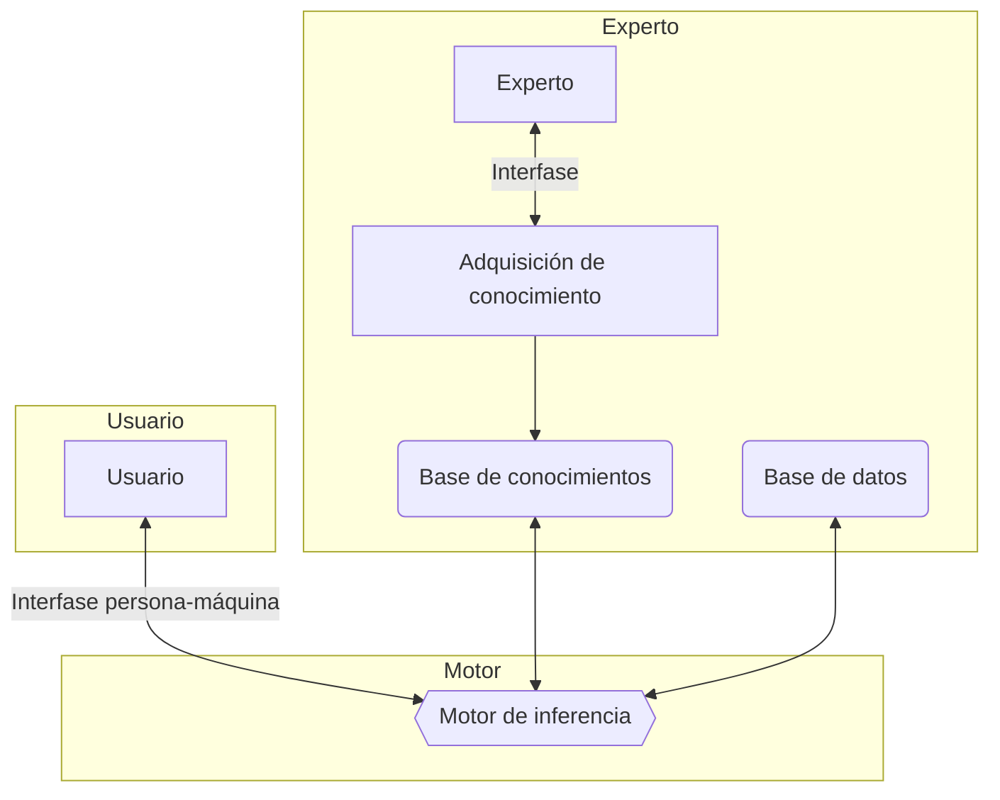

[toc]

# Introducción

Los sistemas expertos son una aplicación de la inteligencia artificial que hacen uso de conocimientos especializados previamente adquiridos por el ser humano. Los sistemas expertos comenzaron su desarrollo en la década de 1970 y fueron muy populares tanto en esa década como en los años 80 del siglo pasado.

Se considera que los primeros sistemas de inteligencia artificial que fueron capaces de obtener resultados con utilidad práctica fueron los expertos. Se trata de sistemas basados fundamentalmente en reglas. Para el desarrollo de un sistema experto, resulta imprescindible disponer del conocimiento de un especialista en el campo objeto de estudio. Es decir, es necesario contar con información relativa a cómo un especialista trataría el problema propuesto. A los sistemas expertos se les denomina también por ese motivo «sistemas basados en conocimientos», o «sistemas basados en reglas».

> ### Todo sistema experto ha de tener la capacidad de explicar cuál es la decisión que ha tomado.

Un sistema experto se puede definir como un software que es capaz de simular el proceso de decisión que tomaría un experto humano en cierto campo. Por tanto, los sistemas expertos se diseñan de manera que puedan tomar de forma automática decisiones como si fueran expertos. Además, cabe señalar que todo sistema experto debe ser capaz de explicar la decisión que ha tomado y también ha de ser capaz de aprender cuando se le facilita nueva información.

# Estructuras elementales de los sistemas expertos

La arquitectura más común de los sistemas expertos es la del sistema basado en reglas. Este tipo de sistemas emplea expresiones del tipo:

«SI ... ENTONCES»

Cada regla representa una porción del conocimiento que se pretende introducir en el sistema. Un conjunto de reglas relacionadas puede llevar de una serie de hechos y datos conocidos hasta algunas conclusiones de utilidad.

Todo sistema experto está formado por los siguientes elementos:

- Interfaz de usuario y de comunicación externa.
- Base de datos de conocimiento.
- Motor de inferencias.
- Sistema para la explicación de las decisiones tomadas.
- Sistema para la adquisición de nuevo conocimiento.



##  Interfaz de usuario y de comunicación externa

Es el medio o vía para las consultas. Debe facilitar una comunicación lo más natural para el usuario, ser sencilla de aprender a utilizar y alertar de posibles datos erróneos de entrada. Los resultados deben ser claros y comprensibles para el usuario. Para conseguir esto, lo habitual ha sido contar con herramientas de desarrollo de interfaces gráficas, e implementar un módulo de comunicaciones y otro de explicaciones.

El módulo de comunicaciones está más enfocado en la interacción con otros sistemas, concretamente, en los casos de automatización de tareas o procesos, como en el caso de robótica industrial.

El módulo de explicación ayuda al ingeniero de conocimiento a refinar el motor de inferencia y al experto a verificar la coherencia de la base de conocimiento. Por otro lado, es el módulo que se encarga de mostrar al usuario el proceso aplicado a la resolución del problema o consulta.

En todo sistema experto resulta importante disponer de una interfaz de usuario que permita una comunicación cómoda del mismo con la aplicación. Toda interfaz hará uso bien de texto, de gráficos o de una combinación de ambos.

Dadas las características fundamentales comunes a todo sistema experto, es imprescindible que el usuario pueda responder de manera cómoda a las preguntas que el sistema le plantee a lo largo del proceso de resolución del problema.

Además, las conclusiones alcanzadas por el sistema serán mostradas al usuario a través de la interfaz.

Dentro de la interfaz se ha de tener en cuenta la parte dedicada a la comunicación externa, dado que resulta altamente probable que el sistema tenga que hacer uso de datos externos al mismo.

## Base de datos de conocimiento

Contiene el conocimiento y la experiencia de los expertos en un campo determinado, estructurado y codificado, preparado para entregar dicho conocimiento cuando sea requerido por el sistema. Ha sido generado a partir de las referencias dadas por los expertos en dicho campo.

El conocimiento puede estar organizado mediante listas, descripción de objetos relacionados con el problema en estudio, cálculo de predicados, redes semánticas y las relaciones o reglas de producción entre ellos. También se considera importante que estén los procedimientos de aplicación de dicho conocimiento en función del problema a resolver.

Para la creación de la base de datos de un sistema experto se necesitará contar con la participación de personas con experiencia que sean capaces de codificar sus conocimientos como reglas de la forma:

```lisp
SI <antecedente> ENTONCES <consecuencia>
```

En algunos casos, una regla puede tener múltiples antecedentes que se unen mediante conectores como O e Y. Este tipo de regla se denomina regla compuesta.

La estructura de una regla compuesta es la que se muestra a continuación:

```lisp
SI <antecedente1> Y <antecedente2>
	ENTONCES <consecuencia>
SI <antecedente1> O <antecedente2>
	ENTONCES <consecuencia>
```

Por tanto, las reglas constituyen la forma más común de codificar el conocimiento adquirido por un experto.

> #### Se pretende construir un sistema experto que decida si se concede o no un crédito al consumo a cierto cliente. Este sistema experto debe trabajar como lo haría un bancario acostumbrado a dicha operación.
>
> Un bancario con experiencia indica que únicamente se conceden este tipo de créditos a mayores de 18 años que dispongan de nómina y cuyo contrato sea bien de carácter indefinido o que la duración del mismo sea superior al tiempo necesario para la devolución de todas las cuotas del préstamo.
>
> Este conocimiento se podría expresar como:
>
> ```SI (cliente mayor de 18 años)
> SI (cliente mayor de 18 años)
> Y (tiene nómina)
> Y (tiene contrato indefinido)
> O (la duración del contrato es superior al tiempo de devolución del préstamo)
> ENTONCES (conceder préstamo solicitado)
> ```
>
> Por tanto, si el único criterio que se emplea para la concesión de créditos al consumo es el indicado por el bancario, un sistema experto que tenga implementada la regla expuesta más arriba será capaz de gestionar la concesión de créditos obteniendo los mismos resultados.

A la hora de implementar un sistema experto, resulta conveniente tener en cuenta que el conocimiento que proporcionan los expertos se pueda clasificar en distintas categorías:

- En primer lugar, un tipo de conocimiento muy utilizado es el denominado conocimiento procedimental. Este conocimiento se refiere a la realización de alguna tarea que se lleva a cabo con el fin de, por ejemplo, mejorar el rendimiento de un sistema o de un proceso. Así, siempre que se disponga de conocimiento relativo a cómo resolver un problema paso a paso, dicho conocimiento se denominará procedimental.
- Existe también otro conocimiento que es del tipo objetivo y que se encuentra en los libros y manuales de una especialidad. Es el llamado conocimiento factual. Si bien es accesible por otras vías, resulta de utilidad implementarlo en un sistema experto dada la rapidez de acceso al mismo.
- Además, también hay otra clase que es la propia de cada experto, que noestá completamente basada en hechos objetivos y que no se encuentra enlos libros de texto. Este conocimiento se denomina conocimiento heurístico y su implementación en sistemas expertos resulta muy adecuada. Si se alimenta a un sistema experto con conocimientos de tipo heurístico, se puede conseguir que, por ejemplo, personal destinado a la realización de una tarea y con escasa experiencia en la misma tome decisiones similares a las que elegiría un experto.
- La representación del conocimiento en un sistema experto por reglas del tipo SI ... ENTONCES contribuye a hacer más sencilla su explicación pues son fácilmente entendibles tanto por los programadores del sistema como por sus usuarios. Nótese también que la base de datos de conocimiento contiene la información que empleará el motor de inferencia.

## Base de hechos o datos

Es la memoria de trabajo propiamente dicha. Consiste en una memoria temporal auxiliar que almacena variables de inicio, valores de variables intermedias y las variables de salida de la consulta.

En esta unidad, queda registrado todo el histórico de estados del sistema en la consulta.

Durante una consulta, el usuario introduce la información que se tiene del problema actual en la base de hechos y el sistema sincroniza ésta con el conocimiento que hay disponible al respecto en la base de conocimiento, de forma que se puedan deducir nuevos hechos. Para esto es necesario que las base de datos sean de tipo relacional.

## Motor o mecanismo de inferencia

Es la unidad lógica que aplica las reglas sobre la base de conocimientos a partir de las consultas, extrayendo conclusiones. Utiliza un método fijo de solución de problemas configurado imitando el proceso humano de los expertos para resolver ese tipo de problemas.

El motor de inferencias es el elemento del sistema experto encargado de realizar el razonamiento. Así, el motor de inferencias es capaz de generar nueva información a partir del contenido existente en la base de datos y, por tanto, de tomar decisiones y contribuir a la resolución de problemas reales.

El motor de inferencia determina las acciones que tendrán lugar, el orden en el que lo harán y la interacción entre las distintas partes del sistema. También selecciona las reglas a aplicar y determina cómo y cuándo se van a aplicar las reglas programadas. Finalmente, también se encarga de la interacción con el usuario.

## Sistema para la explicación de las decisiones tomadas

Una vez que el motor de inferencias ha llegado una decisión, resulta de gran importancia que el sistema sea capaz de explicárselo de forma conveniente al usuario. Una manera de hacerlo es mostrando las reglas de inferencia que el sistema empleó en su proceso de razonamiento. Sin embargo, este método podría ser, en función de la aplicación de que se trate, sumamente tedioso.

Por tanto, todo sistema experto debe disponer de algún tipo de subsistema que permita presentar una explicación de las decisiones tomadas de manera que resulte comprensible para el usuario.

## Sistema para la adquisición de nuevo conocimiento

Es la parte del sistema que facilita la estructuración, implementación y actualización del conocimiento en las bases de datos. La clave es que sea una herramienta que se pueda utilizar sin tener un perfil especialmente técnico y sin tener que programar, aunque sí que debe permitir el acceso a través de código.

Se entiende por sistema de adquisición de nuevo conocimiento una interfaz que permita que un experto en el campo sea capaz de introducir nueva información en el sistema. Dada la naturaleza de los sistemas expertos, es necesario que, una vez puesto en operación, resulte posible seguir añadiendo nueva información a medida que sea necesario y, para ello, es imprescindible disponer de algún sistema que permita la adquisición de este conocimiento.

# Dinámica de un sistema experto.

El objetivo de los sistemas basados en el conocimiento es hacer que la información crítica requerida para que el sistema funcione sea explícita en lugar de implícita. En un programa informático tradicional, la lógica está incrustada en un código que, por lo general, solo puede ser revisado por un especialista informático. Con un sistema experto, el objetivo era especificar las reglas en un formato que fuera intuitivo y fácil de entender, revisar e incluso editar por expertos en el dominio en lugar de expertos en TI. Los beneficios de esta
representación del conocimiento explícita fueron el desarrollo rápido y la facilidad de mantenimiento.

Los sistemas expertos, con su capacidad para combinar información y reglas de actuación, han sido vistos como una de las posibles soluciones al tratamiento y recuperación de información, no sólo documental. La década de 1980 fue prolija en investigación y publicaciones sobre experimentos de este orden, interés que aún no ha disminuido.

Lo que diferencia a este tipo de sistemas de un sistema tradicional de recuperación de información es que este último sólo es capaz de recuperar lo que existe explícitamente, mientras que un sistema experto debe ser capaz de generar información no explícita, razonando con los elementos que se le dan. Pero la capacidad de los sistemas expertos en el ámbito de la recuperación de la información no se limita a la recuperación. Pueden utilizarse para ayudar al usuario, en selección de recursos de información, en filtrado de respuestas, etc. Un sistema experto puede actuar como un intermediario inteligente que guía y apoya el trabajo del usuario final.

Veamos ahora los tipos de sistemas expertos que se desarrollaron y cómo resolvieron las tareas clave que permitieron su funcionamiento.

## Tipos de sistemas expertos.

Existen, principalmente, tres tipos de sistemas expertos:

- **Basados en reglas previamente establecidas**: También conocidos como RBR (Rule Based Reasoning). Trabajan mediante la aplicación de reglas, comparación de resultados y aplicación de las nuevas reglas basadas en la situación modificada. Esta aplicación de reglas heurísticas se apoya principalmente en lo que se conoce como lógica difusa, para su evaluación y aplicación.

- **Basados en casos**: También conocidos como CBR (Case Based Reasoning). Se basan en el proceso de solucionar nuevos problemas según las soluciones de problemas anteriores. Este tipo de razonamiento se adapta al nuevo problema.

- **Basados en redes bayesianas**: Son los conocidos sistemas probabilísticos, que constituyen una herramienta bastante útil en la estimación de probabilidades de resultados en función de nuevas evidencias. Como su nombre indica, se utiliza el cálculo de la probabilidad según el Teorema de Bayes. 

  En esencia, consiste en un gráfico que representa un conjunto de variables conocidas y las relaciones de dependencia entre ellas a fin de inferir, es decir, estimar la probabilidad, de las variables no conocidas. Dadas sus características, este modelo resulta idóneo para la clasificación, la predicción o el diagnóstico.

  Por ejemplo, un sistema de riego automático que tuviese que decidir si regar o no en función de la probabilidad de que llueva o no, seguiría este esquema (que puedes encontrar en un [artículo](https://es.wikipedia.org/wiki/Red_bayesiana) más extenso sobre el tema).

> ## **Lógica difusa**
>
> Si quieres profundizar más en el tema de la lógica difusa o borrosa que permite la toma de decisiones en algunos sistemas expertos, puedes leer sobre ello en este [artículo de la Wikipedia](https://es.wikipedia.org/wiki/Lógica_difusa).

> ## Te recomendamos que juegues con diferentes tipos de sistemas basados en reglas que puedes encontrar en esta [web](https://visiruleexamples.com/vregs.html).

## Representación del conocimiento.

Las estructuras básicas de representación del conocimiento son:

- **Reglas de producción**: El resultado que arroja un sistema experto se basa en la aplicación de reglas sobre los objetos y hechos presentes. Se trata de estructuras condicionales que relacionan a través de la lógica la información de una premisa o antecedente con la información contenida en la parte de conclusión o consecuencia y que suele traducirse en una acción. Tanto la premisa como la conclusión, hacen referencia a hechos mencionados en la base de conocimientos.

  El esquema de una regla de producción sería éste: 

  `SI premisa 1 Y premisa 2 ... Y premisa n ENTONCES conclusión/acción `

  Por ejemplo:

  `SI el reloj funciona Y el reloj marca las 7:00 ENTONCES es hora de levantarse/suena el despertador`

  Cuando se aplica una regla sobre unos hechos, se dice que la regla "dispara" y esto provoca la inserción de un nuevo hecho en la base de hechos.

- **Lógica proposicional**: Es similar a las reglas de producción. Separa los elementos que componen la base de conocimiento de aquellos que controlan la operación del sistema.

- **Redes semánticas**: Representan el conocimiento en formas de redes o grafos. Cada nodo de la red representa un concepto u objeto y los lazos que los interconectan describen reacciones entre ellos.

  

- **Marcos**: Son estructuras de datos donde se almacena información concreta de un cierto concepto y la información relacional correspondiente. Asocian propiedades a los nodos de las redes semánticas, que representan, a su vez, los objetos o conceptos. Dichas propiedades son descritas en términos de atributos y valores asociados.
- **Objetos**: Se utilizan, especialmente, en entornos de programación orientada a objetos y actúan como entidades independientes de forma que el control del sistema se materializa a través del envío de mensajes del sistema a los objetos y entre ellos mismos.

- **Representaciones múltiples**: Son de uso frecuente y combinan dos o más formas de representación entre éstas:
  - **Representación declarativa**: incluye las reglas, el cálculo de predicados y las redes semánticas. El conocimiento queda estructurado en fragmentos independientes entre sí que se combinan mediante un mecanismo general de razonamiento y deducción.
  - **Representación procedimental**: refleja explícitamente las relaciones entre los fragmentos de conocimiento, y éstas son difíciles de modificar
  - **Representación mixta**: es una combinación de las anteriores. Usa objetos y marcos.

## Mecanismos de razonamiento.

Los principales mecanismos o modos de razonamiento son:

- Encadenamiento hacia delante: se parte de hechos para llegar a resultados.
- Encadenamiento hacia atrás: se parte de los resultados y se trata de encontrar o volver a los hechos.
- Encadenamiento mixto: combina los anteriores.
- Algoritmo de búsqueda heurística: el proceso de inferencia es una búsqueda en una estructura de tipo árbol.
- Herencia: usado en entornos de programación orientada a objetos. Un objeto hijo hereda propiedades y hechos de los padres.

Para obtener conclusiones, utilizaremos los diferentes tipos de reglas y estrategias de inferencia y control. Te recomendamos empezar por considerar las más básicas como son **Modus Ponens** y **Modus Tollens** como sistemas de inferencia y el **encadenamiento de reglas hacia adelante** y **encadenamiento de reglas hacia atrás** como estrategias de inferencia.

> ## Para conocer mejor los sistemas de inferencia **Modus Ponens** y **Modus Tollens**, puedes recurrir a sus correspondientes artículos en la Wikipedia:
>
> - [Modus Ponens](https://es.wikipedia.org/wiki/Modus_ponendo_ponens) "si *P* implica *Q; y* si *P* es verdad; entonces *Q* también es verdad."
> - [Modus Tollens](https://es.wikipedia.org/wiki/Modus_tollendo_tollens) "Si *P* implica *Q*, y *Q* no es cierto, entonces *P* no es cierto"
>
> Así como ver este [vídeo](https://youtu.be/MLe9flR4PsA) corto en el que se hace un planteamiento sencillo de los conceptos.

> ## Encadenamiento hacia adelante y hacia atrás
>
> [](https://prezi.com/fvw2aokvct7r/encadenamiento-hacia-adelante-y-hacia-atras/)
# Representación y simulación de comportamientos básicos

Una de las principales ventajas de los sistemas expertos es que estos pueden programarse de manera rápida, dado que introducir la información en forma de frases del tipo `SI ... ENTONCES` resulta muy sencillo. Otra ventaja de dichos sistemas es que son capaces de manejar de manera simultánea grandes cantidades de información y que, además, son fácilmente escalables dado que dicha escalabilidad consiste, fundamentalmente, en alimentarlos con más información.

Dada la forma en la que los sistemas expertos toman sus decisiones, se puede considerar que lo hacen de una manera transparente y también pedagógica, que permite el aprendizaje de aquellos que todavía no son expertos en cierta área o disciplina.

Entra las posibles desventajas de los sistemas expertos, resulta necesario señalar que, por mucho conocimiento que se introduzca sobre cierto campo o disciplina, hoy en día resulta imposible diseñar un sistema experto que sea capaz de cubrir la totalidad de la misma. Además, los sistemas expertos no son capaces de aportar soluciones imaginativas allá donde el ser humano sí puede hacerlo ni tampoco pueden hacer uso para la toma de cualquier decisión de más información que la que se tenga programada en el sistema, mientras que un experto humano puede realizar sus propias investigaciones antes de tomar una decisión sobre cualquier problema.

Con el fin de poder entender los comportamientos básicos de un sistema experto, estudiaremos Experta en la parte práctica de la unidad.

# Estrategias de control de un sistema experto

Las dos estrategias de control más empleadas en los sistemas expertos son la de **razonamiento hacia adelante** y la de **razonamiento hacia atrás**. Ambas son los mecanismos de inferencia que usará el sistema. Aunque los resultados que se pueden obtener haciendo uso de una u otra son equivalentes, en función del lenguaje en que se implemente el sistema experto o la forma concreta en que se programe, se hará uso de una estrategia u otra.

Así, en el caso del lenguaje **LISP** lo que normalmente se utilizará será la estrategia de razonamiento hacia adelante, mientras que en el lenguaje **PROLOG** se empleará la estrategia de razonamiento hacia atrás.

El razonamiento hacia adelante consiste en que dada cierta regla `R`, en caso de producirse cierta condición `A`, esta tendría como consecuencia `B`. Es decir, la regla `R` se aplica si se satisface la condición o condiciones dadas en `A` y esto llevaría a `B`.

Esta forma de ejecución de las reglas de un sistema experto es, probablemente, la más parecida a la forma en la que se lleva a cabo el razonamiento humano.

> #### Dos ejemplos de este tipo de razonamiento hacia adelante podrían ser los dos que se exponen a continuación:
>
> ```lisp
> SI (el paciente tiene fiebre) Y (ha perdido el olfato)
> 	ENTONCES hacer prueba PCR (Polymerase Chain Reaction)
> ```
> 
>El segundo ejemplo sería:
> 
>```lisp
> SI (llueve)
> 	ENTONCES (usar paraguas)
> ```
> 
>En el primero de los dos ejemplos, si simultáneamente se produce que un paciente tiene fiebre y además ha perdido el olfato, se recomienda la realización de una PCR. En el segundo ejemplo, el hecho de que llueva conduce a la necesidad de usar un paraguas.

En el caso del encadenamiento hacia atrás, se parte de un objetivo inicial que se irá reemplazando por otros objetivos como resultado de la aplicación de las reglas hacia atrás. Es decir, se parte del estado de llegada y se trata de llegar a él encadenando objetivos.

Es decir, en el caso del encadenamiento hacia atrás se parte de un resultado que se considerará cierto en caso de cumplirse una serie de condiciones.

> #### Se quiere determinar qué animal es cierta mascota y se sabe que dicho animal caza ratones y bebe leche. La base de reglas de la que se dispone es la siguiente:
>
> ```lisp
> SI Animal caza ratones y bebe leche
> 	ENTONCES Animal es un gato
> SI Animal pía y vuela
> 	ENTONCES Animal es un pájaro
> SI Animal es un gato
> 	ENTONCES Animal tiene pelo
> SI Animal es un pájaro
> 	ENTONCES Animal es tiene plumas
> ```
> Así, tal y como se puede observar a partir del ejemplo, el encadenamiento hacia atrás comienza con una lista de objetivos o una hipótesis y trabaja desde el consecuente hacia el antecedente con el fin de verificar si los datos apoyan las consecuencias.

# Tendencias en sistemas expertos

En la actualidad existen numerosos sistemas expertos en uso repartidos en campos muy variados. Así, se encuentran sistemas expertos en aplicaciones tales como recursos humanos, medicina, banca, mantenimiento, control de embalses, etcétera. Los beneficios fundamentales que se obtienen del uso de los sistemas expertos son una mayor calidad de las decisiones tomadas, la reducción de los costes de operación y toma de decisiones, la mejora de la consistencia entre decisiones adoptadas en momentos temporales distintos, además de una mayor rapidez en la propia toma de las decisiones.

Los sistemas expertos desarrollados en los últimos años no se limitan a la implementación de reglas, sino que las combinan con metodologías propias del machine learning o aprendizaje automático. Una ventaja fundamental de este tipo de sistemas expertos es que, dado que son capaces de aprender, al menos parcialmente, de los datos y sin la necesidad de intervención de un experto, necesitan menos tiempo para su programación y puesta en funcionamiento que los sistemas expertos clásicos. Nótese también que en aquellas situaciones donde existe una cierta incertidumbre, la programación de modelos basados en aprendizaje automático puede tener un mejor comportamiento que los sistemas expertos haciendo que la combinación de ambas posibilidades sea la mejor opción.

# Lenguajes de programación usados en Sistemas Expertos

## LISP

LISP es uno de los lenguajes más antiguos utilizados en sistemas expertos, desarrollado por John McCarthy en 1958. Su nombre, **Lis**t **P**rocessing, refleja su enfoque principal en la manipulación de listas. LISP se ha utilizado extensamente en inteligencia artificial y sistemas expertos debido a su capacidad para representar el conocimiento de manera flexible a través de listas y estructuras de datos jerárquicas. Su sintaxis basada en paréntesis puede resultar peculiar para algunos, pero permite una representación concisa y expresiva del conocimiento. La facilidad con la que se puede modificar y extender el código en LISP es una de sus fortalezas.

Cada función del Lisp y cada programa que se genera con él vienen dado en forma de lista. Por esta razón los datos no se pueden diferenciar sintácticamente de los programas. A este tipo de lenguaje se les denomina aplicativos o funcionales porque se basan en la aplicación de funciones a los datos. 

> #### LISP:
>
> ```lisp
> ;; Definición de una regla simple en LISP
> (defrule regla-ejemplo
>   (hecho1 ?x)
>   (hecho2 ?y)
>   =>
>   (assert (nueva-inferencia ?x ?y)))
> 
> ```

## PROLOG

PROLOG (**pro**gramation et **log**ique), desarrollado a principios de la década de 1970 por Alain Colmerauer y Philippe Roussel, es un lenguaje de programación lógica utilizado en sistemas expertos para representar y consultar conocimiento declarativo. Su sintaxis se basa en reglas y hechos, lo que lo hace especialmente adecuado para expresar relaciones lógicas y reglas de inferencia. PROLOG es eficaz en la resolución de problemas que involucran búsqueda y manipulación de información basada en lógica de primer orden. Sin embargo, puede enfrentar desafíos en el manejo de problemas más complejos debido a la necesidad de gestionar eficientemente la búsqueda en espacios de soluciones grandes.

La mayoría de los programas escritos en PROLOG están formados por una base de datos en la que se incluyen hechos y reglas que se evalúan cuando se efectúa una consulta. El resultado de la evaluación puede ser positivo o negativo, es decir, verdadero o falso.

Es un lenguaje de programación declarativo. Se entiende por lenguaje declarativo aquel lenguaje de programación que se basa en la lógica y en el que se describe el resultado final deseado, en lugar de mostrar todos los pasos de trabajo. Así, a un programa codificado en PROLOG se le puede preguntar si un hecho es verdadero o si una declaración lógica es consistente con las reglas almacenadas en el mismo. 

Aunque un sistema experto se puede programar haciendo uso de prácticamente cualquier lenguaje de programación, existen algunos lenguajes como el propio PROLOG o LISP que nacieron de la mano del desarrollo de dichos sistemas.

Especialmente indicado para modelar problemas que impliquen objetos y las relaciones entre ellos. Está basado en los siguientes mecanismos básicos: unificación, estructuras de datos basadas en árboles

> #### PROLOG:
>
> ```prolog
> % Definición de reglas en PROLOG
> regla_ejemplo(X, Y) :-
>   hecho1(X),
>   hecho2(Y),
>   assert(nueva_inferencia(X, Y)).
> ```

## CLIPS

CLIPS es un lenguaje de programación específicamente diseñado para el  desarrollo de sistemas expertos. Desarrollado en la década de 1980 por  la NASA, combina características de lenguajes como LISP y C. CLIPS  utiliza reglas de producción y tiene una sintaxis clara para representar el conocimiento y las reglas de inferencia. Una de las ventajas clave  de CLIPS es su eficiencia en la ejecución de reglas, lo que lo hace  adecuado para sistemas en tiempo real. Sin embargo, su aprendizaje puede ser un poco más empinado debido a su sintaxis específica.

Se diseñó para facilitar el desarrollo de software que modele el conocimiento humano:

- CLIPS permite integración completa con otros lenguajes de programación como C o Ada.

- Puede ser llamado desde un lenguaje procedural, realizando su función y devolver el control al programa que le llamó.
- También se puede definir código procedural como funciones externas. 

Cuando el código externo finaliza su ejecución devuelve el control a CLIPS. Es un entorno completo para la construcción de SE basados en reglas y/o objetos. La versión estándar de CLIPS proporciona ayuda on-line y un editor integrado. Distingue mayúsculas y minúsculas (case-sensitive), igual que el lenguaje C.

> #### CLIPS:
>
> ```clips
> ; Definición de una regla en CLIPS
> (defrule regla-ejemplo
>   (hecho1 ?x)
>   (hecho2 ?y)
>   =>
>   (assert (nueva-inferencia ?x ?y))
> )
> ```

## Experta

El objetivo es implementar una alternativa Python a CLIPS, lo más compatible posible. Con el objetivo de facilitar al programador CLIPS la transferencia de todos sus conocimientos a esta plataforma. Aprovechando la familiaridad y la versatilidad de Python, Experta (fork de PyKnow)  simplifica el desarrollo de sistemas expertos al proporcionar una  interfaz más intuitiva. Al igual que otros lenguajes para sistemas  expertos, Experta utiliza reglas de producción y patrones para  representar el conocimiento. Su integración con Python permite  aprovechar la amplia variedad de bibliotecas y herramientas disponibles  en este popular lenguaje de programación.

### Características

- Compatible con Python 3.
- Implementación pura de Python.
- Matcher basado en el algoritmo RETE.

### Diferencia entre CLIPS y Experta

1. CLIPS es un lenguaje de programación, Experta es una biblioteca de Python. Esto impone algunas limitaciones a las construcciones que podemos hacer (especialmente al LHS de una regla).
2. CLIPS está escrito en C, Experta en Python. Es de esperar un impacto notable en el rendimiento.
3. En CLIPS agregas hechos usando `assert`, en Python `assert` es una palabra clave, por lo que usamos `declare` en su lugar.

> #### EXPERTA (PyKnow):
>
> ```python
> # Definición de una regla en PyKnow (EXPERTA)
> from pyknow import Fact, Rule, KnowledgeEngine
> 
> class EjemploEngine(KnowledgeEngine):
>     @Rule(Fact(hecho1=True), Fact(hecho2=True))
>     def regla_ejemplo(self):
>         self.declare(Fact(nueva_inferencia=True))
> ```

## Comparativa

Tabla comparativa entre los 4 lenguajes comentados:

**Comparativa:**

| Lenguaje         | Historia y Desarrollo                               | Características Principales                      | Puntos Fuertes                                            | Puntos Débiles                                              | Comentarios                        |
| ---------------- | --------------------------------------------------- | ------------------------------------------------ | --------------------------------------------------------- | ----------------------------------------------------------- | ---------------------------------- |
| LISP             | Desarrollado en 1958 por John McCarthy              | List Processing, manipulación flexible de listas | Expresividad, facilidad para extender el código           | Sintaxis peculiar para algunos                              | `;; Comentario en LISP`            |
| PROLOG           | Desarrollado a principios de la década de 1970      | Programación lógica, reglas y hechos             | Representación lógica, eficaz en búsqueda lógica          | Desafíos en problemas complejos, búsqueda ineficiente       | `% Comentario en PROLOG`           |
| CLIPS            | Desarrollado en la década de 1980 por la NASA       | Lenguaje específico para sistemas expertos       | Eficiencia en ejecución, sintaxis clara                   | Curva de aprendizaje empinada                               | `; Comentario en CLIPS`            |
| PyKnow (EXPERTA) | Basado en Python, desarrollado en tiempos recientes | Integración con Python, sintaxis intuitiva       | Familiaridad con Python, amplio ecosistema de bibliotecas | Menos establecido en comparación con lenguajes más antiguos | `# Comentario en PyKnow (EXPERTA)` |

# Fuentes de información

- [Wikipedia](https://es.wikipedia.org)
- [GhatGPT](https://chat.openai.com)
- [Modelos de Inteligencia Artificial (Ed. Marcombo)](https://www.marcombo.com/modelos-de-inteligencia-artificial-9788426734419/)
- https://iep.utm.edu/artificial-intelligence/
- Materiales MIA curso MEC-20230524
- https://www.gartner.com/en/newsroom/press-releases/2021-09-29-gartner-finds-33-percent-of-technology-providers-plan-to-invest-1-million-or-more-in-ai-within-two-years
- https://rapidapi.com/blog/top-facial-recognition-apis/
- https://www.sciencedirect.com/science/article/pii/S0212656720301463