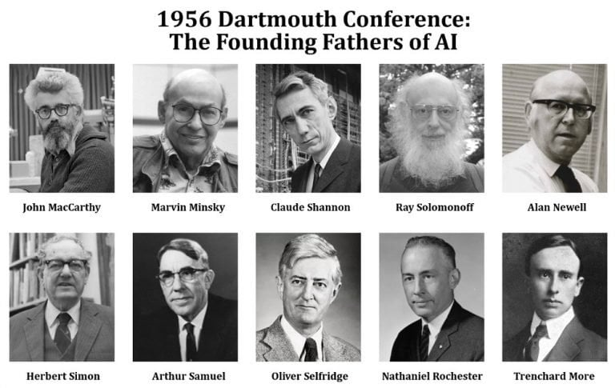
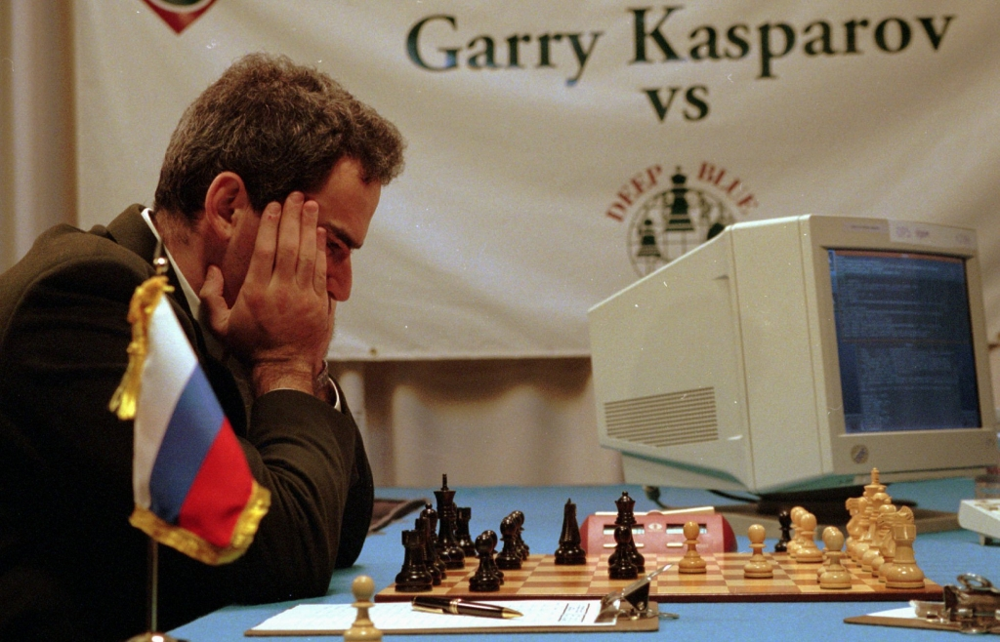
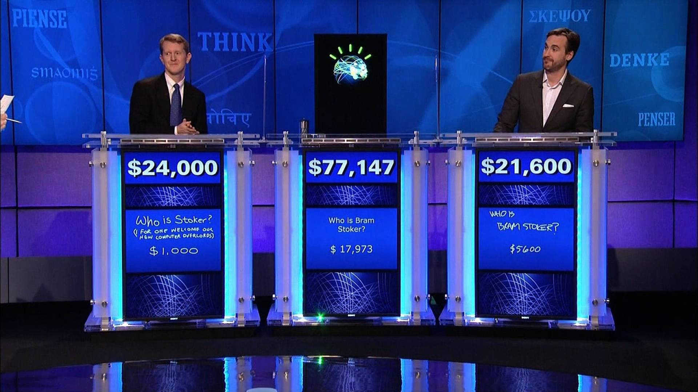
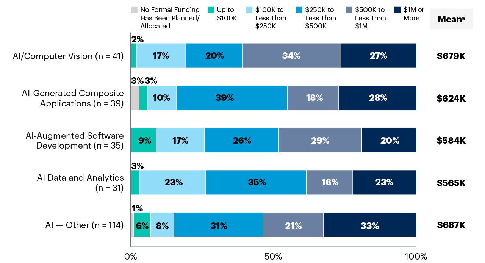

<!--
theme: gaia
size: 16:9
_class: lead
paginate: true
marp: false
backgroundColor: #000
backgroundImage: url('img/hero-backgroundIES.jpg')
-->

# **UD01: Caracterización de sistemas y utilización de modelos de Inteligencia Artificial**
#### Modelos de Inteligencia Artificial
###### version: 2023-08-05
___
<!-- footer: d.martinezpena@edu.gva.es -->
<!-- header: Modelos de Inteligencia Artificial 23-24 (UD01_1)-->
# ¿Qué veremos?
1. Fundamentos de los Sistemas Inteligentes
2. Tipos de Inteligencia Artificial. Escuelas y clasificaciones
3. Utilización de modelos de Inteligencia Artificial
4. Técnicas de la Inteligencia Artificial
5. Campos de Aplicaciones de la Inteligencia Artificial
6. Nuevas Formas de Interacción
7. Mapa conceptual
___
# 1. Fundamentos de los Sistemas Inteligentes
## Definición de Inteligencia Artificial (IA)
Primera definición:
> **"Habilidad para aprender y resolver problemas, llevada a cabo por una máquina o software"**
___
Expertos coinciden en que es la simulación de procesos de inteligencia humana por parte de máquinas:

1. El **aprendizaje** a través de la adquisición de información y reglas para el uso de la información.
2. El **razonamiento** usando las reglas para llegar a conclusiones aproximadas o definitivas.
3. La **autocorrección**.
___
Una definición más concreta y consensuada podría ser:

> **"La inteligencia artificial es la inteligencia llevada a cabo por máquinas. En ciencias de la computación, una máquina «inteligente» ideal es un agente flexible que percibe su entorno y lleva a cabo acciones que maximicen sus posibilidades de éxito en algún objetivo o tarea".**

<!--En realidad, cada generación de hardware y software ha asignado este término a las arquitecturas y técnicas de vanguardia en ese momento. Es por esto que la propia definición puede ir cambiando y evolucionando a medida que se van alcanzando metas más ambiciosas. Podríamos decir que cada nueva oleada de avance tecnológico en este ámbito pasa a conformar una nueva definición de inteligencia artificial, o, al menos, añade un matiz propio a ésta.

La realidad actual es que la IA despierta tanta fascinación como desconfianza. En la gran mayoría de los casos, no se conoce bien la técnica con la que se desarrolla. Ese desconocimiento es el que favorece que se mezcle la realidad con las influencias y fantasías de lo leído y visto en novelas, series y películas.

¿Qué es realmente posible con la tecnología actual y qué sigue perteneciendo al campo de la ciencia ficción? Una habilidad que debe tener cualquier profesional del campo de la IA es, precisamente, ser capaz de explicar de forma sencilla las verdaderas amenazas que esta tecnología puede representar, y saber transmitir una imagen de responsabilidad al respecto.
-->
___
>Los ordenadores (y con ellos la inteligencia artificial) no son ni buenos ni malos. Hacen lo que los humanos programamos que hagan.
>
>La inteligencia y, sobre todo, la intencionalidad que pueda tener un programa o aplicación la proporciona el humano (o equipo de humanos) que lo definen y desarrollan.
___
## Historia de la IA
A lo largo de la historia, la IA ha pasado por diferentes etapas de desarrollo, con avances y desafíos significativos.
___
**Prehistoria de la IA o proto-IA (Antes del 1950):**
En 1943 McCulloch y Pitts presentaron un primer modelo de lo que podría ser una neurona artificial.
Partieron de tres fuentes: 
* conocimientos sobre la fisiología básica y funcionamiento de las neuronas en el cerebro
* análisis formal de la lógica preposicional de Russell y Whitehead
* la teoría de la computación de Turing
___
En 1950, en el trabajo "Computing Machinery and Intelligence", Alan Turing propuso que la pregunta «¿puede pensar una máquina?» era demasiado filosófica para tener valor y, para hacerlo más concreto, propuso un «juego de imitación».
Prueba de Turing

<!--
Este test puede servir, como señala Turing, no solo para probar una destreza verbal superficial, sino también el conocimiento de fondo y la capacidad de razonamiento subyacente, ya que los interrogadores pueden hacer cualquier pregunta o plantear cualquier desafío verbal que elijan. Con respecto a este test, Turing predijo famosamente que "*dentro de unos cincuenta años [para el año 2000] será posible programar computadoras... para hacer que jueguen el juego de imitación tan bien que un interrogador promedio tendrá no más del 70 por ciento de probabilidad de hacer la identificación correcta después de cinco minutos de interrogación*" (Turing 1950); una predicción que ha fallado notoriamente. En el año 2000, las máquinas en la competición del Premio Loebner jugaron tan mal el juego que el interrogador promedio tuvo un 100 por ciento de probabilidad de hacer la identificación correcta después de cinco minutos de interrogación (ver Moor 2001).
-->
___
**Primeros Conceptos de IA (Décadas de 1950 y 1960):**
* "Inteligencia Artificial" acuñado por McCarthy en 1956
* >*Every aspect of learning or any other feature of intelligence can be so precisely described that a machine can be made to simulate it*
<!--En esa época, los investigadores estaban entusiasmados por la idea de que las computadoras pudieran ser programadas para simular la capacidad de razonar y resolver problemas como lo hace el ser humano. Se realizaron esfuerzos iniciales para desarrollar programas que pudieran jugar al ajedrez, realizar cálculos matemáticos y comprender lenguaje natural. En esta conferencia se hicieron previsiones triunfalistas a diez años que jamás se cumplieron (como diríamos ahora "-->
* **se vinieron muy arriba**

___
<!--A partir de esta conferencia, los siguientes años, se dieron sucesivos éxitos y avances (teniendo en cuenta que entonces se contaba con computadores y herramientas de computación bastante rudimentarios) fruto de investigaciones y multitud de proyectos con grandes expectativas. Los más importantes fueron:-->
* Creación del LISP en 1958
* Desarrollo de Micromundos en 1959 por Minsky y Papert en el MIT. 
* demostrador de Teoremas de Geometría en 1959 por Herbert Gelernter.
* Investigación "sistemas expertos" en 1965 por Santford. 
* Lanzamiento de ELIZA en 1966 (primer chatbot).
---
**La Década del Estancamiento (1970):**
* Entre 1960 y 1970,  estancamiento conocida como el "invierno de la IA".
* Los avances prometidos no se materializaron
* disminución en la financiación y el interés en el campo.
---
**El Renacimiento de la IA (Décadas de 1980 y 1990):**
En la década de 1980, resurgimiento
* Se desarrollaron nuevas técnicas de razonamiento, representación del conocimiento y búsqueda heurística.
* Los sistemas expertos se convirtieron en una aplicación exitosa de la IA en medicina e ingeniería.
* rivalidad entre Estados Unidos y Japón
* creación de R1, el primer sistema experto comercial, en 1982 gracias a McDermott (en 4 años de implantación supuso un ahorro de 40 millones de dólares al año).
---
**Aprendizaje Automático y el auge de la IA moderna (finales de los 90 y década de 2000 en adelante):** 
* auge del Aprendizaje Automático. 
* disponibilidad masiva de datos y avances en algoritmos, las máquinas ahora pueden aprender patrones complejos
* avances significativos en visión por computadora, el procesamiento del lenguaje natural y el reconocimiento de voz.
---
- El programa **Deep Blue** desarrollado por **IBM** logró vencer en **1997** al campeón del mundo en ajedrez, **Gari Kaspárov**.

<!--Deep Blue fue una "supercomputadora" que desarrolló la empresa IBM en los años 90 del S.XX para jugar al ajedrez.
En febrero de 1996 se enfrentaron el entonces campeón del mundo, Gary Kaspárov contra la máquina. La primera partida la ganó Deep Blue, otras tres las ganó Kaspárov y dos más quedaron en tablas. Fue la primera máquina que derrotó a un experto jugador. 
En realidad, siendo fieles al concepto de Inteligencia Artificial, esta máquina no se puede considerar exactamente como tal, pues "solo" era capaz de calcular a gran velocidad millones de posiciones posibles por segundo, pero le faltaba "intuición". Es decir, contaba con una tremenda base de datos (posibles jugadas, movimientos, etc), pero sus programadores no fueron jugadores de ajedrez expertos, por lo que la máquina no siempre elegía la jugada óptima.
> ##### *¿Sabes cuántas jugadas posibles hay en el ajedrez? Son cerca de 10^120^ (diez elevado a ciento veinte... 100000000000000000000... así hasta 120 ceros).* 
> 
> *Para hacerte una idea más real de la tremenda capacidad de cálculo de Deep Blue, se estima que la cantidad de átomos que existen en el Universo es de entre 10^80^ y 10^82^.* 
> 
> *El ajedrez es un juego complejo... ¿no crees?*
-->
---
- El sistema **Watson**, también de **IBM**, logró ganar en **2011** el popular concurso televisivo **Jeopardy!** frente a los dos máximos campeones de este programa.

<!--
IBM continuó investigando en el campo de la Inteligencia Artificial (a la vez que sus ordenadores aumentaban su capacidad de cómputo) y, con lo aprendido con Deep Blue y otros desarrollos, creó Watson, una computadora que logró en 2011 ganar en Jeopardy!, uno de los concursos de conocimiento más famosos en Estados Unidos.
Watson era un sistema capaz de comprender y responder preguntas, en lenguaje natural (es decir, expresadas como habla cualquier humano, con variaciones y diferentes formas de expresar la misma idea). Contaba con una base de datos almacenada localmente (sin conexión a Internet) compuesta de enciclopedias, diccionarios, tesauros, artículos de noticias, obras literarias y otras bases de datos complementarias).
-->
---
* La empresa **DeepMind** publicó "el vídeo de los 500 millones de dólares".
<!-- En dicho vídeo mostraba cómo la red neuronal que había desarrollado aprende a jugar al **Arkanoid** de manera autónoma. Google acabó comprando esta empresa en **2014** por **500 millones** de dólares (de ahí el nombre del vídeo).-->
  * <iframe width="560" height="315" src="https://www.youtube.com/embed/V1eYniJ0Rnk" title="YouTube video player" frameborder="0" allow="accelerometer; autoplay; clipboard-write; encrypted-media; gyroscope; picture-in-picture; web-share" allowfullscreen></iframe>

<!--DeepMind, una compañía inglesa creada en 2010, publicó a los pocos años de su creación el que se denominó "El vídeo de los 500 millones de dólares". En dicho vídeo (que puedes ver más arriba) mostraba cómo su Inteligencia Artificial había aprendido a jugar gracias a la técnica de entrenamiento autónomo (Machine Learning) por refuerzo al "Arkanoid" (un juego arcade del S.XX).
La red neuronal que desarrolló "aprendía" a jugar como un humano (con memoria a corto plazo, aplicando lo aprendido en cada partida a las siguientes). Así, en el vídeo podemos ver cómo en las primeras partidas descubre cómo debe mover para evitar perder. Mas adelante aprende a ganar puntos destruyendo ladrillos, y a "ganar" la partida alcanzando la máxima puntuación. Y finalmente "descubre" que si logra colar la pelota por un lateral hasta la parte superior de la pantalla gana en mucho menos tiempo.
Al poco tiempo de publicarse este vídeo recibió oferta de compra de Facebook, que no se materializó, y acto seguido de Google, que la compró por 500 millones de dólares (de ahí el nombre del vídeo).
Ya dentro de la matriz de Google continuaron profundizando en las técnicas de Aprendizaje Automático, logrando otro hito, como veremos más adelante.
-->
---
* **Google** liberó **Tensor Flow**, su librería para Machine Learning, en **2015**, permitiendo que cualquier persona pudiera acceder a sus servidores y crear su propio equipo con capacidad de autoprogramación y de aprender de forma autónoma.

* <iframe width="560" height="315" src="https://www.youtube.com/embed/oZikw5k_2FM" title="YouTube video player" frameborder="0" allow="accelerometer; autoplay; clipboard-write; encrypted-media; gyroscope; picture-in-picture; web-share" allowfullscreen></iframe>
<!--
   En noviembre de 2015 Google liberó TensorFlow, el programa de Inteligencia Artificial que había desarrollado mejorando un sistema de aprendizaje automático anterior conocido como DistBelief.

   Fue la primera vez que se ponía a disposición de cualquier usuario, investigador o empresa interesados en realizar sus propios experimentos de Inteligencia Artificial. Supuso un gran impulso tanto en el campo de la investigación (la propia comunidad de desarrolladores ayudó y sigue ayudando a mejorar y perfeccionar la herramienta) como en el de la democratización de la Inteligencia Artificial, haciéndola accesible para todos.

   En la actualidad sigue utilizándose tanto para primeras aproximaciones al universo de la IA, como para desarrollar prototipos o ejercicios más complejos. 
-->
---
* La IA de **AlphaGo** de **Google** sorprendió a todos proponiendo en una partida de Go una jugada que nunca hubiera hecho un experto jugador humano... que en pocos movimientos más le dió la victoria.

* <iframe width="560" height="315" src="https://www.youtube.com/embed/8tq1C8spV_g" title="YouTube video player" frameborder="0" allow="accelerometer; autoplay; clipboard-write; encrypted-media; gyroscope; picture-in-picture; web-share" allowfullscreen></iframe>
<!--Si jugar al ajedrez es complicado... el juego Go (de origen también oriental) lo es todavía más. La división de Google Deep Mind desarrolló una Inteligencia Artificial capaz de jugar a este juego. Pero la diferencia respecto a logros previos alcanzados por programas de IA capaces de jugar (al ajedrez, a un concurso de preguntas y respuestas...) es que lo hacía "con intuición".
En marzo de **2016** AlphaGo se enfrentó a **Lee Sedol**, que era uno de los mejores jugadores del momento. Ganó AlphaGo. Pero además lo hizo con una jugada (el movimiento 37 de esa partida) completamente inesperado y que ningún experto jugador humano hubiera hecho nunca. Es decir, que aunque la máquina estaba entrenada con registros de partidas reales jugadas por expertos, no siguió ninguna estrategia observada en su base de datos (contaba con 50 millones de partidas de Go entre humanos). Había aprendido a jugar "con intuición": aprendió de los ejemplos "humanos" pero descubrió formas de jugar nuevas (¡y eficaces!). La cara que se le puso a Lee Sedol al observar y analizar el movimiento de la máquina en ese turno 37 de la partida se hizo famoso.
-->
---
- **Ian Goodfellow** presentó en **2014** su generador de imágenes basado en lo que conocemos como red **GAN**, logrando que un humano no sepa distinguir si se trata de imágenes reales o inventadas.
<!--
   Las redes GAN (Generative Adversarial Networks) o generativas antagónicas presentadas por Ian Goodfellow en 2014 han permitido generar fotografías que parecen auténticas a cualquier observador humano. 

   Posteriormente este tipo de técnica (Aprendizaje Automático Supervisado, que veremos más adelante) también se ha aplicado a la generación de textos tal y como los escribiría un humano.

   En esencia las redes GAN se componen de una red generadora (que crea la imagen, texto o diseño) y una red discriminadora (que determina si el resultado de la red generadora es aceptable o no). Ambas redes "compiten" entre ellas (la primera para "engañar a la segunda, y la segunda para detectar fallos en lo generado por la primera). El sistema se retroalimenta y perfecciona con cada iteración.
-->
* La imagen de un rostro humano generado por IA: <a target="_blank" href="https://thispersondoesnotexist.com/">https://thispersondoesnotexist.com/</a>

---
* Desarrollo de **GPT3** por **OpenAI** a través de técnicas de Deep Learning.
<!--GPT-3 es la tercera generación del Modelo de Predicción del Lenguaje que ha sido presentada en mayo de **2020**. Se trata de una Inteligencia Artificial "educada" para escribir cualquier tipo de texto, con cualquier tipo de estilo. A partir de unas pocas palabras que le proporcionas explicando qué es lo que quieres te devuelve un texto complejo que trata sobre lo que le hayas pedido.-->
* Lo más importante de esta tecnología son los **175 Billones de parámetros que utiliza** la para conseguir dar textos naturales (con aspecto de haber sido escritos por humanos).

---
* **GPT-4** representa la cuarta generación del Modelo de Predicción del  Lenguaje, presentado en septiembre de **2022**. 
<!--Esta versión ha  experimentado avances significativos en la capacidad de generación de  texto. Como una Inteligencia Artificial avanzada, GPT-4 ha sido  entrenado para producir textos aún más naturales y coherentes,  adaptándose a cualquier estilo y contenido requerido. Sorprendentemente, 
-->
* cuenta con una impresionante cantidad de **250 Billones de parámetros**, lo que le permite alcanzar un nivel de sofisticación sin precedentes en la creación de textos que parecen ser obra de escritores humanos  expertos. 

---
**Aprendizaje Profundo (Deep Learning):** 
* Una rama del Aprendizaje Automático
* desarrollos más destacados en la IA moderna
* Las redes neuronales profundas, altamente efectivas en tareas como el reconocimiento de imágenes, la traducción automática y el juego de estrategia.
* La escalabilidad junto con las potentes GPU, ha impulsado el rápido progreso en el campo.

---

**IA en la Sociedad Actual:**
* IA ha permeado en diversas áreas de nuestra vida cotidiana
* Aplicaciones como:
  * motores de búsqueda en línea
  * asistentes virtuales
  * recomendaciones de productos y servicios
  * sistemas de navegación
  * automóviles autónomos
  * medicina para el diagnóstico y tratamiento
  * en finanzas para la detección de fraudes
  * en la industria para optimizar procesos de producción.
---
**Desafíos Actuales y Futuros:**
* avances impresionantes, todavía desafíos:
  * la interpretabilidad y explicabilidad de los modelos de IA, especialmente en aplicaciones críticas donde las decisiones pueden tener un impacto importante en las vidas humanas.
  * el sesgo en los datos y la falta de diversidad, lo que puede llevar a resultados injustos o discriminatorios.
* Es esencial abordar estos desafíos y asegurar que su desarrollo y aplicación se realicen de manera ética y responsable.

---
**¿La Inteligencia Artificial es buena o mala?** 
* Piensa en diferentes momentos: El dominio del fuego, la rueda, el hormigón, la pólvora, la imprenta, la radio, Internet...
* La tecnología en sí misma no es ni buena ni mala. Son las personas que la conocen y controlan quienes pueden hacer un uso beneficioso o dañino de ellas.
* ¿Te suena la frase "Un gran poder exige una gran responsabilidad"?
* La IA nos da un poder muy grande hemos de ser responsables al utilizarla.

___

## El futuro de la IA
* Los campos en los que más se ha desarrollado y aplicado la IA en estos últimos años son:
  - Sistemas autónomos
  - Aprendizaje Autónomo (Machine Learning)
  - Aprendizaje Profundo (Deep Learning)
  - Redes neuronales.
  - Reconocimiento de patrones
  - Procesado del lenguaje natural
  - Desarrollo de chatbots
  - Reconocimiento de emociones

___

* En la **actualidad** se está trabajando (y se esperan mejoras en los próximos años) en campos como:
  - Asistentes virtuales
  - Traducción simultánea universal.
  - Control de juegos con el pensamiento.
* Y a **medio plazo** se prevé que la Inteligencia Artificial proporciones soluciones y mejoras en los siguientes ámbitos:
  - Nueva generación de robots interconectados con la nube.
  - Robots médicos autónomos.
  - Asistentes personales robóticos.
  - Ciber-Seguridad cognitiva.
* Y a **largo plazo** se vislumbra que puedan llegar a desarrollase computadoras robóticas con forma y comportamiento humano.
___
**Inversión en proyectos de IA**

<!--Como hemos visto la Inteligencia Artificial ya está demostrando de manera práctica los beneficios que puede proporcionar a empresas e instituciones. Las empresas tecnológicas fueron pioneras hace pocos años al incorporar en sus procesos y productos estas aplicaciones. Y en la medida en que todo el entramado empresarial y social se está digitalizando, la posibilidad de incorporar tecnologías inteligentes en cualquier sector está al alcance de casi cualquiera.-->
En los últimos años la Inteligencia Artificial es el primer o segundo ámbito en el que más dinero están dispuestas a invertir las empresas
<!-- (por delante de otras tecnologías emergentes como Internet de las Cosas, o los datos en la nube). En el siguiente gráfico puedes ver el nivel de financiación que se preveía dedicar en 2022 a incorporar y desarrollar Inteligencia Artificial en un grupo de empresas analizado por Gartner.-->

<!--
fuente: https://www.gartner.com/en/newsroom/press-releases/2021-09-29-gartner-finds-33-percent-of-technology-providers-plan-to-invest-1-million-or-more-in-ai-within-two-years
-->
---

**Limitaciones Prácticas Actuales**
* Existen limitaciones prácticas actuales en el campo de la IA que aún no se han superado por completo:
  1. **Complejidad de la mente humana**<!--La mente humana es increíblemente compleja, y aún no comprendemos completamente todos los aspectos de cómo funciona. La IA actual está lejos de replicar la complejidad y la plasticidad del cerebro humano.-->
  2. **Memoria y recursos limitados**<!--Aunque las capacidades de almacenamiento y procesamiento de las computadoras han aumentado drásticamente, todavía estamos lejos de igualar la capacidad de almacenamiento y la eficiencia de procesamiento del cerebro humano.-->
  3. **Falta de comprensión de la conciencia**<!--A pesar de los avances en neurociencia y cognición, aún no entendemos completamente la naturaleza de la conciencia y cómo emerge en el cerebro. Sin esta comprensión, es difícil replicarla en una máquina.-->
  4. **Ética y responsabilidad**<!--La creación de inteligencia artificial plantea cuestiones éticas y de responsabilidad importantes, como el temor a la toma de decisiones no éticas o la falta de responsabilidad en caso de errores graves.-->
  5. **IA en entornos no controlados**<!--La IA puede funcionar bien en entornos controlados y con datos bien estructurados, pero tiene dificultades para adaptarse a situaciones inesperadas o entornos no controlados.-->
  6. **Creatividad e intuición**<!--Aunque se han logrado avances en la generación de contenido creativo por parte de las máquinas, la verdadera creatividad e intuición humana siguen siendo difíciles de replicar.-->
  7. **Emociones y empatía**<!--La comprensión y expresión emocional, así como la empatía, son aspectos desafiantes de la inteligencia humana que no se han logrado de manera completa en la IA.-->
  8. **Interacción social humana**<!--La comprensión del lenguaje natural, la interacción social y la percepción de matices emocionales en el contexto de la comunicación humana son desafíos actuales para la IA.-->
* >Es importante tener en cuenta estas limitaciones y reconocer que la IA actual está lejos de igualar la inteligencia humana en todos sus aspectos. Sin embargo, esto no implica que no haya avances significativos en el campo de la IA, ni que no se puedan superar algunas de estas limitaciones en el futuro. 
___
## Principios de Sistemas Inteligentes
* Sistema informático
* >el conjunto de cosas (hardware y software) y al conjunto de reglas (procedimientos) que de manera conjunta se emplean para el fin último de adquirir, almacenar, procesar y representar la información de manera automatizada.
<!-- 
> El **hardware** incluye computadoras o cualquier tipo de dispositivo electrónico, principalmente constituido alrededor de semiconductores como memoria, procesadores, sistemas de almacenamiento externo, etc.
> El **software** incluye al sistema operativo, firmware y aplicaciones. También se puede considerar parte del sistema a quien hace uso del hardware: los programadores y los usuarios.

La potencia y eficacia de un sistema de la información radica en la correcta correlación de una gran cantidad de datos ingresados mediante procesos específicos para cada campo o tarea, con el objetivo de producir información para la posterior toma de decisiones. Un sistema informático se destaca por su diseño, facilidad de uso, flexibilidad, mantenimiento automático de los registros, apoyo en la toma de decisiones críticas y la conservación del anonimato en informaciones irrelevantes. 
-->
---
* Inteligencia artificial es un subconjunto de la informática 
* Un sistema de inteligencia artificial ha de ser por extensión un subconjunto dentro de los sistemas informáticos.

* >**Se denominará, por tanto, sistema inteligente a un programa o conjunto de programas de computación que reúne características y comportamientos asimilables al de la inteligencia humana o animal.**
---

* Para que un sistema informático pueda ser considerado un sistema inteligente, habrá de tener las características que se enumeran a continuación:
  1. **ser un sistema inteligente**.
  2. **las partes del sistema han de tener correlaciones con otros elementos del mismo sistema**.
  3. capaz de **cumplir uno o varios objetivos**
  4. ha de disponer de **capacidad sensorial**
  5. **necesidad de poder almacenar información**. 
  6. ha de disponer de **procedimientos y métodos con reglas de actuación**
  7. **El sistema aprende nuevos conceptos a partir de la información recibida de los sentidos, las reglas conocidas y la experiencia**.
* >Los primeros sistemas inteligentes, como los sistemas de expertos, no cumplen todas estas características por lo que reciben el nombre de sistemas de inteligencia incompletos.
---

La inteligencia artificial (IA) es un área de cambio social, transforma rápidamente hábitos y costumbres, ha de prestarse mucha atención, y marcar una serie de límites éticos. Principios fundamentales o éticos de la IA son:

1. **La IA debe estar libre de prejuicios**, puede generar discriminantes negativas, toda IA debe programarse sin conjuntos sesgados. Se introducen continuamente sesgos de manera involuntaria e inadvertida. 
    >Sistemas de ayuda médica entrenados en varones blancos de entre 30 y 50 años de edad podrán dar resultados buenos sobre el grupo para el que se ha desarrollado, pero pueden actuar no tan correctamente en otras categorías.
---
2. **Ayudar a ayudar**. Se debe de identificar de forma clara la responsabilidad de las decisiones tomadas por los sistemas autónomos. 

3. **Uso de algoritmos abiertos**. Para poder confiar en la respuesta de una IA es preciso tener acceso limpio al algoritmo de entrenamiento y de toma de decisiones que posee, lo que comporta acceso a todo su modelo matemático.
---
4. **Seguridad, privacidad y confiabilidad**. Dado que las IA hacen uso de gran cantidad de datos, se ha de velar por la transparencia y la privacidad en el uso de los mismos.

   >Un asistente virtual ha de garantizar que las conversaciones escuchadas no se filtrarán ni difundirán a terceros.

5. **Bien común**. Ningún sistema de IA debería ser desplegado si al hacerlo se atenta contra el bien común.
---
Los agentes inteligentes son entidades capaces de percibir su entorno a través de sensores y actuar en él mediante efectores para alcanzar objetivos específicos.

**Componentes de un Agente Inteligente:**
1. **Sensores (S)**: Los sensores son dispositivos que permiten al agente percibir información sobre su entorno. Pueden incluir cámaras, micrófonos, sensores de temperatura, GPS, entre otros. La información que los sensores recopilan se utiliza para representar el estado actual del entorno.
---
2. **Actuadores (A)**: Los actuadores son los medios mediante los cuales el agente interactúa con su entorno. Pueden ser ruedas en un robot, motores en un brazo robótico o simplemente salidas de datos en un sistema de software. Los actuadores permiten que el agente realice acciones para alcanzar sus objetivos.
3. **Función del Agente (f)**: La función del agente representa el comportamiento del agente en función de las percepciones que recibe. Toma como entrada el estado actual del entorno y devuelve una acción que el agente debe ejecutar. Esta función puede ser simple o compleja, dependiendo de la complejidad de la tarea que el agente debe realizar.
---
4. **Arquitectura (A)**: La arquitectura del agente se refiere a cómo se organiza el agente en términos de sus componentes y cómo interactúan entre sí. Puede haber diferentes arquitecturas según la complejidad de la tarea y los requisitos de rendimiento.
---

Ejemplo de **Agente Inteligente:**: un sistema de navegación GPS en un automóvil.
* **Sensores (S)**: El sistema de navegación utiliza sensores GPS para recibir información sobre la ubicación actual del automóvil y sensores de velocidad para conocer su velocidad y dirección.
* **Actuadores (A)**: Los actuadores son los mecanismos que permiten al sistema de navegación proporcionar instrucciones al conductor para alcanzar el destino deseado, como la pantalla de navegación o las indicaciones de voz.
* **Función del Agente (f)**: La función del agente en este caso podría ser bastante simple: recibir la ubicación actual y el destino deseado, calcular la ruta más rápida y segura y guiar al conductor a lo largo del camino.
* **Arquitectura (A)**: La arquitectura del sistema de navegación podría ser una combinación de algoritmos de planificación de rutas, sistemas de reconocimiento de voz para recibir comandos del conductor y sistemas de visualización para mostrar las indicaciones.
<!-- Put this script at the end of Markdown file. -->
