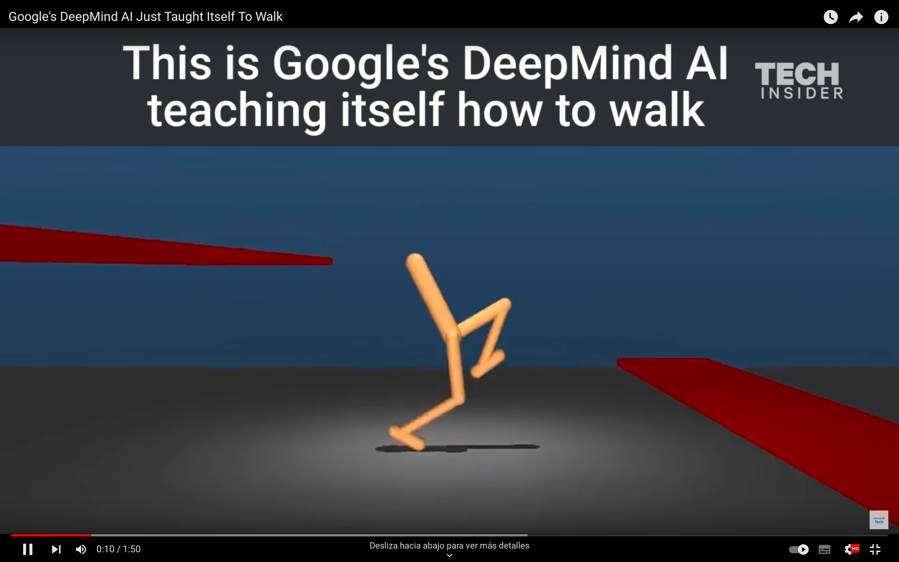

<!--
theme: gaia
size: 16:9
_class: lead
paginate: true
marp: false
backgroundColor: #000
backgroundImage: url('img/hero-backgroundIES.jpg')
-->

# **UD01: Caracterización de sistemas y utilización de modelos de Inteligencia Artificial**
#### Modelos de Inteligencia Artificial
###### version: 2023-08-05
___
<!-- footer: d.martinezpena@edu.gva.es -->
<!-- header: Modelos de Inteligencia Artificial 23-24 (UD01_3)-->
# 3. Utilización de modelos de Inteligencia Artificial
En esta sección, se explorarán los requisitos básicos de un sistema de resolución de problemas y los diferentes modelos de sistemas de Inteligencia Artificial, incluyendo la automatización de tareas, sistemas de razonamiento impreciso y sistemas basados en reglas.
___

## Requisitos básicos de un sistema de resolución de problemas
1. **Representación del Problema**: Para el PLN, se pueden utilizar modelos basados en redes neuronales que convierten el texto en representaciones vectoriales.
2. **Razonamiento y Toma de Decisiones**: Los sistemas de IA deben ser capaces de razonar sobre la información disponible y tomar decisiones informadas para llegar a una solución. Esto implica aplicar técnicas lógicas, de aprendizaje automático o de búsqueda heurística, según la naturaleza del problema.
3. **Aprendizaje y Adaptabilidad**: La capacidad de aprender de la experiencia y adaptarse es esencial para mejorar el rendimiento de un sistema de IA con el tiempo. El aprendizaje automático y el aprendizaje por refuerzo son enfoques comunes utilizados para habilitar esta funcionalidad.
___
4. **Eficiencia Computacional**: Los sistemas de resolución de problemas deben ser eficientes en términos computacionales para proporcionar respuestas rápidas y escalables a problemas complejos. Esto implica el uso óptimo de algoritmos y técnicas de optimización para reducir el tiempo de ejecución y los recursos necesarios.
5. **Interacción con Usuarios**: Los sistemas de Inteligencia Artificial deben permitir la interacción con los usuarios de una manera comprensible y natural. Esto implica el desarrollo de interfaces de usuario amigables que faciliten la comunicación y la comprensión mutua entre humanos y sistemas de IA.
___

## Modelos de sistemas de Inteligencia Artificial
### Automatización de Tareas
* **Reconocimiento de Voz**: Los sistemas de reconocimiento de voz convierten el habla en texto y pueden automatizar la transcripción de documentos o comandos de voz en dispositivos. Por ejemplo, aplicaciones de reconocimiento de voz como Google Speech-to-Text o Microsoft Azure Speech Service permiten convertir grabaciones de voz en texto escrito de manera automatizada.
* **Detección de Fraude**: Algoritmos de aprendizaje automático pueden analizar patrones de datos financieros y detectar transacciones sospechosas o fraudulentas. Por ejemplo, instituciones financieras utilizan modelos de aprendizaje automático para identificar patrones de comportamiento inusuales que podrían indicar actividades fraudulentas.
___

### Sistemas de Razonamiento Impreciso
<!--Los sistemas de razonamiento impreciso permiten el manejo de incertidumbre y vaguedad en los datos y la toma de decisiones. Estos sistemas son útiles cuando los datos son incompletos o inciertos y se basan en la lógica difusa y otras técnicas de incertidumbre. Algunos ejemplos son:-->
* **Controladores de Tráfico**: En el control del tráfico y semáforos, se pueden utilizar sistemas de razonamiento impreciso para optimizar los tiempos de espera de los vehículos y mejorar el flujo del tráfico. La lógica difusa permite ajustar los tiempos de semáforos en función del flujo vehicular en tiempo real.
* **Diagnóstico Médico**: En medicina, se pueden aplicar sistemas de razonamiento impreciso para evaluar síntomas y proporcionar diagnósticos preliminares o sugerencias de tratamiento. Por ejemplo, en el diagnóstico de enfermedades como el cáncer, donde los resultados de las pruebas pueden no ser definitivos, los sistemas de razonamiento impreciso pueden ayudar a proporcionar una evaluación más completa y considerar múltiples factores para el diagnóstico.
<!--El razonamiento impreciso es especialmente valioso cuando se enfrentan problemas en los que la información es vaga o incierta, lo que permite tomar decisiones más robustas y flexibles.-->
___
### Sistemas Basados en Reglas
<!--Los sistemas basados en reglas son sistemas de Inteligencia Artificial que utilizan reglas lógicas para representar el conocimiento y tomar decisiones. Cada regla consiste en una condición y una acción, y cuando se cumple la condición, se aplica la acción correspondiente. Algunos ejemplos son:-->
- **Sistemas de Recomendación**: Los sistemas de recomendación utilizan reglas lógicas para sugerir productos, películas, música u otros elementos en función del comportamiento del usuario y otros datos relevantes.<!--Por ejemplo, plataformas de comercio electrónico como Amazon utilizan sistemas de recomendación basados en reglas para ofrecer productos relacionados basados en el historial de compras del usuario.-->
- **Diagnóstico en Sistemas de Soporte Médico**: En sistemas de soporte médico, las reglas se utilizan para evaluar síntomas y datos médicos y proporcionar diagnósticos preliminares o sugerencias de tratamiento. <!--Por ejemplo, en sistemas de asistencia médica remota, las reglas basadas en síntomas pueden proporcionar recomendaciones iniciales antes de que el paciente sea atendido por un profesional de la salud.-->
<!--Los sistemas basados en reglas son ampliamente utilizados en aplicaciones donde se requiere un razonamiento transparente y fácil de entender, ya que las reglas lógicas son explícitas y pueden ser interpretadas por humanos.-->
<!--Estos modelos de sistemas de Inteligencia Artificial representan diferentes enfoques para resolver problemas y tomar decisiones en diversas aplicaciones. Cada uno de estos modelos tiene sus propias ventajas y desafíos, y la elección del enfoque adecuado depende del contexto y los requisitos específicos del problema a resolver.-->
___
# 4. Técnicas de la Inteligencia Artificial
A continuación veremos una taxonomía de técnicas que se usan en IA, algunas se estudiaran a fondo en este módulo (Modelos de Inteligencia Artificial - MIA) y otros en otro módulo del curso (Sistemas de Aprendizaje Automático - SAA).
___

## Modelo Clásico. Sistemas expertos (MIA)
* La Inteligencia Artificial, inicialmente, tuvo un desarrollo más teórico que práctico. Los planteamientos originarios de esta Inteligencia Artificial clásica se definieron para un tipo de trabajo informático que ignoraba en buena medida cómo se ha desarrollado en los últimos decenios y que actualmente está establecido como convencional.
* > Recuerda que estamos hablando de los años 60 del Siglo XX, y que en esa época apenas existían ordenadores experimentales, con una memoria y capacidad de cómputo que ahora consideraríamos ridículos.
<!--Otro aspecto importante a tener en cuenta sobre lo que se entendía por Inteligencia Artificial en esos primeros años es que se preveía que en un plazo de tiempo razonable iba a ser posible que las máquinas "pensaran" como los humanos. Es decir, que los mecanismos de la Inteligencia Artificial imitarían la manera de aprender y reaccionar (actuar) del cerebro humano.
Se dedicó tiempo y esfuerzo, por tanto, a intentar definir de manera matemática y computacional cómo funcionaba el cerebro humano. En última instancia se intentó definir un proceso informático (basado en algoritmos matemáticos) equivalente a lo que haría una neurona humana.
-->
___

Por tanto, para entender bien qué es la Inteligencia Artificial Clásica, debemos tener en cuenta que:
* Lo que ahora denominamos **Inteligencia Artificial Clásica** fue más bien un **ejercicio de creación de principios generales**, que posteriormente se emplearon para desarrollar los primeros programas informáticos prácticos de Inteligencia Artificial aplicada. Pero esta IA está bastante alejada de lo que hoy por hoy entendemos a nivel práctico como Inteligencia Artificial.
* La Inteligencia Artificial Clásica **quería desarrollar programas informáticos que replicaran el conocimiento humano**, inicialmente en casos particulares y "sencillos", con la intención de ir poco a poco abarcando procesos y casos más complejos. De tal manera que la máquina pudiera "pensar" y actuar como un humano experto en dicho caso particular.
___
* La Inteligencia Artificial Clásica necesitaba que en el proceso de aprendizaje de dicha IA participaran "expertos" en la tarea que se pretendía que la máquina realizara por sí misma.
* > Si se quería que una máquina aprendiera a jugar al ajedrez, en el proceso de aprendizaje era necesario contar con expertos jugadores de ajedrez. De esa necesidad de contar con "expertos" se acabó extendiendo el término "**Sistema Experto**" para designar a los primeros programas de IA que se desarrollaron.
___
Siendo más concretos, la definición de Sistema Experto es:
> **Un sistema experto es un programa informático que se ha desarrollado a partir de nuestro conocimiento sobre una cuestión, y que consigue que el ordenador muestre un comportamiento equivalente al que tendría un experto humano sobre el mismo tema** 
___
En esencia se seguía un proceso con cuatro fases:
* 1. **Localizar al humano experto con conocimiento** 
* 2. **Definir reglas** 
* 3. **Informatizar**
* 4. **Iterar**
* La Inteligencia Artificial Clásica quería "informatizar" modelos de conocimiento. Es decir, lograr convertir en programas informáticos capacidades humanas como "jugar al ajedrez", "detectar faltas de ortografía", "aprender un idioma"... 
___
* Pero esta manera de programar Inteligencia Artificial tiene bastantes limitaciones. **Sólo es asequible cuando el conocimiento o "inteligencia"** que se quiere informatizar **se basa en una relación de causalidad: Causa-Efecto**.
* Ejemplo de **juego del ajedrez**
<!--
1. Se busca a una o varias personas expertas jugadoras de ajedrez, que conozcan en profundidad el juego, sepan cuáles son las jugadas más características, etc.
2. Con la ayuda de estos expertos jugadores, los científicos definen todos los aspectos del juego de ajedrez, desde cómo es el tablero, las fichas, los movimientos, la jerarquía o relación de importancia entre las fichas, las posibles reacciones a los movimientos del contrario.
3. Los informáticos toman todas esas reglas y las traducen a lenguaje de programación.
4. Se comprueba que el ordenador sea capaz de jugar al ajedrez, sin equivocarse, y priorizando los movimientos que antes le permitan obtener la victoria. Si algo sale mal o se detectan fallos, hay que volver a revisar todo el proceso y mejorarlo (redefinir la forma de algunas normas, o la programación, etc). 
Cada posible movimiento del contrario permite que la Inteligencia Artificial reaccione de diferentes maneras (moviendo tal o cual ficha). A su vez, este movimiento de la Inteligencia Artificial permite otras diferentes maneras de reaccionar por parte del contrario... Son lo que hemos mencionado más arriba: relaciones de causalidad. Cada acción tiene una serie de posibles reacciones (y la IA debe elegir una de ellas), que a su vez tienen otra serie de reacciones posibles (el contrario debe elegir una) y así sucesivamente. Gracias a la memoria de la computadora y la capacidad de cómputo es capaz de ver todas las posibles situaciones a 10, 20, 30... movimientos; e ir escogiendo los movimientos que con mayor probabilidad le puedan llevar a la victoria.
Cuando el conocimiento o "inteligencia" que se quiere informatizar se basa en una correlación (relaciones proporcionales entre todas las variables que intervienen) es prácticamente imposible definir y traducir a lenguaje informático todas esas reglas y relaciones. Para estos casos necesitamos otra manera de abordar la Inteligencia Artificial... que es la que se ha desarrollado posteriormente y veremos en los siguientes apartados.
-->
___

## Aprendizaje Automático (Machine Learning) (SAA)
* Es una rama clave de la Inteligencia Artificial que permite a las máquinas aprender y mejorar su rendimiento en tareas específicas a través de la experiencia. En lugar de ser programadas explícitamente para realizar una tarea, las máquinas utilizan datos para aprender patrones y tomar decisiones informadas.
* > Es importante entender que el Aprendizaje Automático es una rama de la IA, aunque en la actualidad ha adquirido mucha importancia y se utiliza en prácticamente todos los proyectos de IA. De manera que hoy cuando hablamos de Inteligencia Artificial en realidad estamos hablando de esta rama concreta (**el todo por la parte**).
<!--
El Machine Learning o Aprendizaje Autónomo (Automático) a su vez ha evolucionado en estos pocos años que lleva desarrollándose: Inicialmente se focalizaba en lograr que la máquina aprendiera basándose en datos, a través de estudiar el reconocimiento de patrones (casos similares entre el total de elementos del data set o base de datos). Actualmente se centra más bien en "resolver" problemas prácticos que en "aprender", aunque evidentemente "aprende" (pero el aprendizaje como tal ya no es el foco, sino el resultado obtenido). Al reconocimiento de patrones que ya se usaba desde el principio añade ahora lo que conocemos como el razonamiento probabilístico, la estadística y la recuperación de datos.
-->
___

### Definiciones de Aprendizaje Automático
* Arthur Samuel (que trabajó para IBM) en 1959 describía el Aprendizaje Automático como:
* > **El campo del estudio que da a las computadoras la capacidad de aprender sin ser programadas explícitamente**
* Tom Mitchell (profesor en la Universidad de Carnegie Mellon) ha ofrecido una definición más moderna:
* > **Se dice que un programa de computadora aprende de la experiencia E con respecto a alguna clase de tareas T y medida de rendimiento P, si su desempeño en las tareas en T medido por P mejora con la experiencia E**
___
* #### Ejemplo... **Jugar a las damas.**
  * E es la experiencia de jugar muchas partidas de damas.
  * T es la tarea de jugar a las damas.
  * P es la probabilidad de que el programa gane la partida actual.
* A medida que la máquina "observa" el desarrollo de cada partida gana experiencia. Gracias a esta experiencia acaba siendo capaz de realizar la tarea (jugar a las damas) por sí misma. Y además va comprobando el rendimiento obtenido en cada partida (si gana o no gana, en cuántos movimientos, etc), por lo que va perfeccionando su capacidad de jugar de manera eficaz.
<!--El Aprendizaje Automático consiste en un programa informático que analiza y aprende de los datos que le proporcionamos para decidir qué hacer con ellos y proporcionar respuestas. Genera reglas para, con eso que ha "aprendido", acelerar procesos, reconocer patrones, segmentar grupos (personas, hábitos, etc). Lo fundamental es que el "cómo aprende" es automático; nosotros sólo le tenemos que dar datos o ejemplos de partida.-->
___
* La definición de Aprendizaje Automático más aproximada a lo que entendemos actualmente sería:
> **El Aprendizaje Automático (Machine Learning) es un proceso de adquisición de conocimiento de manera automática mediante la utilización de ejemplos (experiencia) de entrenamiento**.
___
### Tipos de Aprendizaje Automático
#### Aprendizaje Supervisado
* La característica fundamental del Aprendizaje Automático Supervisado es que dicho aprendizaje se realiza **a partir de datos que ya han sido etiquetados previamente**. 
<!--
¿Qué queremos decir con datos etiquetados? Pues que al programa que va a "aprender" le proporcionamos los datos indicando sus características (bien las de entrada, bien las de salida). Por ejemplo, si queremos que un programa de IA sea capaz de distinguir en qué fotos aparece un perro, al proporcionarle fotos para el aprendizaje (datos de entrada) ya le decimos en cuáles aparecen gatos, en cuáles perros y en cuáles patos... Podemos decir que "supervisamos" el aprendizaje dándole pistas al programa de Inteligencia Artificial. 

En realidad el término correcto que debemos emplear es el de instancias: que son cada uno de los elementos que forman el conjunto de datos (en el ejemplo, cada foto), se componen de una serie de campos de características o atributos (en el ejemplo, aparecer gato, aparecer perro, aparecer pato...) y un campo objetivo (en el ejemplo, aparecer perro), que es el que se encuentra etiquetado en los datos de entrenamiento. El objetivo de este tipo de aprendizaje es extraer un conjunto de reglas que permitan predecir el campo objetivo para nuevos casos de estudio.
-->
* Los problemas de Aprendizaje Supervisado **se dividen en dos categorías: Regresión y Clasificación**.
<!-- La diferencia entre estas dos categorías radica en el tipo de campo objetivo (lo que queremos que la Inteligencia Artificial nos dé como respuesta), que es numérico en el caso de la Regresión y categórico en el caso de la Clasificación.-->
___
#### Aprendizaje no Supervisado
* En este tipo de aprendizaje **no se requiere un etiquetado previo** de las instancias, pues **el objetivo es encontrar relaciones de similitud, diferencia o asociación** en el conjunto de datos.
<!--
Es decir, que no "le decimos" a la Inteligencia Artificial qué estamos buscando, ni cuál es el dato concreto sobre el que queremos que haga una predicción. Asumimos que hay ciertos tipos de relación y dependencias entre los diversos datos, pero queremos que sea la Inteligencia Artificial la que encuentre esas relaciones. En muchas ocasiones nos llevamos sorpresas, cuando la IA nos muestra semejanzas entre datos que nos han pasado desapercibidas a los humanos.
-->
* Como hemos dicho, el objetivo es que la IA encuentre relaciones de tres tipos:
  * Similitudes.
  * Diferencias.
  * Asociaciones.
___
#### Aprendizaje por Refuerzo
Existe también el Aprendizaje por Refuerzo, en el que **el objetivo es aprender cómo mapear situaciones o acciones para maximizar una cierta recompensa**. Se trata de programar agentes mediante premio y castigo sin necesidad de especificar cómo realizar la tarea.
<!--
Uno de los casos más conocidos de refuerzo automático es el cuando en la empresa Deep Mind lograron "enseñar" a jugar al Arkanoid (¿Te acuerdas? lo vimos en el punto [Historia de la IA](#Historia de la IA). Lo hicieron con este modelo de Aprendizaje. La IA solo conocía los parámetros básicos de movimiento, y los "premios" (puntos por romper bloques, puntos por tardar lo menos posible en terminar la partida) y "castigos" (finalizar la partida sin puntos si se perdía la pelota por el extremo inferior de la pantalla.

En este tipo de problemas lo más importante es definir y programar las condiciones que deben cumplirse (las reglas del juego, qué se puede hacer y cómo interactúan unos elementos con otros). Por ejemplo, en el siguiente vídeo, podemos ver cómo una serie de personajes digitales han "aprendido" a caminar, correr y sortear obstáculos. Se ve claramente que los programadores han sido precisos para que "los brazos" se mantengan articulados al cuerpo, igual que las "patas". Pero no parece que hayan especificado mucho sobre la gravedad o sobre "el cansancio" que supone correr con los brazos hacia arriba.
-->

___
## Redes Neuronales Artificiales (SAA y PIA)
### Conceptos básicos y funcionamiento
Las redes neuronales artificiales están inspiradas en la estructura y funcionamiento del cerebro humano. 
* > **Consisten en una colección de nodos interconectados (neuronas artificiales) organizados en capas que transmiten señales entre ellas. Cada neurona recibe entradas ponderadas, las procesa mediante una función de activación y produce una salida que se envía a otras neuronas.**
<!--
El proceso de aprendizaje en las redes neuronales se basa en ajustar los pesos de las conexiones entre las neuronas para que el modelo pueda realizar predicciones precisas y generalizadas en nuevos datos.
-->
___
### Aplicaciones y arquitecturas comunes
* **Reconocimiento de Patrones**: Clasificación de datos en diferentes categorías, como en reconocimiento de imágenes y diagnóstico médico.
* **Procesamiento de Lenguaje Natural**: Análisis de texto y generación de texto coherente, como en traducción automática y generación de subtítulos.
* **Juegos y Control de Robots**: Entrenamiento de agentes para jugar juegos y controlar robots mediante técnicas de aprendizaje por refuerzo.
___
Las arquitecturas comunes de redes neuronales incluyen:
* **Redes Neuronales Feedforward**: Son las más básicas, donde las señales solo se transmiten en una dirección, desde la entrada hasta la salida, sin ciclos.
* **Redes Neuronales Recurrentes**: Tienen conexiones cíclicas que permiten el procesamiento de secuencias de datos, lo que las hace adecuadas para tareas de procesamiento de lenguaje natural y series de tiempo.
___
## Algoritmos Genéticos
### Principios Básicos y Funcionamiento
* >  **Los algoritmos genéticos son una clase de algoritmos de computación evolutiva inspirados en el proceso de selección natural. Utilizan principios biológicos como la reproducción, mutación y selección para buscar soluciones óptimas en problemas de optimización y búsqueda heurística.**
<!--
En un algoritmo genético, se crea una población inicial de soluciones candidatas, y luego se evalúa su aptitud en función de una función objetivo. Las soluciones con mayor aptitud tienen una mayor probabilidad de ser seleccionadas para reproducirse y producir descendencia mediante operaciones de cruza y mutación. Este proceso se repite a lo largo de generaciones, buscando converger hacia una solución óptima.
-->
___
### Optimización y Búsqueda Heurística
* **Problemas de Optimización**: Encontrar la mejor solución posible en un espacio de búsqueda grande, como en el diseño de redes de transporte, rutas de vehículos y programación de horarios.
* **Diseño y Aprendizaje de Parámetros**: Optimización de parámetros en modelos de aprendizaje automático y redes neuronales.
___
## Lógica Difusa
### Fundamentos y uso en sistemas de toma de decisiones
La lógica difusa es una extensión de la lógica clásica que permite manejar incertidumbre y vaguedad en los datos. A diferencia de la lógica binaria (verdadero/falso), la lógica difusa utiliza grados de verdad entre 0 y 1, lo que permite representar y razonar con conceptos imprecisos.
<!--
La lógica difusa es especialmente útil en sistemas de toma de decisiones, donde las condiciones y resultados pueden ser vagos o subjetivos. Los conjuntos difusos y las reglas de inferencia difusa se utilizan para modelar y resolver problemas con datos inciertos.
-->
___

### Ventajas y desventajas frente a la lógica clásica
* Ventajas de la lógica difusa:
  * **Tratamiento de Incertidumbre**: Permite manejar datos imprecisos o ambiguos en un contexto más cercano a la forma en que los humanos toman decisiones.
  * **Adaptabilidad**: Es útil para modelar sistemas complejos y no lineales donde las relaciones son difíciles de expresar con precisión.
* Algunas desventajas:
  * **Complejidad Computacional**: El procesamiento de la lógica difusa puede ser más complejo y costoso en términos computacionales en comparación con la lógica clásica.
  * **Interpretación de Resultados**: La interpretación de los resultados difusos puede ser subjetiva y depender del contexto, lo que dificulta la comparación entre diferentes sistemas.
<!-- Put this script at the end of Markdown file. -->
