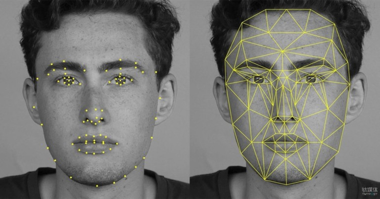
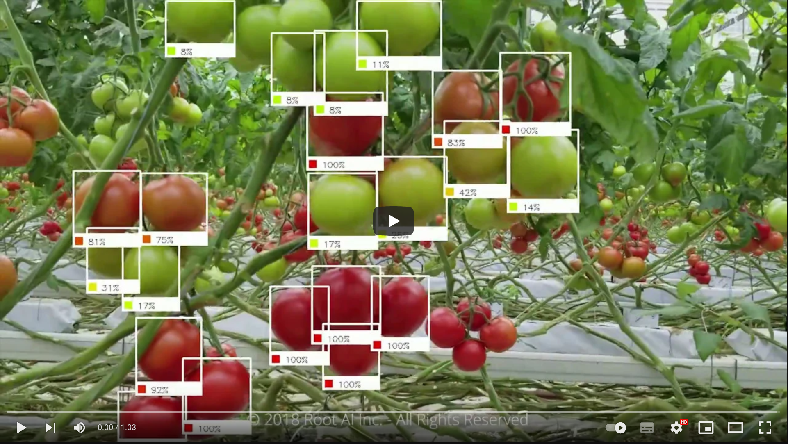

<!--
theme: gaia
size: 16:9
_class: lead
paginate: true
marp: false
backgroundColor: #000
backgroundImage: url('img/hero-backgroundIES.jpg')
-->

# **UD01: Caracterización de sistemas y utilización de modelos de Inteligencia Artificial**
#### Modelos de Inteligencia Artificial
###### version: 2023-08-05
___
<!-- footer: d.martinezpena@edu.gva.es -->
<!-- header: Modelos de Inteligencia Artificial 23-24 (UD01_4)-->
# 5. Campos de Aplicaciones de la Inteligencia Artificial
___
## Visión por Computadora
<!--La visión por computadora es un campo de la inteligencia artificial que se enfoca en **enseñar a las máquinas a interpretar y comprender el mundo visual**, permitiéndoles analizar y procesar imágenes y videos. Esta área ha experimentado un rápido avance en los últimos años gracias a los avances en técnicas de Aprendizaje Profundo y el aumento de la capacidad computacional. La visión por computadora tiene una amplia gama de aplicaciones en diversos campos, desde la medicina y la industria hasta la seguridad y el entretenimiento.

Los nuevos desarrollos de reconocimiento de imagen y visión artificial no han tenido un origen único y concreto, sino que se han ido conformando por la aportación de investigadores e ingenieros que han compartido sus ideas, como es el caso de **Yann Lecun**, que ideó **LeNet** usando, ya a **finales 90**, redes convolucionales para el reconocimiento de dígitos manuscritos.

El lanzamiento de **ImageNet**, abierto y gratuito, por parte de **Fei Fei Li**, que ya ha alcanzado más de 14 millones de imágenes, supuso un gran impulso al desarrollo de nuevas aplicaciones de visión artificial.

> ##### Tú mismo puedes descargarte un dataset reducido (¡aunque es de 166 GB!) para probar en [Kaggle](https://www.kaggle.com/).

Cada vez más y mejores datasets de imágenes etiquetadas, y un mayor conocimiento y dominio de redes convolucionales, han revolucionado el campo de la visión computacional, que ha pasado de ser una cuestión de más resolución o renderizados 3D, a una cuestión más cognitiva. Se ha conseguido crear modelos que realmente entienden qué están viendo.
-->
* La visión artificial automatiza la extracción, el análisis, la clasificación y la comprensión de la información útil a partir de los datos de las imágenes. Los datos de la imagen adoptan muchas formas, como las siguientes: 
  * Imágenes individuales
  * Secuencias de video
  * Visualizaciones de varias cámaras
  * Datos tridimensionales
___

### Aplicaciones de Visión por Computadora
**Vigilancia**
<!--La utilización de cámaras para sistemas de vigilancia y seguridad, se ha extendido de forma generalizada en nuestra sociedad actual. Pero, en algunos casos, estas cámaras tienen el plus de formar parte de un sistema de inteligencia artificial. 
Esta aplicación de los sistemas de reconocimiento de imagen son bastante controvertidos, pues plantean muchas dudas éticas respecto a la libertad fundamental de las personas. Es una herramienta muy útil y potente, y puede servir para beneficiar al ser humano tanto como para perjudicarlo. Lo bueno es que la comunidad en torno a la inteligencia artificial va descubriendo e ideando formas sencillas de evitar o combatir usos deshonestos de este tipo de herramientas.
En la mayoría de los casos, el software hace cálculos agregados de lo que "ve" y devuelve valores de ciertos indicadores, en vez de la imagen o fragmento de grabación con los datos personales. Solo en países donde hay regímenes autoritarios se mantienen prácticas que atentan contra los derechos de los ciudadanos.
-->
* Entre las aplicaciones concretas de este tipo de sistemas, a parte de las obvias por parte de la policía o sistemas de seguridad de organizaciones, están: 
  * Vigilancia y control del tráfico en las ciudades.
  * Cuidado de personas mayores.
  * Detección de infracciones de reglas sanitarias en la industria (especialmente en la industria alimentaria).
  * Monitorización del uso de infraestructuras críticas o adscritas a normas de utilización. 
  * Monitorización de funcionamiento y estados en líneas de producción. 
___
Incluso la inteligencia artificial puede ayudar a hacer más respetuosas con la privacidad ciertas aplicaciones y herramientas que ya se estaban utilizando, como el caso del software [Cherry Home de la empresa AvantGuard](https://www.agmonitoring.com/blog/industry-news/new-ai-camera-technology-protects-users-privacy).
____
**Reconocimiento Facial**
<!--
Un analizador facial es un software que identifica o confirma la identidad de una persona a partir del rostro. Funciona mediante la identificación y medición de los rasgos faciales en una imagen. El reconocimiento facial puede identificar rostros humanos en imágenes o videos, determinar si el rostro que aparece en dos imágenes pertenece a la misma persona o buscar un rostro entre una gran colección de imágenes existentes. Los sistemas de seguridad biométricos utilizan el reconocimiento facial para identificar de forma exclusiva a las personas durante la incorporación o el inicio de sesión de los usuarios, así como para reforzar la actividad de autenticación de estos. Los dispositivos móviles y personales también utilizan con frecuencia la tecnología de los analizadores faciales para proteger los dispositivos.
-->

<!--
Se pueden detectar los datos faciales tanto en los perfiles frontales como en los laterales del rostro. El sistema de reconocimiento facial analiza la imagen del rostro. Asigna y lee la geometría del rostro y las expresiones faciales. Identifica los puntos de referencia faciales que son clave para distinguir un rostro de otros objetos. La tecnología de reconocimiento facial por lo general busca lo siguiente:
- Distancia entre los ojos
- Distancia de la frente a la barbilla
- Distancia entre la nariz y la boca
- Profundidad de las cuencas oculares
- Forma de los pómulos
- Contorno de los labios, las orejas y la barbilla

El sistema convierte los datos de reconocimiento facial en una cadena de números o puntos denominada huella facial. Cada persona tiene una huella facial única, de forma similar a una huella dactilar. La información utilizada por el reconocimiento facial también se puede utilizar a la inversa para reconstruir digitalmente el rostro de una persona.
-->
El reconocimiento facial puede identificar a una persona al comparar los rostros de dos o más imágenes y evaluar la probabilidad de que coincidan.
<!-- Por ejemplo, puede verificar que el rostro mostrado en una autofoto tomada con la cámara de un móvil coincide con el rostro de una imagen de un documento de identidad emitido por el gobierno, como un permiso de conducir o un pasaporte, así como verificar que el rostro que aparece en la autofoto no coincide con un rostro de un conjunto de rostros capturados previamente.-->
___

#### **Aplicación de Visión por Computadora:**
* Ejemplo práctico de aplicación de visión por computadora: reconocimiento facial desbloqueo de dispositivos.
  * **Entrada**: La entrada es una imagen o un video que contiene rostros humanos. 
  * **Procesamiento de Imagen**: El sistema de visión por computadora procesa la imagen para detectar y extraer características clave del rostro, como ojos, nariz, boca, etc.
  * **Aprendizaje Automático**: Las características del rostro se utilizan como entrada para un modelo de aprendizaje automático previamente entrenado. El modelo clasifica las características y compara con una base de datos de rostros previamente almacenados.
  * **Salida**: Como resultado, el sistema identifica o verifica la identidad del individuo y permite el acceso o desbloqueo según los resultados.
___
**Conducción autónoma.**
El sistema de conducción autónoma de vehículos implica varias tareas y subsistemas, pero uno de los más importantes, es el de visión artificial.Reconocimiento de señales de tráfico u objetos/obstáculos alrededor del vehículo a una velocidad relativamente alta.
<!--Por ejemplo, si el coche debe parar porque hay una persona cruzando la carretera, el sistema de visión debe captar la imagen con antelación suficiente como para frenar a una distancia también suficiente.-->

___
**Sistema auxiliar en robots.**
Los robots son sistemas complejos que suelen ejecutar una serie de tareas en el mundo físico en base a una secuencia programada.

___
* Un sistema robótico tiene tres partes fundamentales:
  * Sensores o entradas.
  * Sistema de control.
  * Actuadores.

<!--Mas adelante hablaremos de cómo los sistemas de control se han beneficiado de la inteligencia artificial, pero aquí nos detenemos en el módulo de visión artificial como parte del conjunto de sensores que aportan los estímulos o la información que el sistema robótico va a necesitar para la toma de decisiones.

El sistema de visión artificial de un robot, le permite detectar objetos y posicionarse a sí mismo o a objetos que transporta en función de lo que está viendo. Esto es un gran avance respecto a otros sistemas de posicionamiento, que exigían constantes tareas de calibración y ralentizaban las tareas del robot.
-->
https://bostondynamics.com/videos/
___
**Reconocimiento de Objetos**
El reconocimiento de objetos implica identificar y localizar objetos específicos en imágenes o videos.
<!--Algunos ejemplos incluyen reconocimiento de vehículos en carreteras, detección de peatones en sistemas de asistencia al conductor y clasificación de objetos en aplicaciones de etiquetado automático.-->

<!--
En la industria agroalimentaria, la capacidad de visión inteligente es de vital importancia, porque constituye una parte decisiva de cara a que se obtenga un buen producto o una buena cosecha. En algunos casos, el robot sabe distinguir, mejor que el humano, si una fruta está en su momento óptimo de cosecha.
-->
___
**Detección y diagnóstico**
Herramientas de inteligencia artificial para la detección y diagnóstico de enfermedades a través de imágenes.
<!--
Existen muchos programas informáticos de apoyo y ayuda al diagnóstico que han ido mejorando su aprendizaje a través de su uso repetido y continuado. Actualmente existen diferentes tipos de software que se pueden aplicar a diferentes grupos de enfermedades como MYCIN/MYCIN II para enfermedades infecciosas, CASNET para oftalmología, PIP para enfermedades renales o Al/RHEUM para enfermedades reumatológicas. La empresa FDNA a través de su software de reconocimiento facial Face2Gene® es capaz de apoyar o sospechar el diagnóstico de más de 8.000 enfermedades raras, con un reciente ensayo clínico desarrollado en Japón con buenos resultados.
-->

<!--
En el campo del procesamiento y la interpretación de imágenes para el diagnóstico, la IA ofrece algoritmos que mejoran la calidad y la precisión del diagnóstico ya que los métodos de IA son excelentes para reconocer automáticamente patrones complejos en los datos de imágenes, elimina ruido en las imágenes ofreciendo una mayor calidad y permite establecer modelos tridimensionales a partir de imágenes de pacientes concretos.

Investigadores de IBM publicaron una investigación en torno a un nuevo modelo de IA que puede predecir el desarrollo del cáncer de mama maligno, con tasas comparables a las de los radiólogos humanos. Este algoritmo aprende y toma decisiones tanto de datos de imágenes como del historial de la paciente, pudo predecir correctamente el desarrollo del cáncer de mama en el 87% de los casos analizados, y también pudo interpretar el 77% de los casos no cancerosos. Este modelo podría algún día ayudar a los radiólogos a confirmar o negar casos positivos de cáncer de mama. Si bien los falsos positivos pueden causar una enorme cantidad de estrés y ansiedad indebidos, los falsos negativos a menudo pueden obstaculizar la detección temprana y el tratamiento posterior de un cáncer. Cuando se puso a prueba frente a 71 casos diferentes que los radiólogos habían determinado originalmente como «no malignos», pero que finalmente terminaron siendo diagnosticados con cáncer de mama dentro del año, el sistema de IA pudo identificar correctamente el cáncer de mama en el 48% de las personas (48% de los 71 casos), que de lo contrario no se habrían detectado (Fuente: "[La inteligencia artificial y sus aplicaciones en medicina](https://www.sciencedirect.com/science/article/pii/S0212656720301463)")
-->
___
**Procesos creativos**
Auge de los modelos generativos: las redes [GAN](https://en.wikipedia.org/wiki/Generative_adversarial_network) para el campo de la imagen y los modelos de generación de texto basados en Transformers. 
* **Deep Dream**
<!-- En 2015 apareció DeepDream, un modelo de generación de imágenes creado por Google. El software Deep Dream fue desarrollado para el imageNet large scale visual recognition challenge (ILSVRC). Este era un desafío reto, propuesto a diferentes equipos de investigación, que consistió en crear un sistema de reconocimiento de objetos y su localización dentro de una misma imagen, aparte de su detección inmediata. En este Desafío se adjudicó a Google el primer premio en el año 2014, logrado gracias al uso del entrenamiento de redes neuronales. En junio de 2015 Google publicó la investigación, y tras esto hizo su código fuente abierto utilizado para generar las imágenes en un IPython notebook. Con esto se permitió que las imágenes de la red neuronal pudiesen ser creadas por cualquiera. Actualmente, se puede utilizar la aplicación de manera online en la web DeepDreamGenerator. Básicamente, el algoritmo procesa la imagen dada identificando sus elementos, para utilizar una transferencia de estilos respetando la identidad esencial de la imagen original.-->
* **Gaugan**<!--GauGAN es una herramienta con la que se pueden crear paisajes falsos partiendo de un boceto. Este software de Nvidia, hace uso de una red de confrontación generativa (GAN), basado en una técnica denominada "normalización espacialmente adaptativa" que es capaz de generar imágenes realistas a partir de un determinado diseño semántico, controlado por el usuario con el uso de un programa de edición de imágenes, donde cada color actúa como representación de un tipo de objeto, material o ambiente. Se puede utilizar desde su interfaz web abierta.-->
* **DALL·E**
<!--Una de las más recientes incorporaciones al ámbito de "cosas increíbles que la inteligencia artificial puede hacer ya" es el modelo de generación de imágenes de openAI. Se trata de una implementación multimodal de GPT3. El algoritmo interpreta una descripción escrita que se le proporciona a través de su interfaz, y genera la imagen correspondiente en base a lo que sus 12 mil millones de parámetros del modelo GPT3 han interpretado de la entrada de texto dada. En concreto, se utiliza un proceso llamado "diffusion" que parte de una imagen de ruido aleatoria y va alterando dicho esquema de puntos en función de que vaya reconociendo distintos patrones de objetos cuyas palabras clave se le han dado en la descripción.-->
* **MidJourney**:
<!-- **Midjourney** es un laboratorio independiente de investigación y el nombre de un programa de inteligencia artificial con el cual sus usuarios pueden crear imágenes a partir de descripciones textuales, similar a Dall-e de OpenAI y al Stable Diffusion de código abierto.
La herramienta funcionó bajo versión de beta cerrada hasta que el 13 de julio de 2022 el laboratorio anunció el comienzo de una beta abierta. El equipo de Midjourney está dirigido por David Holz, cofundador de Leap Motion. Midjourney emplea un modelo de negocio *freemium*, con un nivel gratuito limitado y niveles de pago que ofrecen un acceso más rápido, mayor capacidad y funciones adicionales. Los usuarios pueden crear obras de arte con Midjourney dando órdenes a un bot alojado en Discord, ya sea enviando mensajes directos o invitando a dicho bot a un servidor de terceros.-->

___
## Procesamiento del Lenguaje Natural (PLN)

El Procesamiento del Lenguaje Natural (PLN) se enfoca en permitir a las máquinas entender y procesar el lenguaje humano en forma escrita o hablada.
<!--El PLN permite que las computadoras analicen, comprendan y generen texto de manera similar a como lo hacen los seres humanos. Esta tecnología ha sido fundamental en el desarrollo de asistentes virtuales, traducción automática, análisis de sentimientos y muchas otras aplicaciones útiles en el ámbito empresarial y cotidiano.
Tratar computacionalmente una lengua implica un proceso de modelización matemática. Los ordenadores solo entienden de bytes y dígitos y los informáticos codifican los programas empleando lenguajes de programación como C, Python o Java. -->

Los lingüistas computacionales se encargan de la tarea de "preparar" el modelo lingüístico para que los ingenieros informáticos lo implementen en un código eficiente y funcional.
___
**Componentes** del procesamiento del lenguaje natural:
* **Análisis morfológico o léxico.**
- **Análisis sintáctico.**
- **Análisis semántico.** 
- **Análisis pragmático.** . 
<!--Un análisis morfológico, sintáctico, semántico o pragmático se aplicará dependiendo del objetivo de la aplicación. Por ejemplo, un conversor de texto a voz no necesita el análisis semántico o pragmático. Pero un sistema conversacional requiere información muy detallada del contexto y del dominio temático.-->
* > No te recuerda a algo?
___
### Aplicaciones de Procesamiento del Lenguaje Natural
* **Asistentes Virtuales y Chatbots**
<!--Los asistentes virtuales como Siri, Google Assistant y Alexa utilizan PLN para entender y responder a las consultas y comandos de voz de los usuarios. Los chatbots en aplicaciones de servicio al cliente y soporte técnico también emplean PLN para ofrecer respuestas automáticas y contextuales a las preguntas de los usuarios.

Esta generación actual de asistentes están habilitados para llevar a cabo tareas dentro del sistema que las aloja e, incluso, a través de webhooks, en otros sistemas que cuenten con las políticas de acceso correspondientes. De esta forma, los asistentes virtuales más avanzados pueden encargar una pizza, comprar online un producto entre varias sugerencias o incluso controlar la domótica de nuestra casa.
-->
* **Generación de textos**
<!--
El área del marketing y comunicación ha sido de los primeros que ha abrazado la inteligencia artificial para automatizar y mejorar muchos de sus procesos. Y entre las distintas tareas que puede llevar a cabo la IA, la generación de textos empezó a tener una aplicación comercial clara como herramienta para crear mensajes publicitarios, publicaciones de marketing de contenidos o incluso lemas de producto. Por eso, durante estos años han ido surgiendo una gran cantidad de servicios de este tipo. Siempre para generar breves fragmentos, y con una serie de requerimientos, como incluir las palabras clave.

Pero, recientemente, están surgiendo modelos mucho más generales y con una versatilidad mayor en el tipo de textos, el tema a tratar, el idioma, etc. Es el caso de los modelos BERT, GPT3 y Bloom. El primero, creado por Google en 2018, integrado en el algoritmo de búsqueda de Google y publicado con licencia de código abierto, no tiene una aplicación directa de generación de textos, pero tiene la misma arquitectura que los modelos que se están utilizando en ese campo: los Transformers.
-->
* **Interpretación de textos** -->
<!--En el campo del análisis de lenguaje natural existen aplicaciones basadas en voz, como los asistentes virtuales que tenemos encima de la mesa, en el móvil o en el ordenador, o las aplicaciones basadas en texto. Ambas utilizan la misma base, y después, para añadir la habilitación oral, se utiliza un módulo de "Voz a Texto" y viceversa.

Las aplicaciones de PLN sirven para extraer información valiosa de los datos sin estructurar basados en textos y para acceder a la información extraída con el objetivo de generar una nueva comprensión de esos datos.-->
___

Algunos ejemplos de aplicación serían:
  * Traducción automática de idiomas.
  * Chatbots.
  * Comprender los recibos y las facturas
  * Análisis de documentos
  * Clasificación de contenido general
  * Análisis de tendencias
  * Sanidad

>¿cómo comprender realmente el significado de un texto? ¿cómo intuir neologismos, ironías, chistes o poesía?
___
**Ejemplo de Aplicación de Procesamiento del Lenguaje Natural: Análisis de Sentimientos en comentarios de productos en línea**
- **Entrada**: La entrada es un conjunto de comentarios escritos por usuarios sobre un producto específico.
- **Procesamiento de Lenguaje Natural**: El PLN procesa el texto para tokenizarlo, eliminar palabras irrelevantes y realizar lematización o extracción de raíces para reducir las palabras a su forma base.
- **Análisis de Sentimientos**: para asignar un valor de sentimiento (positivo, negativo o neutral)
- **Salida**: Se obtiene un resumen del sentimiento general de los usuarios
___

## Analítica avanzada
* Los Modelos Predictivos pretende dar una predicción de resultados futuros
* Se busca el patrón de comportamiento y la tendencia escondida en las relaciones entre diferentes variables de un sistema, y, a través de aprendizaje supervisado, con modelos de regresión y de clasificación.
* Cada vez van siendo más utilizados también los modelos de aprendizaje automático no supervisado, como el "clustering", que son el alma de sistemas de recomendación en plataformas de contenido online o comercio electrónico.
* Los modelos predictivos tienen gran aplicabilidad en todos los sectores comerciales. Son capaces de resolver muchos problemas que antes eran irresolubles.
___
## Robótica e Inteligencia Artificial
Robots cada vez más inteligentes y autónomos.
El caso de Davinci, el robot cirujano, o agro-bot, el robot que recoge fresas en su punto óptimo de madurez.

___

### Aplicaciones de la IA en la robótica
* **Robots sociales.**
<!--
Este tipo de robots tienen muy desarrollados los módulos sensoriales, es decir, el de reconocimiento de imagen, procesamiento de lenguaje natural, y su sistema de control es, básicamente, un asistente virtual que tiene ciertas opciones de movilidad y acciones remotas o conectadas, como encender la luz o hacer una llamada de emergencia.
-->
* **Casas y ciudades inteligentes.**
<!--
Estos sistemas robóticos cuentan con un elaborado sistema de sensores, y un hardware extendido por diversas localizaciones, lo que hace necesario contar, a menudo con microcontroladores que hagan parte del procesamiento de la información que captan y luego lo envíen al controlador principal. Por ejemplo, un sistema en el que tenemos cámaras que monitorizan las ventanas, en el propio microcontrolador de la cámara se puede hacer la tarea de reconocer la imagen de "ventana abierta", que la unidad principal recibirá junto a otros datos de interés como si está lloviendo o si hace frío, para accionar un actuador que haga saltar una alerta en el móvil de la persona propietaria o incluso que accione un motor para cerrarla.
-->
* **Conducción autónoma.**
<!--
La unidad de control de un vehículo autónomo es el paradigma de las técnicas más avanzadas en aprendizaje automático. Se trata de aprendizaje por refuerzo, y se entrena en simuladores virtuales hasta que el sistema tiene un comportamiento más o menos aceptable como para probarlo de forma segura en circuitos de pruebas reales.
Existen vehículos autónomos desde hace bastante tiempo, como es el caso de los drones, e incluso el sistema de control de navegación de los aviones cuenta con muchos automatismos, pero, probablemente, un coche autónomo, hoy por hoy, es el sistema más espectacular en tanto debe lidiar con muchos obstáculos y reglas de circulación.
-->
* **Robots Colaborativos**
<!--
Los robots colaborativos, también conocidos como cobots, son robots diseñados para trabajar de forma segura y eficiente junto a los seres humanos. Estos robots se utilizan en la industria para aumentar la productividad y mejorar la seguridad en la colaboración humano-robot. Por ejemplo:
-->
* **Ensamblaje de Productos**
<!--
En líneas de ensamblaje de automóviles o electrónicos, los cobots pueden trabajar junto a los operadores humanos para realizar tareas repetitivas y pesadas, mejorando la eficiencia y reduciendo la fatiga de los trabajadores.
-->
* **Embalaje y Logística**
<!--
En almacenes y centros de distribución, los cobots pueden colaborar con los trabajadores en la selección, embalaje y envío de productos, agilizando los procesos logísticos.
-->
* **Robótica Médica**
  * **Cirugía Asistida por Robot**
  * **Rehabilitación Robótica**
  * **Cuidados de Pacientes**
<!--
La robótica médica ha revolucionado la cirugía y la asistencia médica, permitiendo procedimientos más precisos y menos invasivos. Algunos ejemplos de aplicaciones de la robótica médica son:
-->
<!--
Los robots quirúrgicos, controlados por cirujanos, pueden realizar movimientos más precisos y estables durante procedimientos complejos, reduciendo el riesgo de errores y acelerando la recuperación del paciente.
-->

<!--
Los robots de rehabilitación se utilizan para asistir en la terapia de pacientes con discapacidades físicas, proporcionando movimientos controlados y repetitivos para mejorar la recuperación.
-->
<!--
Los robots asistenciales pueden ayudar a los pacientes en tareas diarias, como levantarse, caminar y tomar medicamentos, brindando una mayor autonomía y apoyo en el cuidado de la salud.
-->
* **Robots Autónomos**
  * **Exploración Espacial**
  * **Búsqueda y Rescate**
<!--
Los robots autónomos son máquinas que pueden operar de manera independiente en entornos desconocidos o adversos sin intervención humana directa. Algunos ejemplos de aplicaciones de robots autónomos incluyen:
-->
<!--
Los robots autónomos se utilizan en misiones espaciales para explorar planetas, asteroides y lunas, recopilando datos valiosos sin la necesidad de una comunicación constante con la Tierra.
-->
<!--
En situaciones de desastres naturales o emergencias, los robots autónomos pueden buscar y localizar supervivientes en áreas peligrosas o inaccesibles para los equipos de rescate humanos.
-->
___

## Ciencia de datos y Data Mining
* Detectar patrones y relaciones mediante métodos no supervisados, y llevar a cabo agrupaciones y heurísticos. Todo ello será visto con detalle en el módulo SAA.
##### **Minería de datos o Data mining**
* Los conceptos minería de datos y machine learning. Son conceptos "primos hermanos", pero no son lo mismo.
* Mientras que la minería de datos descubre patrones anteriormente desconocidos, el Machine Learning se usa para reproducir patrones conocidos y hacer predicciones basadas en los patrones.
* > En pocas palabras se podría decir que la minería de datos tiene una función exploratoria mientras que el machine learning se focaliza en la predicción.
___

## Ciberseguridad
* Algunos de los usos más destacados:
  * 1. **Detección de amenazas avanzadas**<!-- La IA se utiliza para analizar grandes volúmenes de datos y detectar patrones de comportamiento anómalos que puedan indicar actividades maliciosas. Los sistemas de detección de intrusiones basados en IA pueden identificar amenazas avanzadas y desconocidas que los enfoques tradicionales podrían pasar por alto.-->
  * 2. **Prevención de ataques de phishing**<!-- Los algoritmos de aprendizaje automático pueden analizar correos electrónicos y sitios web en busca de indicios de phishing y ayudar a bloquear o filtrar contenido malicioso antes de que llegue a los usuarios.-->
  * 3. **Identificación de malware**<!-- Los sistemas de IA pueden analizar el comportamiento de archivos y aplicaciones para detectar malware y ransomware. Además, la IA puede mejorar la identificación y clasificación de nuevas variantes de malware desconocido.-->
  * 4. **Autenticación de usuarios**<!-- La IA se utiliza en sistemas de autenticación biométrica y de reconocimiento facial para mejorar la seguridad en el acceso a dispositivos y servicios.-->
  * 5. **Análisis de logs y eventos de seguridad**<!-- Los sistemas de IA pueden analizar y correlacionar grandes cantidades de registros y eventos de seguridad para identificar patrones de actividad sospechosa y facilitar la respuesta a incidentes.-->
  * 6. **Predicción y prevención de brechas de seguridad**<!-- Mediante el análisis de datos históricos y la identificación de vulnerabilidades conocidas, la IA puede predecir posibles brechas de seguridad y ayudar a prevenir futuros ataques.-->
  * 7. **Automatización de tareas de seguridad**<!-- La IA se utiliza para automatizar tareas repetitivas en ciberseguridad, como la gestión de parches, el análisis de vulnerabilidades y la respuesta a incidentes, lo que permite a los profesionales de seguridad centrarse en tareas más complejas.-->
  * 8. **Protección de redes y sistemas IoT**<!-- La IA puede monitorear y proteger redes empresariales y dispositivos IoT (Internet de las cosas) para detectar y prevenir actividades maliciosas.-->
____

Soluciones reales basadas en IA:
* **Cylance:** Una plataforma de prevención de ataques basada en IA que utiliza algoritmos de aprendizaje automático para proteger contra malware y ransomware.
* **Darktrace:** Un sistema de detección de amenazas basado en IA que utiliza algoritmos de inteligencia artificial para identificar y responder a comportamientos anómalos en tiempo real.
* **IBM Watson for Cyber Security:** Una solución de seguridad cibernética que utiliza IA para analizar grandes cantidades de datos y ayudar a identificar y responder a amenazas de manera más rápida y precisa.

* **BioCatch:** Una solución de autenticación biométrica que utiliza IA para analizar el comportamiento del usuario y detectar actividades fraudulentas.
<!-- Put this script at the end of Markdown file. -->
