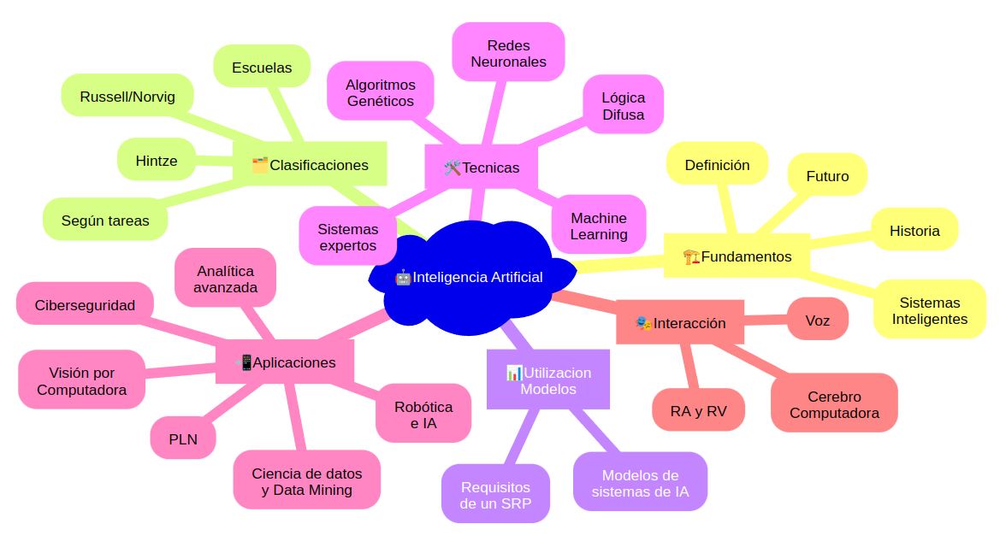

<!--
theme: gaia
size: 16:9
_class: lead
paginate: true
marp: false
backgroundColor: #000
backgroundImage: url('img/hero-backgroundIES.jpg')
-->

# **UD01: Caracterización de sistemas y utilización de modelos de Inteligencia Artificial**
#### Modelos de Inteligencia Artificial
###### version: 2023-08-05
___
<!-- footer: d.martinezpena@edu.gva.es -->
<!-- header: Modelos de Inteligencia Artificial 23-24 (UD01_5)-->
# 6. Nuevas Formas de Interacción
___
## Interfaces de Voz
> Las interfaces de voz son una forma de interacción con sistemas de Inteligencia Artificial que permiten a los usuarios comunicarse mediante comandos de voz en lugar de texto o clics.

Algunas aplicaciones:
* ### Asistentes Virtuales
  * **Siri**
  * **Google Assistant**
  * **Amazon Alexa**
<!--
Desarrollado por Apple, Siri es un asistente virtual que se encuentra integrado en dispositivos como iPhones, iPads y Macs. Puede responder preguntas, enviar mensajes, configurar alarmas, hacer llamadas y más.
Desarrollado por Google, Google Assistant está disponible en dispositivos Android y en otros dispositivos como Google Home. Puede proporcionar información en tiempo real, realizar búsquedas en la web, establecer recordatorios y controlar dispositivos inteligentes del hogar.
Alexa es el asistente virtual de Amazon y está presente en dispositivos como el Amazon Echo. Permite realizar compras en línea, reproducir música, controlar luces y termostatos inteligentes, y realizar muchas otras tareas.
-->
___
## Sistemas de Navegación
* Las interfaces de voz también se utilizan en sistemas de navegación para proporcionar instrucciones de conducción en tiempo real. Algunos ejemplos incluyen:
  * **Google Maps**
  * **Sistemas de Navegación Integrados en Automóviles**
<!--
La popular aplicación de mapas y navegación utiliza el reconocimiento de voz para que los conductores reciban instrucciones mientras mantienen la vista en la carretera.
Muchos automóviles modernos están equipados con sistemas de navegación por voz que permiten a los conductores obtener direcciones y encontrar lugares de interés sin quitar las manos del volante.
-->
___
### Aplicaciones de Accesibilidad
Accesibilidad tecnológica para personas con discapacidades visuales o motrices.
* **Lectores de Pantalla**: Estas aplicaciones utilizan la voz para leer en voz alta el contenido de la pantalla de un dispositivo, permitiendo que las personas con discapacidades visuales puedan interactuar con la tecnología.
* **Comandos de Voz para Controlar Dispositivos**: Las interfaces de voz permiten a personas con discapacidades motrices controlar dispositivos y realizar tareas sin la necesidad de utilizar las manos.
___

## Interfaces Cerebro-Computadora (BCI)
* Las Interfaces Cerebro-Computadora (Brain-Computer Interface BCI) son tecnologías avanzadas que permiten la comunicación directa entre el cerebro humano y dispositivos tecnológicos. A través del registro y análisis de señales cerebrales, estas interfaces posibilitan que las personas controlen dispositivos y sistemas mediante su actividad cerebral. 
  * ### Asistencia Médica
  * ### Neurofeedback
  * ### Juegos y Entretenimiento
<!--
Las BCI han abierto nuevas posibilidades para asistir a personas con discapacidades motoras. Estas interfaces permiten a individuos con lesiones espinales, amputaciones u otras condiciones que afectan su capacidad de movimiento, controlar prótesis y dispositivos asistenciales mediante señales cerebrales. Por ejemplo, una persona con una extremidad amputada podría usar una prótesis controlada por BCI para realizar movimientos precisos y naturales, restaurando parte de su funcionalidad física.

El neurofeedback es una técnica terapéutica en la que se proporciona a los individuos información en tiempo real sobre su actividad cerebral. Las BCI se utilizan para capturar señales cerebrales y mostrar a los usuarios visualizaciones de sus patrones de actividad cerebral. Esto permite que las personas aprendan a autorregular su actividad cerebral, lo que puede ser beneficioso para tratar problemas de salud mental, como el estrés, la ansiedad y la depresión, y mejorar el rendimiento cognitivo en tareas específicas.

Las BCI también se aplican en el campo de los juegos y el entretenimiento. Al utilizar señales cerebrales para controlar videojuegos y aplicaciones, se crea una experiencia de juego más inmersiva e interactiva. Los jugadores pueden controlar personajes y acciones dentro del juego mediante su actividad cerebral, lo que abre un mundo de posibilidades para nuevas mecánicas de juego y experiencias innovadoras.
-->
___
## Realidad Aumentada y Virtual
* La Realidad Aumentada (AR) y la Realidad Virtual (VR) ofrecen nuevas formas de interactuar con la IA, aplicaciones destacadas son:
  * Educación y Formación
  * Diseño y Visualización
  * Entretenimiento e Inmersión
<!--
La AR y la VR se están convirtiendo en herramientas valiosas en el campo de la educación y la formación. Al simular entornos y escenarios de la vida real, estas tecnologías permiten a los estudiantes aprender de manera práctica y vivencial, lo que puede mejorar significativamente la retención de conocimientos y habilidades. Por ejemplo, los estudiantes de medicina pueden realizar simulaciones de cirugías en entornos de realidad virtual, lo que les proporciona una experiencia práctica sin riesgos para los pacientes.

Las AR y VR también ofrecen ventajas en el campo del diseño y la visualización. Los arquitectos, ingenieros y diseñadores pueden utilizar estas tecnologías para ver y modificar modelos 3D de edificios, productos o espacios. Esto permite una comprensión más clara y detallada de los proyectos, lo que puede conducir a un diseño más eficiente y una toma de decisiones más informada.

En el ámbito del entretenimiento, la AR y la VR proporcionan experiencias inmersivas que integran elementos del mundo real y virtual. Los videojuegos de realidad virtual permiten a los jugadores sumergirse por completo en mundos virtuales y participar en experiencias interactivas. Además, la AR se ha utilizado en aplicaciones de entretenimiento móvil, como juegos de realidad aumentada que interactúan con el entorno del usuario.
-->

___

<!-- Put this script at the end of Markdown file. -->
