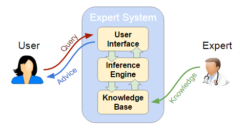
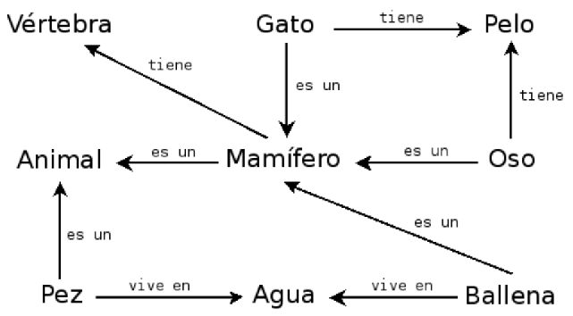

<!--
theme: gaia
size: 16:9
_class: lead
paginate: true
marp: false
backgroundColor: #000
backgroundImage: url('img/hero-backgroundIES.jpg')
-->
<style>
section::after {
  content: attr(data-marpit-pagination) '/' attr(data-marpit-pagination-total);}
img[alt~="center"] {
  display: block;
  margin: 0 auto;
}
table {
  margin-left: auto;
  margin-right: auto;
}
footer {
  font-size: 20px;
 }
header {
  font-size: 16px;
 }
</style>
<style scoped>
section {
  @extend .markdown-body;
  font-size: 28px;
  justify-content: top;
 }
</style>


# **UD02: Sistemas Expertos**
#### Modelos de Inteligencia Artificial
###### version: 2023-08-05
___
<!-- footer: d.martinezpena@edu.gva.es -->
<!-- header: Modelos de Inteligencia Artificial 23-24 (UD01_1)-->
# ¿Qué veremos?
1. Introducción
2. Estructuras elementales de los sistemas expertos
3. Dinámica de un sistema experto.
4. Representación y simulación de comportamientos básicos
5. Estrategias de control de un sistema experto
6. Tendencias en sistemas expertos
7. Lenguajes de programación usados en Sistemas Expertos
___
<style scoped>
section {
  @extend .markdown-body;
  font-size: 31px;
  justify-content: top;
 }
</style>
# 1. Introducción
* Los sistemas expertos son una aplicación de la inteligencia artificial.
* Los sistemas expertos comenzaron su desarrollo en la década de 1970.
* Se considera que los primeros sistemas que fueron capaces de obtener resultados con utilidad práctica.
* Basados fundamentalmente en reglas. 
* imprescindible disponer del conocimiento de un especialista en el campo objeto de estudio.
  > Todo sistema experto ha de tener la capacidad de explicar cuál es la decisión que ha tomado.

<!--Un sistema experto se puede definir como un software que es capaz de simular el proceso de decisión que tomaría un experto humano en cierto campo. Por tanto, los sistemas expertos se diseñan de manera que puedan tomar de forma automática decisiones como si fueran expertos. Además, cabe señalar que todo sistema experto debe ser capaz de explicar la decisión que ha tomado y también ha de ser capaz de aprender cuando se le facilita nueva información.-->
___
# 2. Estructuras elementales de los sistemas expertos
* La arquitectura... basado en reglas del tipo: «SI ... ENTONCES»
* Cada regla representa una porción del conocimiento que se pretende introducir en el sistema. 
* Un conjunto de reglas relacionadas puede llevar de una serie de hechos y datos conocidos hasta algunas conclusiones de utilidad.
___
Todo sistema experto está formado por los siguientes elementos:

___
# 3.Dinámica de un sistema experto.
* En un programa informático, la lógica está incrustada en un código que,solo puede ser revisado por un especialista informático.
* En un sistema experto, el objetivo era especificar las reglas en un formato que fuera intuitivo y fácil de entender, revisar e incluso editar por expertos en el dominio en lugar de expertos en TI.
* Un sistema experto debe ser capaz de generar información no explícita, razonando con los elementos que se le dan.
* Un sistema experto puede actuar como un intermediario inteligente que guía y apoya el trabajo del usuario final.
___
## Tipos de sistemas expertos.
* **Basados en reglas previamente establecidas** <!-- También conocidos como RBR (Rule Based Reasoning). Trabajan mediante la aplicación de reglas, comparación de resultados y aplicación de las nuevas reglas basadas en la situación modificada. Esta aplicación de reglas heurísticas se apoya principalmente en lo que se conoce como lógica difusa, para su evaluación y aplicación.-->
* **Basados en casos** <!-- También conocidos como CBR (Case Based Reasoning). Se basan en el proceso de solucionar nuevos problemas según las soluciones de problemas anteriores. Este tipo de razonamiento se adapta al nuevo problema.-->
* [**Basados en redes bayesianas**](https://es.wikipedia.org/wiki/Red_bayesiana)<!--Son los conocidos sistemas probabilísticos, que constituyen una herramienta bastante útil en la estimación de probabilidades de resultados en función de nuevas evidencias. Como su nombre indica, se utiliza el cálculo de la probabilidad según el Teorema de Bayes. En esencia, consiste en un gráfico que representa un conjunto de variables conocidas y las relaciones de dependencia entre ellas a fin de inferir, es decir, estimar la probabilidad, de las variables no conocidas. Dadas sus características, este modelo resulta idóneo para la clasificación, la predicción o el diagnóstico. Por ejemplo, un sistema de riego automático que tuviese que decidir si regar o no en función de la probabilidad de que llueva o no, seguiría este esquema (que puedes encontrar en un [artículo](https://es.wikipedia.org/wiki/Red_bayesiana) más extenso sobre el tema).-->
* [**Lógica difusa**](https://es.wikipedia.org/wiki/Lógica_difusa)<!-- Si quieres profundizar más en el tema de la lógica difusa o borrosa que permite la toma de decisiones en algunos sistemas expertos, puedes leer sobre ello en este [artículo de la Wikipedia]-->
* Diferentes tipos de sistemas basados en reglas: [web](https://visiruleexamples.com/vregs.html).
___
<style scoped>
section {
  @extend .markdown-body;
  font-size: 27px;
  justify-content: top;
 }
</style>
## Representación del conocimiento.
* **Reglas de producción**<!--El resultado que arroja un sistema experto se basa en la aplicación de reglas sobre los objetos y hechos presentes. Se trata de estructuras condicionales que relacionan a través de la lógica la información de una premisa o antecedente con la información contenida en la parte de conclusión o consecuencia y que suele traducirse en una acción. Tanto la premisa como la conclusión, hacen referencia a hechos mencionados en la base de conocimientos.   Cuando se aplica una regla sobre unos hechos, se dice que la regla "dispara" y esto provoca la inserción de un nuevo hecho en la base de hechos.-->
* **Lógica proposicional**<!--Es similar a las reglas de producción. Separa los elementos que componen la base de conocimiento de aquellos que controlan la operación del sistema.-->
* **Redes semánticas**<!-- Representan el conocimiento en formas de redes o grafos. Cada nodo de la red representa un concepto u objeto y los lazos que los interconectan describen reacciones entre ellos.-->

  

- **Marcos**<!-- Son estructuras de datos donde se almacena información concreta de un cierto concepto y la información relacional correspondiente. Asocian propiedades a los nodos de las redes semánticas, que representan, a su vez, los objetos o conceptos. Dichas propiedades son descritas en términos de atributos y valores asociados.-->
- **Objetos**<!-- Se utilizan, especialmente, en entornos de programación orientada a objetos y actúan como entidades independientes de forma que el control del sistema se materializa a través del envío de mensajes del sistema a los objetos y entre ellos mismos.-->

- **Representaciones múltiples**<!--: Son de uso frecuente y combinan dos o más formas de representación entre éstas:-->
  - **Representación declarativa**<!--: incluye las reglas, el cálculo de predicados y las redes semánticas. El conocimiento queda estructurado en fragmentos independientes entre sí que se combinan mediante un mecanismo general de razonamiento y deducción.-->
  - **Representación procedimental**<!--: refleja explícitamente las relaciones entre los fragmentos de conocimiento, y éstas son difíciles de modificar-->
  - **Representación mixta**<!--: es una combinación de las anteriores. Usa objetos y marcos.-->
___
## Mecanismos de razonamiento.
* **Encadenamiento hacia delante**: se parte de hechos para llegar a resultados.
* **Encadenamiento hacia atrás**: se parte de los resultados y se trata de encontrar o volver a los hechos.
* **Encadenamiento mixto**: combina los anteriores.
* **Algoritmo de búsqueda heurística**: el proceso de inferencia es una búsqueda en una estructura de tipo árbol.
* **Herencia**: usado en entornos de programación orientada a objetos. Un objeto hijo hereda propiedades y hechos de los padres.
___
### [Encadenamiento hacia adelante y hacia atrás](https://prezi.com/fvw2aokvct7r/encadenamiento-hacia-adelante-y-hacia-atras/)

### Para obtener conclusiones...
* [Modus Ponens](https://es.wikipedia.org/wiki/Modus_ponendo_ponens) "si *P* implica *Q; y* si *P* es verdad; entonces *Q* también es verdad."
* [Modus Tollens](https://es.wikipedia.org/wiki/Modus_tollendo_tollens) "Si *P* implica *Q*, y *Q* no es cierto, entonces *P* no es cierto"

Así como ver este [vídeo](https://youtu.be/MLe9flR4PsA) corto en el que se hace un planteamiento sencillo de los conceptos.
___
<style scoped>
section {
  @extend .markdown-body;
  font-size: 27px;
  justify-content: top;
 }
</style>
# 4.Representación y simulación de comportamientos básicos
* Ventajas:
  * se programan de manera rápida (si...entonces)
  * manejan gran cantidad de información simultaneamente
  * son escalables, solo debemos alimentarlos con más información.
  * actuan de manera transparente y pedagógica
* Desventajas:
  * por mucha info que introduzcamos, imposible abarcar todo
  * no son creativos o imaginativos

* Aprenderemos más usando Experta en la parte práctica.
___
# 5.Estrategias de control de un sistema experto

* Las dos estrategias de control más empleadas:
  * **razonamiento hacia adelante**
  * **razonamiento hacia atrás**

* **LISP** normalmente utilizará razonamiento hacia adelante
* **PROLOG** empleará la estrategia de razonamiento hacia atrás.
___
#### razonamiento hacia adelante:
```lisp
SI (el paciente tiene fiebre) Y (ha perdido el olfato)
	ENTONCES hacer prueba PCR (Polymerase Chain Reaction)
```
```lisp
 SI (llueve)
 	ENTONCES (usar paraguas)
 ```
___
<style scoped>
section {
  @extend .markdown-body;
  font-size: 27px;
  justify-content: top;
 }
</style>
#### encadenamiento hacia atrás:
Se parte del estado de llegada y se trata de llegar a él encadenando objetivos. Se parte de un resultado que se considerará cierto en caso de cumplirse una serie de condiciones.
determinar qué animal caza ratones y bebe leche. La base de reglas de la que se dispone es la siguiente:
```lisp
SI Animal caza ratones y bebe leche
	ENTONCES Animal es un gato
SI Animal pía y vuela
	ENTONCES Animal es un pájaro
SI Animal es un gato
	ENTONCES Animal tiene pelo
SI Animal es un pájaro
	ENTONCES Animal es tiene plumas
```
El encadenamiento hacia atrás comienza con una lista de objetivos o una hipótesis y trabaja desde el consecuente hacia el antecedente con el fin de verificar si los datos apoyan las consecuencias.
___
<style scoped>
section {
  @extend .markdown-body;
  font-size: 33px;
  justify-content: top;
 }
</style>
# 6.Tendencias en sistemas expertos
* sistemas expertos en campos muy variados: recursos humanos, medicina, banca, mantenimiento, control de embalses, etcétera. 
* Los beneficios: una mayor calidad de las decisiones tomadas, la reducción de los costes de operación y toma de decisiones, la mejora de la consistencia entre decisiones adoptadas en momentos temporales distintos, además de una mayor rapidez en la propia toma de las decisiones.
* Ahora se combinan con metodologías propias del machine learning o aprendizaje automático.
___
<style scoped>
section {
  @extend .markdown-body;
  font-size: 32px;
  justify-content: top;
 }
</style>
# 7.Lenguajes de programación usados en Sistemas Expertos
* LISP
* PROLOG
* CLIPS
* EXPERTA (PYKNOW)
___
## LISP
LISP es uno de los lenguajes más antiguos utilizados en sistemas expertos, desarrollado por John McCarthy en 1958. Su nombre, **Lis**t **P**rocessing, refleja su enfoque principal en la manipulación de listas. 

> ```lisp
> ;; Definición de una regla simple en LISP
> (defrule regla-ejemplo
>   (hecho1 ?x)
>   (hecho2 ?y)
>   =>
>   (assert (nueva-inferencia ?x ?y)))
> ```
___
<style scoped>
section {
  @extend .markdown-body;
  font-size: 32px;
  justify-content: top;
 }
</style>
## PROLOG
PROLOG (**pro**gramation et **log**ique), desarrollado a principios de la década de 1970 por Alain Colmerauer y Philippe Roussel, es un lenguaje de programación lógica utilizado en sistemas expertos para representar y consultar conocimiento declarativo. Su sintaxis se basa en reglas y hechos, lo que lo hace especialmente adecuado para expresar relaciones lógicas y reglas de inferencia

> ```prolog
> % Definición de reglas en PROLOG
> regla_ejemplo(X, Y) :-
>   hecho1(X),
>   hecho2(Y),
>   assert(nueva_inferencia(X, Y)).
> ```
___
<style scoped>
section {
  @extend .markdown-body;
  font-size: 29px;
  justify-content: top;
 }
</style>
## CLIPS
CLIPS es un lenguaje de programación específicamente diseñado para el  desarrollo de sistemas expertos. Desarrollado en la década de 1980 por  la NASA, combina características de lenguajes como LISP y C. CLIPS  utiliza reglas de producción y tiene una sintaxis clara para representar el conocimiento y las reglas de inferencia. Permite integración completa con otros lenguajes de programación como C o Ada.
> ```clips
> ; Definición de una regla en CLIPS
> (defrule regla-ejemplo
>   (hecho1 ?x)
>   (hecho2 ?y)
>   =>
>   (assert (nueva-inferencia ?x ?y))
> )
> ```
___
<style scoped>
section {
  @extend .markdown-body;
  font-size: 32px;
  justify-content: top;
 }
</style>
## Experta
El objetivo es implementar una alternativa Python a CLIPS, lo más compatible posible. Con el objetivo de facilitar al programador CLIPS la transferencia de todos sus conocimientos a esta plataforma. Aprovechando la familiaridad y la versatilidad de Python, Experta (fork de PyKnow)  simplifica el desarrollo de sistemas expertos al proporcionar una  interfaz más intuitiva.
* Compatible con Python 3.
* Implementación pura de Python.
* Matcher basado en el algoritmo RETE.
___
### Diferencia entre CLIPS y Experta

1. CLIPS es un lenguaje de programación, Experta es una biblioteca de Python. Esto impone algunas limitaciones a las construcciones que podemos hacer (especialmente al LHS de una regla).
2. CLIPS está escrito en C, Experta en Python. Es de esperar un impacto notable en el rendimiento.
3. En CLIPS agregas hechos usando `assert`, en Python `assert` es una palabra clave, por lo que usamos `declare` en su lugar.
___
#### EXPERTA (PyKnow):

> ```python
> # Definición de una regla en PyKnow (EXPERTA)
> from pyknow import Fact, Rule, KnowledgeEngine
> 
> class EjemploEngine(KnowledgeEngine):
>     @Rule(Fact(hecho1=True), Fact(hecho2=True))
>     def regla_ejemplo(self):
>         self.declare(Fact(nueva_inferencia=True))
> ```
___
<style scoped>
section {
  @extend .markdown-body;
  font-size: 20px;
  justify-content: top;
 }
</style>
**Comparativa:**
| Lenguaje         | Historia y Desarrollo                               | Características Principales                      | Puntos Fuertes                                            | Puntos Débiles                                              | Comentarios                        |
| ---------------- | --------------------------------------------------- | ------------------------------------------------ | --------------------------------------------------------- | ----------------------------------------------------------- | ---------------------------------- |
| LISP             | Desarrollado en 1958 por John McCarthy              | List Processing, manipulación flexible de listas | Expresividad, facilidad para extender el código           | Sintaxis peculiar para algunos                              | `;; Comentario en LISP`            |
| PROLOG           | Desarrollado a principios de la década de 1970      | Programación lógica, reglas y hechos             | Representación lógica, eficaz en búsqueda lógica          | Desafíos en problemas complejos, búsqueda ineficiente       | `% Comentario en PROLOG`           |
| CLIPS            | Desarrollado en la década de 1980 por la NASA       | Lenguaje específico para sistemas expertos       | Eficiencia en ejecución, sintaxis clara                   | Curva de aprendizaje empinada                               | `; Comentario en CLIPS`            |
| PyKnow (EXPERTA) | Basado en Python, desarrollado en tiempos recientes | Integración con Python, sintaxis intuitiva       | Familiaridad con Python, amplio ecosistema de bibliotecas | Menos establecido en comparación con lenguajes más antiguos | `# Comentario en PyKnow (EXPERTA)` |
<!-- Put this script at the end of Markdown file. -->
<script type="module">
import mermaid from 'https://cdn.jsdelivr.net/npm/mermaid@10.0.0/dist/mermaid.esm.min.mjs';
mermaid.initialize({ startOnLoad: true });

window.addEventListener('vscode.markdown.updateContent', function() { mermaid.init() });
</script>